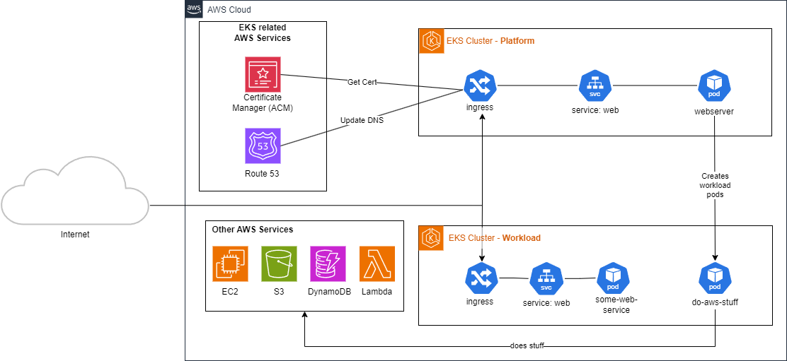

Cloud technologies move fast, none more so than AWS EKS. I'm not in the business of managing clusters full-time - even via managed services like EKS. I recently revisited the technology and found it's evolved considerably, and I found it quite difficult to jump back in and understand the various authentication and authorization methods that seem to overlap with each other.

This post explores the following AWS EKS technologies, and applies them to the context of a real scenario*.
- aws-auth (2018)
- IRSA (IAM Roles for Service Accounts) (2019)
- EKS Pod Identities (2023)
- EKS Cluster Access Management (2023)

*At least that was the original intention. I wanted to provide reusable snippets for each of the technologies, but as I started, i realised that the post would just become far too long, so have settled for an overview of each.

# Scenario
In order to wrap your head around these technologies, let's consider the following architecture.

I've kept this diagram very high level, otherwise it [gets very messy](https://www.stacksimplify.com/course-images/aws-eks-alb-ingress-external-dns-route53.png) if you include all the actual resources required to pull something like this off. 



Let's say you have two clusters: platform and workload. The platform cluster contains your main website, and all supporting services. If your business runs process intensive applications, which may require integrations with other AWS services, you may choose to run your infrastructure two clusters.

But your **platform** cluster may also need to talk to AWS services, especially if using fancy things like [external-dns](https://github.com/kubernetes-sigs/external-dns) and the [EKS AWS load balancer controller](https://kubernetes-sigs.github.io/aws-load-balancer-controller/latest/).

In this scenario, perhaps you'd also want your platform cluster to act as a kind of orchestrator/control plane for the workload cluster. Your website backend might react to user activity, and want to provision workload-pods in the workload cluster.

Of course, you could achieve this all in a single cluster, but you may want fine-grained auto-scaling behaviour over your workload, without affecting your platform.

What follows is a delicate symphony for AWS and cluster permissions. Forget about least-privilege -- its hard enough to getting it to work as intended!

# AWS EKS Authentication & Authorization
I don't want to go into the details of the AWS and K8s API integrations - I just want to give an overview of the various EKS methods available to achieve the above scenario. The solutions to tackling this architecture have evolved over the years; blink and you'll miss it.

With the above architecture in mind, we actually need two different kind of permissions:
- Permissions to create/delete AWS resources
- Permissions to create Kubernetes resources (+ across clusters)

These are two distinctly different things, which can be a bit confusing when searching the web for getting started. Especially when reviewing five year old stackoverflow pages to fix your problems, or using AI models based on data from 2022.

There are four AWS-managed options available:

| Auth Solution | AWS Perms | K8s Perms |
|---------|-----------|-----------|
| aws-auth (2018) (deprecated)                  | ❌| ✔ |
| IRSA (2019)                         | ✔ | ✔ |
| EKS Pod Identities (2023)           | ✔ | ❌ |
| EKS Cluster Access Management (2023) | ❌ | ✔|

AWS Perms, refers to the ability for the cluster to interact with resources in AWS. K8s perms, means the ability to act as a kind of provisioner - the ability to manage k8s resources (e.g. create pods).

## aws-auth (2018)
With the [launch of EKS](https://aws.amazon.com/blogs/aws/amazon-eks-now-generally-available/) back in 2018, [aws-auth ConfigMap](https://aws.github.io/aws-eks-best-practices/security/docs/iam/#the-aws-auth-configmap-deprecated) was the way to map AWS IAM Roles, Users & Groups to Kubernetes RBAC authorization.

The `ConfigMap` would be added to your cluster during provisioning, and would reside in the `kube-system` namespace. Essentially, you edit the `ConfigMap`, to map between your IAM principals to your Kubernetes RBAC resources. It won't give your Kubernetes resource AWS permissions, but rather gives your AWS principals over your cluster.

With our scenario in mind; `aws-auth` dosent really give us anything useful. `aws-auth` only handles AWS IAM to Kubernetes RBAC mappings within a single cluster. It can't be used to manage cross-cluster permissions between two EKS clusters. It also dosent give our Kubernetes resources permissions over AWS.

Although aws-auth is [officially deprecated](https://docs.aws.amazon.com/eks/latest/userguide/auth-configmap.html), you can still [configure `ConfigMap` as an authentication mode](https://docs.aws.amazon.com/eks/latest/userguide/grant-k8s-access.html#set-cam). If you were curious, you can check out the [initial ConfigMap](https://amazon-eks.s3-us-west-2.amazonaws.com/1.10.3/2018-06-05/aws-auth-cm.yaml) from nearly 7 years ago.

## Identity and Access Management (IAM) Roles for Service Accounts (IRSA) (2019)
In 2019, [AWS released IRSA](https://aws.amazon.com/blogs/opensource/introducing-fine-grained-iam-roles-service-accounts/). Traditionally, containers would all share the credentials of the node (which is obviously a huge least-privilege concern), so the community had developed tools such as [kube2iam](https://github.com/jtblin/kube2iam) as a workaround, which redirected ec2 metadata traffic to specific containers.

AWS released IRSA to address the problem, and avoid the need for workarounds by *"combining an OpenID Connect (OIDC) identity provider and Kubernetes service account annotations, to use IAM roles at the pod level"*. This means that customers can run multiple applications on the same EKS cluster, ensuring each application applies its own least-privilege rules.

With our scenario in mind; IRSA solves a lot of the problems. We can create an OIDC provider and give a pod permissions to interact with AWS resources. E.g. *update Route53 dynamically to point to my load balancer*. It also allows us to give our IAM principals permissions to manage resources within our cluster. E.g. We can create an `IAM Role` named **pod-creator**, and map it to a kubernetes `Role` named **PodCreator**.

However, for our scenario, we want the **platform** cluster, to have permissions to create/delete pods in the **workload** cluster. Managing OIDC providers, service accounts, IAM roles, IAM policies, and K8s role bindings is already a *lot* to manage -- let alone throwing cross-cluster permissions in the mix.

IRSA does allow for that scenario, with a lot of very confusing configuration.

IRSA is extremely flexible, and delivers on its promise of fine-grained access, but at the cost of significant complexity to implement and maintain. As well as the management complexity, there are other problems of running IRSA at scale, such as [100 OIDC identity provider limit per account](https://docs.aws.amazon.com/general/latest/gr/iam-service.html), and IAM trust policy size limit.

## EKS Pod Identities (2023)
At the tail end of 2023, [AWS released EKS Pod Identities](https://aws.amazon.com/blogs/containers/amazon-eks-pod-identity-a-new-way-for-applications-on-eks-to-obtain-iam-credentials/) to significantly simplify the administration of Kubernetes pod permissions, entirely removing the need to configure OIDC providers. One of the many reasons this is great, is because provisioning/configuring OIDC is an administrative AWS action, which a lot of Kubernetes administrators likely dont have permissions to do.

EKS pod identities offers a simpler method for obtaining IAM permissions for EKS customers. AWS introduced a special new EKS service principal to establish trust between IAM roles and EKS.

From our perspective, all we need to do is create an EKS Pod Identity Association, which maps a service account in a namespace, to an IAM role. The role's trust policy maps to the special EKS principal. Then we just give that IAM role permissions over AWS, and that pod can start interacting with AWS. 

```
# trust policy
data "aws_iam_policy_document" "pod-identity-assume-role" {
  statement {
    effect = "Allow"

    principals {
      type        = "Service"
      identifiers = ["pods.eks.amazonaws.com"]
    }

    actions = [
      "sts:AssumeRole",
      "sts:TagSession"
    ]
  }
}

resource "aws_iam_role" "external-dns" {
  name               = "external-dns"
  description = "This role is used by all clusters, and is mapped to cluster permissions for external-dns"
  assume_role_policy = data.aws_iam_policy_document.pod-identity-assume-role.json
}

# minimal external DNS perms
resource "aws_iam_policy" "external-dns-eks" {
  name        = "external-dns-eks"
  path        = "/"
  description = "Allow external dns to read route53 stuff"

  policy = jsonencode({
    Version = "2012-10-17"
    Statement = [
      {
        Action   = "route53:ChangeResourceRecordSets",
        Effect   = "Allow"
        Resource = "arn:aws:route53:::hostedzone/*"
      },
      {
        Action = [
          "route53:ListHostedZones",
          "route53:ListResourceRecordSets",
          "route53:ListTagsForResource"
        ],
        Effect   = "Allow"
        Resource = "*"
      },
    ]
  })
}
```

Then all we need to do, is create the EKS Pod Identity Association:
```
resource "aws_eks_pod_identity_association" "platform" {
  depends_on = [ aws_eks_addon.pod-identity ]
  cluster_name    = aws_eks_cluster.platform.name
  namespace       = "default"
  service_account = local.platform_aws_service_account
  role_arn        = aws_iam_role.platform-pod-permissions.arn
}
```

This is **so** much simpler to manage than IRSA, and allows for least privilege permissions, as we can easily craft permissions for each specific pod. You'll notice in the above examples, that the trust policy is super generic, meaning we can make identical associations in each cluster without having to modify the trust policy of the role.

EKS Pod Identity will not create the mapped service account in your cluster, you'll have to create that yourself. 


## EKS Access Management (2023)
Also at the tail end of 2023, [AWS released EKS Access Management](https://aws.amazon.com/about-aws/whats-new/2023/12/amazon-eks-controls-iam-cluster-access-management/) to reduce the cumbersome multi-step process of using both Amazon EKS and Kubernetes APIs to configure access and permissions. 

This new feature has two significant benefits:

Firstly, you can now revoke the cluster-admin permissions from the principal that was used to create the cluster. If you need those permissions back, then you can restore cluster access by calling an Amazon EKS API. This is especially useful when deploying your cluster via CICD, as you might not want that principal to *also* have `ClusterAdmin` over your cluster.

The second benefit is the introduction of [access policies](https://aws.amazon.com/blogs/containers/a-deep-dive-into-simplified-amazon-eks-access-management-controls/
), which are special AWS-managed & EKS-specific policies that assign K8s permissions to AWS principals (access entries).


Some notable & popular access policies are:

| EKS Policy | K8s Equivalent [User-facing role](https://kubernetes.io/docs/reference/access-authn-authz/rbac/#user-facing-roles) |
|------------|------------------|
| `AmazonEKSClusterAdminPolicy` | `cluster-admin` |
| `AmazonEKSAdminPolicy` | `admin` |
| `AmazonEKSEditPolicy` | `edit` |
| `AmazonEKSViewPolicy` | `view` |

There are only [15 policies in total](https://docs.aws.amazon.com/eks/latest/userguide/access-policy-permissions.html
), meaning you lose a lot of granularity and control over implementing least privilege access. You cannot create your own access policies, and must use one of these 15. There is [workaround though](https://github.com/aws/containers-roadmap/issues/2411#issue-2464594025)... When creating your *access entries* (IAM Principals to use in the cluster), you can also optionally specify the Kubernetes API groups the principal would belong to. Then separately in your cluster, create your own `RoleBindings` or `ClusterRole` bindings that have your fine-grained permissions (e.g. `get pods` on `namespace` `ashley`), which are also in those K8s API groups.

It undermines the "less things to manage" aspect of EKS Access Management, but does do the job, without the limitations of setting up identity providers and managing additional service accounts.

So what about my precious scenario? EKS Access Management would help simplify giving my IAM principals permissions to create pods, especially in a multi-cluster scenario 🔥 BUT those permissions are not least privilege, and this feature does not give my pods permissions over AWS itself.

# Conclusion
The modern answer to building my scenario is:
- Use EKS Pod Identities for AWS permissions
- Use EKS Access Management to give the platform cluster permissions to create pods in the workload cluster

If i want least privilege in my cluster, i'll have to create and manage my own RoleBindings, add them to an K8s API group and then create an AWS Access Entry which is in that same group. Personally, I think the benefit of minimal administration outweighs the risks. I think `AmazonEKSAdminPolicy` (`admin`) is a suitable compromise.