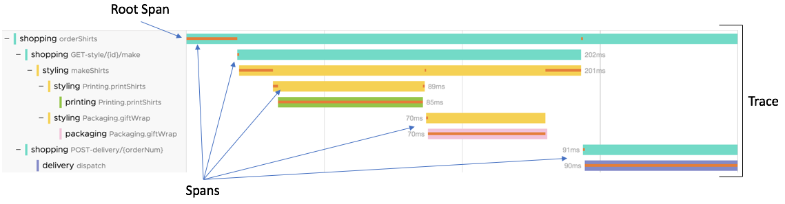

## Preamble

I keep hearing the term *observability* thrown around a lot, often used in the wrong context. Working in Cybersecurity, I think people often confuse the idea of observability with blue team operations, particularly SOC analysts sifting through large volumes of data to find a needle in a haystack. Although there is a fair few cross-cutting concepts, and a lot of *synergies* (cringe word) between the two, I'm hoping this post provides a brief overview of observability engineering to help others avoid misconceptions and encourage food for thought.

I'm a big fan of [Thomas Stringer's blog](https://trstringer.com/), and in particular his posts on [Observability with OpenTelemetry](https://trstringer.com/otel-part1-intro/), which first introduced me into the Observability Engineering by Charity Majors, Liz Fong-Jones and George Miranda.


Nowadays, you can pick up a [free digital copy of Observability Engineering directly from Honeycomb](https://www.honeycomb.io/wp-content/uploads/2022/05/Honeycomb-OReilly-Book-on-Observability-Engineering.pdf) (the co-founder of Honeycomb wrote the book).

What I'm going to try and do here, is condense **some** the information from these rich sources of information, into a bitesize (a big bite, mind) snippet, but with a focus on understanding the *what*, rather than the *why* or deep into the *how*.

I think in a follow-up post, I'll explore more *security* related aspects of Observability.

## Observability in a nutshell 🥜

Observability is the ability to interrogate any behaviour in <ins>**your applications**</ins> without shipping any new code to debug something that's happened. I want to stress **your** and **applications**. It (typically) has to be applications that you fully control.

But even more than that, observability engineering techniques and tooling address difficulties in monitoring *distributed systems*. If you're running a monolith, or don't use microservices, or only integrate with a few other services, then some of the observability engineering technologies *might* not help you.

For an observable system, you need to upgrade the way you "log" information, which means *instrumenting* (enriching) your code with **a lot more** context as to what's going on.

Observability is not debugging your code, you still need a debugger for that. *"Observability is for figuring out **where** in your systems to find the code you need to debug."*

With observability engineering, there are **three** types of information to help with that:
- Metrics
- Logs
- Traces

Each one of these types of data is likely to end up in its own analysis tool. That means that even once you've instrumented your applications, you may need to upskill in **three different** analysis tools.

Observability engineering defines these analysis tools like so:
> Observability tools pull high-cardinality, high-dimensionality context from telemetry
data into a single location where investigators can easily slice and dice to zoom in,
zoom out, or follow breadcrumbs to find definitive answers

From what I've seen, the only **single tool** out there is premium software, which the author co-founded ([https://www.honeycomb.io/](https://www.honeycomb.io/)). 

Popular and open-source alternatives include [prometheus](https://github.com/prometheus/prometheus) for metrics, [Grafana Loki](https://grafana.com/products/cloud/logs/) or [ELK stack](https://www.elastic.co/elastic-stack) for your logs and [Jaeger](https://www.jaegertracing.io/) for traces.

## Metrics
Metrics are nothing new ([SNMP came out in the 80s](https://datatracker.ietf.org/doc/html/rfc1067)), are extremely common, and are typically represented as timeseries data. For example, at 13:24:31, the server's memory capacity was at 94%.

This information can be useful to determine performance issues, but is often pretty useless on its own. It needs to be correlated with other data to identify root causes.

Metrics can also be more intelligent than that, and might aggregate other information, for example, `34ms` is the average response time for web page to load. But again, they *typically* represent something over a time period. `34ms` might be the average response time, but the sample will be taken over a period of time.

## Logs
Logs are far from a new concept; they are chronological records of events generated by applications, infrastructure, and systems. Traditionally, logs were simple, human-readable text files that were manually parsed by engineers to troubleshoot issues.

For example:
```
6:01:00 accepted connection on port 80 from 10.0.0.3:63349
6:01:03 basic authentication accepted for user foo
6:01:15 processing request for /super/slow/server
6:01:18 request succeeded, sent response code 200
6:01:19 closed connection to 10.0.0.3:63349
```
(The examples here are taken directly from Observability Engineering (page 55))

While these traditional logs were invaluable for debugging; processing and searching through logs like this is painful. Their unstructured nature made them difficult to scale and analyze in complex environments.

Structured logging like this, improves things a lot:

```
time="6:01:00" msg="accepted connection" port="80" authority="10.0.0.3:63349"
time="6:01:03" msg="basic authentication accepted" user="foo"
time="6:01:15" msg="processing request" path="/super/slow/server"
time="6:01:18" msg="sent response code" status="200"
time="6:01:19" msg="closed connection" authority="10.0.0.3:63349"
```
You can now begin query and correlate logs, to assist with investigations. But part of the issue here (and we see this a lot with SIEMS), is that the message body still requires parsing and processing to make the data queryable.

But the above information *could* be simplified into a single event, if we just used JSON straight off the bat, and improved the way we conveyed information.
```
{
"authority":"10.0.0.3:63349",
"duration_ms":123,
"level":"info",
"msg":"Served HTTP request",
"path":"/super/slow/server",
"port":80,
"service_name":"slowsvc",
"status":200,
"time":"2019-08-22T11:57:03-07:00",
"trace.trace_id":"eafdf3123",
"user":"foo"
}
```
So now you have one message, showing the same information, but its really easy to query **if** you know what to search for.

> The goal of observability is to enable you to interrogate your event data in arbitrary ways to understand the internal state of your systems.

Essentially, traditional logging data on it's own isn't good enough. It needs to be super-charged into an event, packed with as much information as possible, in particular, a unique identifier used to track a particular *request* or *action* across your many services, which leads nicely onto the third information type: Traces.

## Traces
Traces are the new kid, that complement logs and metrics to unlock the power of observability. They allow us to *trace* events (like user requests) end-to-end, across all our services.

When you hear the word traces, tell yourself **distributed traces**. AFAIK, it's not an official terminology, but I think it helps with grasping the concept. Observability engineering, and particularly ~~traces~~ distributed traces, are for end-to-end *tracing* across multiple different services within distributed systems.

For example, a single user request might traverse multiple services, databases, and infrastructure components. A trace captures the entire journey of that request, providing visibility into how each component contributes to the overall operation.

Still trying to keep it high level, a trace consists of *spans*, which are the individual units of work within a trace. A trace might *span* multiple endpoints/services, and a span is the details of a specific work unit.

A unique identifier should be attached to a trace, and all of its component parts, so the trace can be tracked across each service it touches.

[This picture](https://docs.wavefront.com/trace_data_details.html#traces) from VMware shows the concept in a concise way.



The trace contains a bunch of spans, which themselves might contain child spans. Each span represents a unit of work, like interacting with a backend system, or processing some data. Each span will have its own UUID, as well as a common attribute (trace id) with the parent span and trace.

In the above example, the trace shows the *observable* latency of a user action (shopping `orderShirts`), flowing through multiple services (`makeShirts`, `giftWrap`).

Two core bits of terminology have been mentioned already, but should be explained (even in a nutshell overview): Cardinality & Dimensionality

**Cardinality** refers to the uniqueness of values within trace data. In particular, each span within a trace should be enriched with as much *unique* data as possible, providing as much context as possible. For example, if every span just logged a username as "ashley", it will be difficult to process that specific request. Whereas, if each span used `first.lastname` (`ashley.kingscote`), then that span has higher cardinality, which makes it more useful for processing. The higher the cardinality of our observability data, the more useful it is to pinpoint specific issues, understand granular user behavior, and diagnose complex, edge-case scenarios in distributed systems.

**Dimensionality** refers to all the data packed into a trace or span. It essentially means the more data packed into a trace, the higher its dimensionality.

The dream is high-cardinality (unique data) and high dimensionality (lots of data), which enables you to track specific activity as it flows through your (distributed) systems.

You've probably seen trace Ids out in the wild before, but never paid any attention to them, for example here is a [TraceID from Microsoft](https://answers.microsoft.com/en-us/windows/forum/all/server-error-traceid-9ceht5untekrquf14777/d0e9f5ad-16c9-405e-a486-922404512eba):


Microsoft will be able to plug that TraceId into their observability tooling and be able to track that *specific* user requests end-to-end, across all their systems. They can then use that information to focus their efforts in diagnosing the issue.

To clarify:
- Metrics - much the same as always
- Logs - much the same, but supercharged!
- Traces - new, detailed information, able to track a request across **distributed** systems

## Instrumentation
I'll keep this section brief, but essentially there are some automatic instrumentation capabilities, that bind into your existing network requests and add some more information.
```
import "go.opentelemetry.io/contrib/instrumentation/net/http/otelhttp"

mux.Handle("/route",
otelhttp.NewHandler(otelhttp.WithRouteTag("/route",
http.HandlerFunc(h)), "handler_span_name"))
```
(example was taken directly from Observability Engineering (page 77))

This essentially wraps the default golang HTTP handler with OpenTelemetry, providing some basic instrumentation and enrichment to your network requests.

Alibaba Cloud recently (late 2024) released [opentelemetry-go-auto-instrumentation](https://github.com/alibaba/opentelemetry-go-auto-instrumentation), which allows you to recompile your existing go code with OpenTelemetry magic. This means that you can potentially get some observability improvements without even touching your code!

But if you want a real observable system; you're going to have to write some code that satisfies your own business logic.

Here is a high level example of some golang, enriching a web request with a bunch of otel stuff:
```
func getProductPrice(ctx context.Context, priceServiceEndpoint string, productID int) (float64, error) {
	ctx, span := otel.Tracer(telemetry.TelemetryLibrary).Start(ctx, "get_product_price")
	defer span.End()

	span.SetAttributes(attribute.Int("product.id", productID))

	resp, err := otelhttp.Get(ctx, fmt.Sprintf("%s/%d", priceServiceEndpoint, productID))
	if err != nil {
		return 0.0, fmt.Errorf("error getting price from price service: %w", err)
	} else if resp.StatusCode != http.StatusOK {
		return 0.0, fmt.Errorf("bad status code from price service: %d", resp.StatusCode)
	}

	body, err := io.ReadAll(resp.Body)
	if err != nil {
		return 0.0, fmt.Errorf("error reading response body from price service: %w", err)
	}

	product := struct {
		Cost float64 `json:"price"`
	}{}
	if err := json.Unmarshal(body, &product); err != nil {
		return 0.0, fmt.Errorf("error unmarshalling price service response: %w", err)
	}

	return product.Cost, nil
}
```
In the above example (taken from [Thomas Stringer's otel-shopping-cart example](https://github.com/trstringer/otel-shopping-cart/blob/main/cmd/cart/main.go#L308)), you can see that a span is *instrumented* (enriched) with the `produceID`, added to the `product.id` attribute.

Lots of the observability (specifically OpenTelemetry) examples are in Golang, because many microservices (for distributed systems) are written in Golang.

## The Result
Really, the only new thing here is instrumenting your code with as much context as possible, and the idea of distributed traces.

You may have concluded that the ambitions of these concepts likely result in a *lot* of data being stored. You'd be right, its difficult to store, index, and query these large and rich datasets efficiently.

Observability engineering sounds glamourous, but the reality is that it's an awful lot of work, and even if you had all your applications instrumented, there are still aspects you can't really control or monitor. 

To get the most out of it, you'll need deep pockets. From instrumenting the code, managing the services, managing the observability tooling or paying for premium tooling, there is a not-insignificant cost to deploying and managing all of this shiny tech.

There is a lot of free tooling out there, and OpenTelemetry itself is part of that. But even deploying and maintaining your own Jaeger, ELK and Prometheus services is a lot of work, let alone learning and using them to extract the value of the instrumentation. 

Whether it's the significant development overhead in instrumenting your apps, it's then managing more (open source) tools and the vast amounts of data they need, or you use a premium off-the-shelf tool (like honeycomb).

Observability has some fantastic ideas, but I don't see how its feasible for small businesses to implement. You've got to be running distributed services at scale.

I really have only touched the surface here, and encourage everyone to read [Observability Engineering](https://www.honeycomb.io/wp-content/uploads/2022/05/Honeycomb-OReilly-Book-on-Observability-Engineering.pdf), and get the additional information on why and how that i've omitted.
