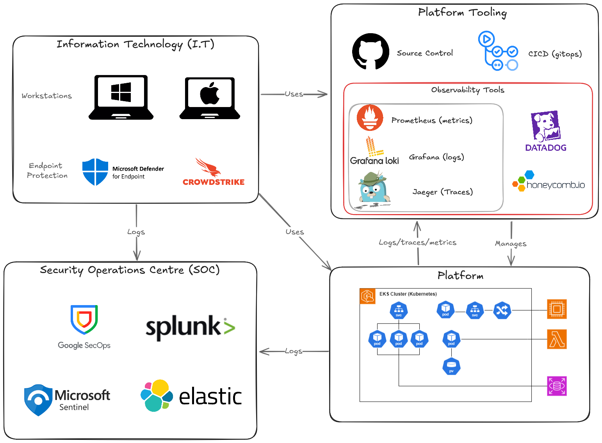

## TL;DR
- Observable systems can support a security function but are distinctly different.
- Buzzword cloud "observability" tooling typically only covers either VMs or Linux-based systems such as Kubernetes. eBPF has some limitations to be aware of.
- Everyone uses a SIEM for the same thing, but there are dozens of products and query languages. I think AI will kill the competitiveness, and hopefully the industry will focus on getting *good data in*, as getting *good information out* can be achieved with AI.

## Introduction
My [observability in a nutshell post](https://akingscote.co.uk/posts/observability-in-a-nutshell/) hopefully clarified the concepts behind the buzzword "observability engineering". It's about instrumenting **your applications** to emit or derive traces/logs/metrics, so that you can interrogate your distributed systems to then debug platform issues.

This post explores of some of the cross-cutting concepts between observability engineering and how it can help with cyber security. 

I touch upon some of the overlaps and distinctions between logs/metrics/traces for observability and logs/metrics for your Security Operations Centre (SOC) and its Security Information and Event Management (SIEM) tools.

I'd also like to share my personal observations on the direction that detection engineering is moving towards, and where lessons from observability engineering could be applied.

Finally, I'd like to explore observability engineering and the use of eBPF for security. I'd like to explain these concepts at a high level, and how they can help with securing Linux-based systems, as well as call out some of the limitations and the potential snakeoil products out there.

## Scene Setting
In my mind, there are at least four components that require their own distinction.

Firstly, there is our Information Technology (I.T). This includes workstations, on-premise servers, active directory, kerberos, WSUS servers, email servers and the likes. These devices are prime targets for threat actors, as they can contain valuable data, or can provide the initial access into core infrastructure or platform services. This dosen't necessarily mean on-premise, but encompasses the supporting technology behind any business.



Machines such as workstations would be protected & monitored with endpoint software, such as Crowdstrike. These internal systems are often managed through central interfaces, to assist with asset management, avoid shadow I.T, and to provide timely rollout of the latest OS and software patches.

All of these systems would spit out a mountain of logs into a Security Operations Centre (SOC), running a SIEM of choice, potentially with SOAR capabilities. SOC analysts monitor these environments (potentially 24/7), and search for Indicators of Compromise (IoC), and leverage latest threat intelligence sources to search for novel threats.

There is likely to also be a product (or service) that the company creates. The I.T systems are used to access these platform systems, to help build and manage the services, and to enable the business to function.

As we know from the previous post, these *incredibly complex* and complicated platform services can implement observability engineering concepts to minimize downtime and help diagnose issues as soon as possible.

Often, organisations have dozens of tools to assist in standing up the platform. Nearly all organisations will have source control and some kind of CICD pipelines to manage the platform. These are also prime targets for cyber attacks (supply chain attacks, leaked keys etc...).

In the incredibly simple architecture above, i'm trying to draw the distinction between observability tooling, and SOC tooling. Your platform will have security related logs, which will be required to feed into your SOC (e.g. who is accessing S3 buckets), but the SOC is also very interested in the I.T logs. I.T can host valuable services, or it can also be an attack vector for initial access, allowing for lateral movement to the platform, or privilege escalation.

Where it can get confusing, is the overlap between the SOC and observability tooling, and the need for all these different tools.

## Observability & Security Monitoring
On the surface, the requirements for observability and a SIEM look incredibly similar.

I want to be able to find this piece of information, from this huge set of data.

> They are so similar, that you can even use some of the same tools. Elastic is used as a SIEM and can also used as part of the ELK (Elastic, Logstash, and Kibana) for observability engineering!
{: .prompt-info }

The key difference is that observability engineering has a SRE focus, and has the luxury of being able to control the incoming data. Security monitoring doesnt have that luxury and has to complete a similar requirement, but with much poorer data. You simply do not control the level of granularity of data coming from your operating systems, or cloud services.

That being said, if your company does have a product, and has deployed an observable system, it can help with security. These two quotes from [Observability Engineering](https://www.honeycomb.io/wp-content/uploads/2022/05/Honeycomb-OReilly-Book-on-Observability-Engineering.pdf) help with that distinction.

> While they are related, the difference between an observability tool and a debugger is an order of scale; like a telescope and a microscope, they may have some overlapping use cases, but they are primarily designed for different things.

> Observability is not for debugging your code logic. Observability is for figuring out where in your systems to find the code you need to debug. Observability tools help you by swiftly narrowing down where problems may be occurring. From which component did an error originate? Where is latency being introduced? Where did a piece of this data get munged? Which hop is taking up the most processing time? Is that wait time evenly distributed across all users, or is it experienced by only a subset? Observability helps your investigation of problems pinpoint likely sources.

This reminds me of the [2024 xz backdoor](https://boehs.org/node/everything-i-know-about-the-xz-backdoor), where Andres Freund noticed SSH was taking longer than usual. He saw that there were a few more errors (valgrind logs), and `ssh` was using up a lot of CPU, and essentially was able to use that information to thwart a huge cyber attack.

With observable systems, you have the ability to slice and dice data, ask difficult questions and correlate data. Observability engineering enables engineers to be curious, and do what they do best; ask questions and solve problems. This translates so well for security teams, by providing a capability that typically just dosen't exist, or at least is very inaccessible.

An observable system helps your security function, by providing a jumping-off point. Determining the impact of an incident is often incredibly challenging. But being able to identify which users interacted with a specific database shard,  understand how many users are susceptible to a particular (platform) issue, or assess the number of users affected by downtime is immensely valuable.

> Metrics are pretty much identical for security monitoring and observability. In fact, the mechanism to gather this information is synonymous, it's historically always been SNMP which has been around [since the 80s](https://datatracker.ietf.org/doc/html/rfc1067). The difference in the context. Rather than noticing that our application is slow, and using metrics to confirm a hypothesis, a metric for security might be the starting point. Why is this machine's memory really high, or above normal? With modern security monitoring tools (like eBPF, which i'll get onto later...), you don't need SNMP and can gather CPU usage, network latency, and I/O operation metrics straight from the Linux kernel with minimal overhead.
{: .prompt-tip }


## Good data in the SIEM is hard
The biggest challenge that SIEM tools have, is having control over the logging dimensionality and formatting.

A SIEM will have an interest in any logs which might be useful from a security perspective. This is across both any platform/cloud environments and internal I.T systems.

Some services out there, simply do not offer a low-enough level of insight into their operation. 

How do I get my unstructured IIS logs or unstructured Windows Security Events from this:
```
2025-02-23 21:45:10 ::1 GET /getuser - 80 - ::1 Mozilla/5.0+(Windows+NT+10.0;+Win64;+x64)+AppleWebKit/537.36+(KHTML,+like+Gecko)+Chrome/52.0.2743.116+Safari/537.36 - 500 0 0 5502
```
into a format where I can query its individual components with my SIEM query language?

The answer is processing the data, with string parsing, spliting, datatype conversions, and maybe the odd regular expression. This type of processing is **so common**. Surely most organisations need to query their Windows logs in their SIEM?

> Kusto Query Language (KQL) from Microsoft offers a [`parse` operator](https://learn.microsoft.com/en-us/kusto/query/parse-operator), which involves crafting overly complex queries, to *parse* data and pack results into columns. It's gross 🤮
{: .prompt-info }

This is just one specific example; but the SIEM is plagued with preprocessing unstructured (and even structured) data, to get it into a usable format. From Apache server logs, Sysmon logs, SSH logs, Windows logs to more modern structured logs like Cloudtrail logs; it's still a challenge to get the data into a processable format. In comparison, observability tooling dosen't have this issue, as a properly engineered observable system can be ~~programmed~~ instrumented to provide high-dimensionality data. 

## Future of SIEMs
Anecdotally, I've been planning to improve my knowledge around [regular expressions](https://www.regular-expressions.info/), particularly as they are useful for extracting and parsing text data like unstructured logs. It's been on my TODO list for literally years. The other month, I finally started that journey, and I realised that it's really not worth the effort, especially as I am basically Homer Simpson:


The reason is, I find that I can simply just ask AI to get me *close enough* to the answer. Regular expressions are inherently inefficient, so why do I care about crafting a *perfect* expression. CPU and memory is cheap; time isn't.

For SIEMs, its all about getting quality data in; and getting quality information out. The way we *extracting* information from the SIEM, is a case of crafting queries in various proprietary languages. They all have the same purpose, but each SIEM vendor has created their own language to force vendor-lock in and protect their bottom line.

The situation is untenable. Just look at how many languages there are, to do effectively the same thing!
- [Kusto Query Language (KQL)](https://learn.microsoft.com/en-us/kusto/query/?view=microsoft-fabric) (Microsoft)
- [Kibana Query Language (KQL)](https://www.elastic.co/guide/en/kibana/current/kuery-query.html) (Kibana)
- [Elasticsearch Query Langauge ESQL](https://www.elastic.co/blog/getting-started-elasticsearch-query-language) (Elastic)
- [YARA-L](https://cloud.google.com/chronicle/docs/detection/yara-l-2-0-overview) (Google SecOps)
- [Search Processing Language (SPL)](https://docs.splunk.com/Splexicon:SPL) and [Common Information Model (CIM)](https://docs.splunk.com/Documentation/CIM/6.0.2/User/Overview) (Splunk)
- [Event Query Language (EPL)](https://www.elastic.co/guide/en/elasticsearch/reference/current/eql.html) (Elastic)
- [Ariel Query Language (AQL)](https://www.ibm.com/docs/en/SS42VS_7.4/pdf/b_qradar_aql.pdf) (IBM QRadar)
- [CrowdStrike Query Language (CQL)](https://library.humio.com/data-analysis/syntax.html) (CrowdStrike Falcon LogScale (formerly Humio))
- [Sigma Rules](https://github.com/SigmaHQ/sigma)

Then you've also got database querying with SQL, MongoDB/CouchDB query languages, as well as things like [querying in Datadog](https://docs.datadoghq.com/tracing/trace_explorer/query_syntax/), or [querying in Honeycomb](https://docs.honeycomb.io/investigate/query/build/), and malware detection rules like [yara](https://virustotal.github.io/yara/).

It can't just be me that thinks this whole ecosystem is lost. A lot of these languages are trying to achieve the exact same goal; extracting information from logs. It reminds me of this [famous xkcd](https://xkcd.com/927/):


But like with my regular expression experience, nowadays I can just ask my favourite AI chatbot to craft me a query to get me *close enough*. In the past, I've spent months mastering learning KQL, which I now feel is wasted. If I don't touch a technology regularly; my skillset fades and I question the long-term value behind that learning exercise.

Even Google SecOps has Gemini built into the SIEM search webpage:


Personally, I don't care what the SIEM is (as long as the UI is pretty and easy to use). All I want to do is extract information from my logs either manually, or on a schedule, and be alerted when something sketchy has been detected. In my experience, most of the SIEM vendors have very similar functionality; they have to. It's how they remain competitive with each other and is why there isn't a single market-dominating product.

Over the last two years, I've noticed a **significant** improvement in the quality of query language responses from AI, and it's only ever going to get better. If software engineering is becoming more obsolete, then query languages will be the first to be replaced.

My point with this rant is this: counterintuitively, I think it's much better to focus on **getting data in**, rather than on getting information out.

The situation with SIEMs isn't directly comparable to observability engineering. As mentioned numerous times, with observability engineering, you control the applications, which means you control the instrumentation and the richness of your events.

I feel that with the progression of AI, SIEMs are increasingly going to lose any competitive advantage. I don't need to learn your language and be a slave to your increasing licensing costs; I'll just move from Microsoft Sentinel to Google SecOps, and use AI to convert my KQL queries to YARA-L. It'll get me 90% of the way there and will save me £20K a month in licensing costs, without sacrificing the quality of our SOC. I also don't need to lose hours tripping up over silly synax mistakes or spend months learning your bespoke query language that has no application (or benefit to me) outside your SIEM.

In my opinion, security monitoring (SIEM) has the same challenges monitoring distributed systems, but without the ability to fix it. You don't control the source. You dont control Windows logs or firewall logs. Its not like we can instrument those logs, which means we are forced to use pre-processors, parsers and write [excessively long queries](https://github.com/Azure/Azure-Sentinel/blob/master/Solutions/Windows%20Security%20Events/Analytic%20Rules/PotentialFodhelperUACBypass.yaml#L35). 

We end up missing a lot of insight because these queries are so specific. No matter how generic you write the query, you don't get the flexibility that observability engineering solutions offer.

With observability engineering, you can ask **any** question.
> Show me how many Chrome users accessed the webpage at a certain time that had a 90ms response time whilst <some other> platform activity was happening

Imagine if we had the ability to (easily) ask something similar in SIEM!

Although it's *technically* possible to ask those kind of questions, the reality is you don't control the infrastructure (logs might just not appear, or can get lost in the void), or the logs just don't exist. For example, [only last year were Microsoft Graph generally logs available](https://techcommunity.microsoft.com/blog/microsoft-entra-blog/microsoft-graph-activity-logs-is-now-generally-available/4094535); and even then they aren't particularly granular. You literally can't query for the information because it dosen't exist. 

I write cyber labs for a living. I've created realistic cloud security cyber scenarios, and captured all the logs, and it's **impossible** to recreate the attacking scenario solely through the logs - and that's when I wrote the attack myself! I've had scenarios where I'm using Microsoft Azure firewalls, key vaults, VMs, and it's literally impossible to track user activity end to end through the systems.

There is progress in bridging the gap, with tools such as eBPF. But as I'll explain shortly, that's still going to have some significant shortfalls.

What further complicates things, is when you have SIEMs like [Google SecOps](https://cloud.google.com/chronicle/docs/ingestion/use-bindplane-agent#bp-console), using the Bindplane Agent for log ingestion. The Bindplane agent is an [OpenTelemetry connector](https://github.com/observIQ/bindplane-otel-collector) which to be fair, does provide enriched data. But thats only for VMs. Your SIEM might have *some* observability-looking data, but how much of a cloud environment is VMs? I'd wager < 50% in most organisations.

So in this case, you have a SIEM (for the SOC), ingesting logs for security (✔), but also sending telemetry data into a tool which isn't not really designed for (❌). Is the SIEM trying to move into the observability domain? Personally, I think it's muddying two separate concepts. Observability data should go into your observability tools, and security logs into the SIEM.

/rant

## Kubernetes, eBPF & Observability
I feel the need to talk a bit about Kubernetes specifically and give a high level explanation of all these terms.

Its as simple as this: **Kubernetes is container orchestration. Containers are inherently Linux-based; Linux namespacing is used to *contain* processes. extended Berkeley Packet Filter (eBPF) is (predominantly) a Linux kernel feature; allowing syscalls and network traffic to be blocked or monitored with minimal overhead.**

This extremely powerful technology means that anything Linux-based and has super-charged monitoring **and** security, by simply blocking sketchy-looking syscalls.

I'd wager that most product-led organisations have adopted Kubernetes or at the very least, use containers. Any time containers or Kubernetes is used, this technology can be used.

A lot of companies promote security observability with eBPF. But again, that will only really work for **your** applications, or Linux-based services. Cloud providers don't provide that low level of control or visibility for **their** services, such as AWS RDS or AWS Lambda. You can deploy it on your clusters or maybe your VMs, which is great; but it's not going to help with your managed database service, or for your serverless function invocations through your cloud provider.

> I wonder if we will start to see the migration away from cloud provider-managed database services (e.g. AWS RDS), and greater adoption of Kubernetes database operators, such as the [MariaDB operator](https://github.com/mariadb-operator/mariadb-operator). As the eBPF monitoring and security tooling matures, this would enable much better control and insight into your database operations, than using a managed service. Of course the administrative overhead may be higher, but these operators remove a lot of that traditional burden of managing your own database.
{: .prompt-tip }

As well as that, it dosen't really touch the I.T component. The endpoint device management can potentially tap into eBPF, but how many enterprise organisation allows people to run Linux devices? I'm sure some endpoint vendors have their own proprietary equivelants, but taking a standardised, open-source approach is nearly always better for the consumer.

It's worth mentioning that there is [eBPF for Windows](https://github.com/microsoft/ebpf-for-windows) which is gaining traction, and there is also some limited eBPF functionality for macOS, although Apple historically lock down their internals as much as possible.

I think that these same concepts will make their way to the **I.T** world, and into the SIEMs. Most on-premise machines are either Windows or Linux; and if we can use eBPF tooling to monitor **and** protect devices.

### Limitations of eBPF for security monitoring
This fantastic talk "Commencement into Real Kubernetes Security" by Jay Beale and Mark Manning, from ShmooCon2025, explains that these runtime analysis tools can fall short even with these low level (eBPF) monitoring and security blocking.

<iframe width="560" height="315" src="https://www.youtube.com/embed/MTW4QMKSyGI?si=E7a6gQqVSguZ_ZRp&amp;start=558" title="YouTube video player" frameborder="0" allow="accelerometer; autoplay; clipboard-write; encrypted-media; gyroscope; picture-in-picture; web-share" referrerpolicy="strict-origin-when-cross-origin" allowfullscreen></iframe>

Say eBPF *detects* a system call to open `/tmp/test` (Time of Check (TOC)), it's possible (via `ptrace` which is an administrative action) to manipulate system calls so that the actual request is opening a different file, such as `/etc/shadow` (Time of Use (TOU)). So the eBPF monitoring is too late, it's been bypassed and it's not actually able to block that call. The way around it is to compare the initial call open (`/tmp/test`) to any subsequent calls.

I'd highly encourage everyone to watch the video from the linked timestamp, as Mark Manning does a much better job of explaining it than I do.

My point here is that these fancy runtime security tools, that help improve your "observability" can be limited. They are often eBPF based which is a fantastic tool, but even then do not guarantee complete security insight.

## Summary
I hope that I've explained some concepts and overlaps and that you've learned something from these late night ramblings.

> I've had seven black coffees and I feel like i'm really nailing it

<iframe width="560" height="315" src="https://www.youtube.com/embed/IDbMluwpHZQ?si=TjLKdCohsTBRDvWm&amp;start=32" title="YouTube video player" frameborder="0" allow="accelerometer; autoplay; clipboard-write; encrypted-media; gyroscope; picture-in-picture; web-share" referrerpolicy="strict-origin-when-cross-origin" allowfullscreen></iframe>
