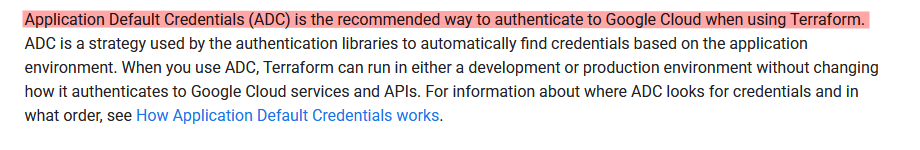
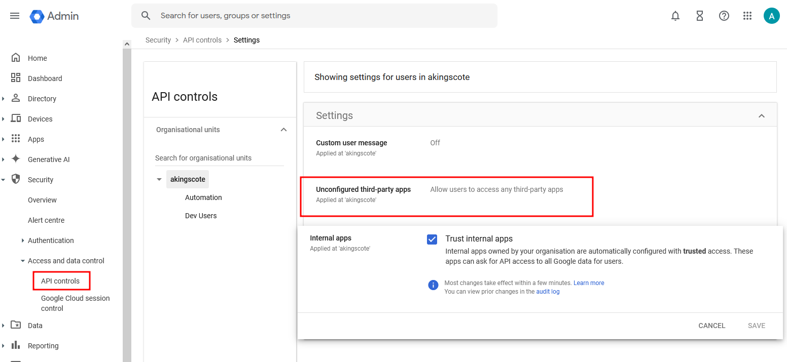
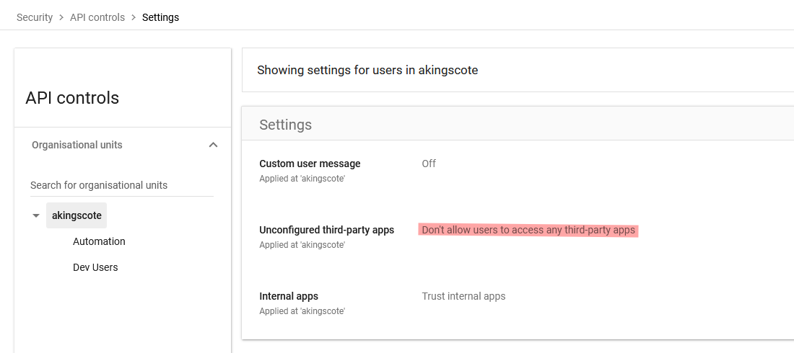
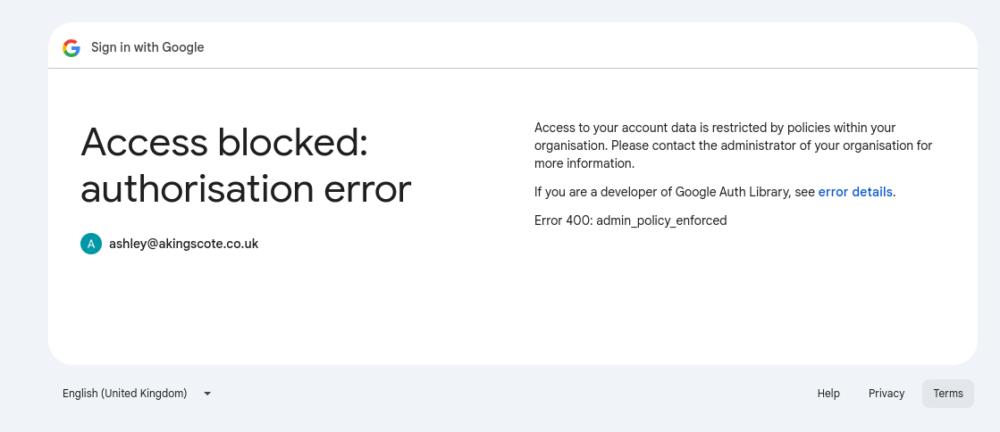
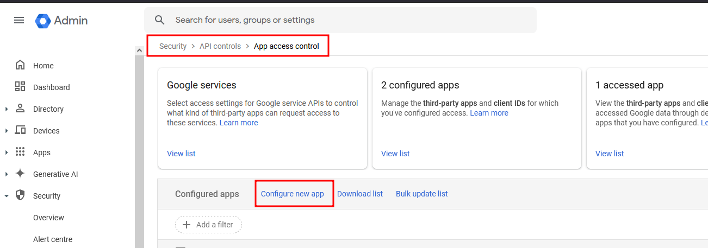
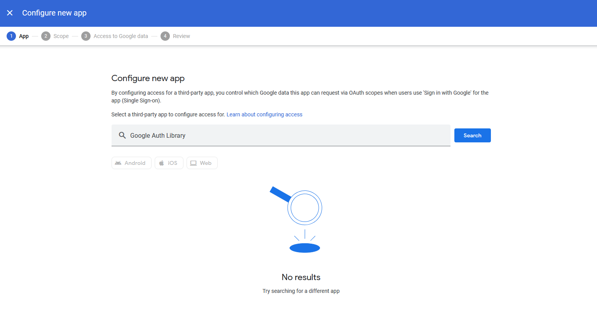
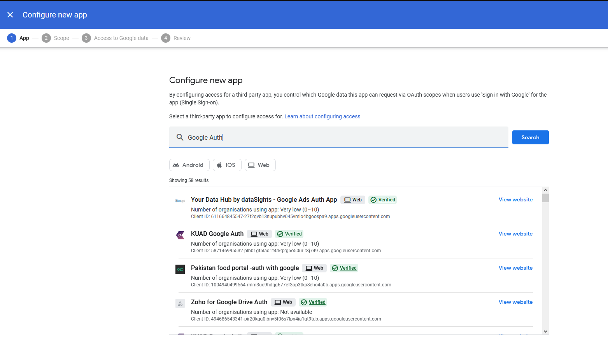
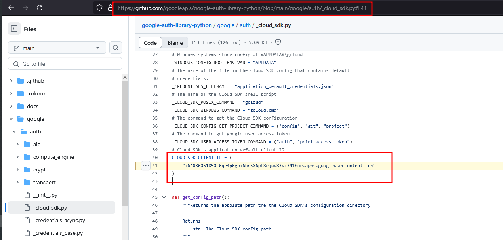
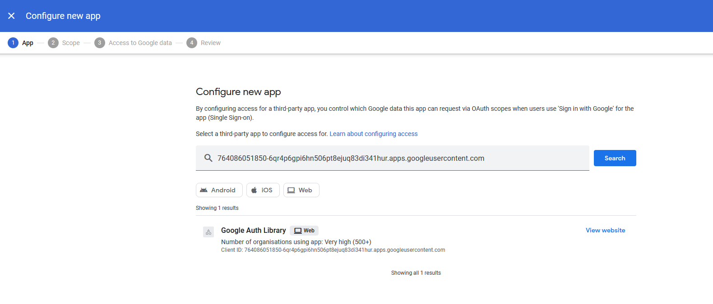
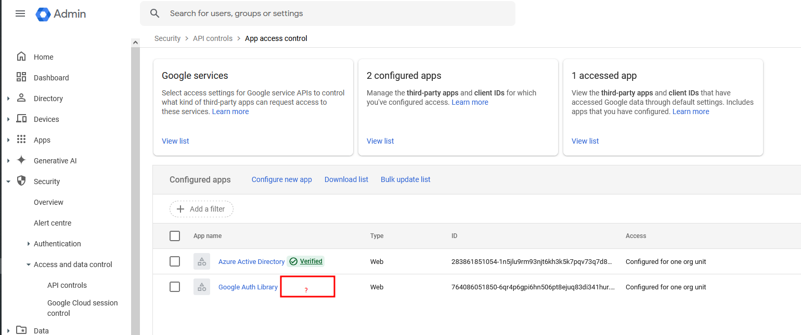

# Google Cloud - Managing Google's Unverified Authentication Library
In Google Cloud, [Application Default Credentials (ADC) allows your code/applications to automatically find and use credentials](https://cloud.google.com/docs/authentication/application-default-credentials).

For example, if writing terraform and using the official Google provider, it's [recommended to authenticate to Google Cloud using Application Default Credentials](https://cloud.google.com/docs/terraform/authentication).

When using Google Cloud Platform (GCP), you'll have to use Google Workspace or Google Cloud Identity (even if you're using federated identities).
To manage user accounts, you will use the Google Admin console ([https://admin.google.com](https://admin.google.com)).

By default, your API security settings will be configured as **Allow users to access any third-party apps**.

Perhaps for compliance reasons, or just best security practice, you may want to lock down access to third-party apps.

The problem is, the **official** application behind ADC (created by Google), is unverified and is a third party app.

If you don't allow third-party apps like so:

Then you try to use ADC (e.g. `gcloud auth application-default login`), you'll be blocked with the following:

The way around it is to explicitly allow (trust) the Google Auth Library.

In the Google admin console, go to Security -> Access and data control -> API controls and select **Configure new app**.

But good luck finding the app! If you search for "Google Auth Library", nothing will be returned:

You can find a bunch of other Google authentication apps, that **are actually verified**

but not the actual genuine Google Auth library 🙃

If you look at the [source code for the library](https://github.com/googleapis/google-auth-library-python/blob/main/google/auth/_cloud_sdk.py#L41), you can see the ID is present in there.

That is the application ID of the official Google Auth Library app: `764086051850-6qr4p6gpi6hn506pt8ejuq83di341hur.apps.googleusercontent.com`.

Searching for that full ID, will finally return something when trying to configure a new app!

You can proceed through the wizard, and configure the app as trusted within your org, whilst blocking all untrusted third-party apps.

Once it's trusted, you'll be able to use ADC!

As I understand, the reason the app dosen't appear when searching "Google Auth Library", is because the application is not verified.

If you are creating an app through Google Auth Platform, and if your app uses scopes that are sensitive, then the app will go through manual approval before it can be published externally.

Similarly, if you add a logo to an app, then it'll also be manually reviewed by Google before being published. I think the same goes for renaming an existing app that has been published.

This is a bit relieving, as it means malicious actors cannot just create and publish (or edit) a naughty app named "Google Authentication Library" without at least someone from Google actually reviewing it.

> You can't actually create an app with the name Google in it, but GCloud Authentication Library would work
{: .prompt-tip }

Anyway, I hope this was interesting as it feels very counter-intuitive to me.
