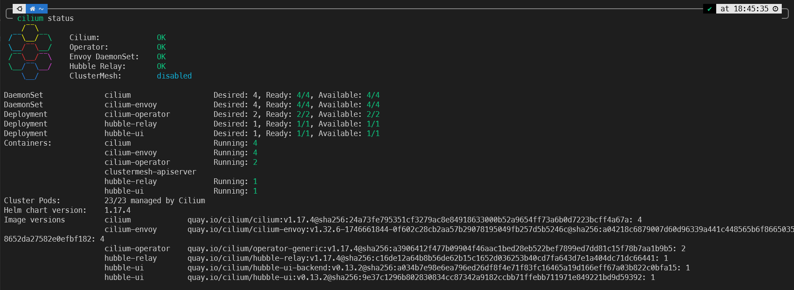

# Azure Kubernetes Service (AKS) – eBPF-based Networking & security + integration with Microsoft Sentinel
This post explores the setup and configuration of Cilium and Tetragon in Azure Kubernetes Service and integrating & monitoring with Microsoft Sentinel.

Essentially, it does what [this blog from Isovalent](https://isovalent.com/blog/post/microsoft-and-isovalent-bring-ebpf-based-networking-to-azure) talks about, but for free 💲💸💰

> For some reason, that blog includes a screenshot from Elastic, rather than Microsoft Sentinel 🙃
{: .prompt-info }

The end result is something like this:
TODO

All the lab terraform is available here. Deployment takes about 30 minutes unfortnately, as discussed in detail within the blog. I've intentionnally written verbose terraform, so you can easily pick parts out for your own deployments.

I'm not going to talk about eBPF in detail; I'll likely cover that in a complementary talk or blog in the future. It's also not meant to be a deep dive into cilium or tetragon, or Microsoft Sentinel; but rather a light touch on all of them together.

# Sexy Security Stuff
The headlines are this:

1. Cilium is so outrageously good
  - I can [replace kube-proxy](https://cilium.io/use-cases/kube-proxy/) (iptables-based) with a sexy eBPF based alternative, siginficantly improving performance
  - L7 inspection with envoy - meaning I can check headers and shit on my infra using eBPF 🔥
  -  It's got native wireguard/ipsec termination
  - complete observability out the box; easy integration with managed services such as promethues (metrics) and grafana and xxx (traces)
2. Tetragon - I feel like this deserves more hype
  - I can block syscalls without hardly any perforamnce overhead
  - I can block network calls without much performance overhead
3. I can integrate all this with Microsoft Sentinel and build a SOC on steriods. We all know SIEMs need data - with this blog I'll give you more data that you ever need.

It blows my mind, that with open-source technology and a laptop, I can build a cluster on steroids with decent observability, and configure a SIEM with super rich and useful infromation/context.

I'd like to talk about eBPF and its uses for netwokring and security

Networking (SRE) -> how powerful cilium is:
- what it is and how it works
- nuances and setup on AWS
- observability tooling and integration
- debugging a SRE issue with hubble
- prometehus and grafana built in capabilities (no need for managed services)
- Layer 7 capabilities and how it works (envoy), demo using headers and secrets integraton (keyvault)

Tetragon
- what it is how it works
- its capabilities
- examples

Then talk about how tetragon is for security, so we want that integrated into Microsoft Sentinel
- but i also want *some* cilium stuff integrated into sentinel
- integration (container insights) and nuances
- alerts
- custom


# Structure
There is a lot to this blog, this is the structure 

# Container Network Interface (CNI)
A CNI (Container Network Interface) is a plugin-based framework that lets you configure networking for your clusters containers. It defines how your pods get IPs, talk to each other, and connect to outside networks. The CNI handles all the low-level stuff like assigning IPs, setting up routing, and enforcing network policies.

By default, cloud platforms like Azure provide their own CNI ([Azure CNI](https://learn.microsoft.com/en-us/azure/aks/azure-cni-overview)), but "Bring Your Own CNI" (BYOCNI) lets you swap it out for something like Cilium, Calico, or Flannel. This can lead to better performance and advanced security features but it means you've gotta manage it yourself.

# Azure CNI Powered by Cilium
There is also ["Azure CNI Powered by Cilium"](https://learn.microsoft.com/en-us/azure/aks/azure-cni-powered-by-cilium) (catchy name) which sounds like a great way to get the benefits of Cilium, without the pain of setting it up or managing it.

But you should know that "Azure CNI Powered by Cilium" has a **very** limited capability. Pretty much all of the cool and powerful security features are not available, unless you pay for the enterprise version.

|            | Azure CNI Powered by Cilium | Isovalent Enterprise for Cilium |
|------------|-----------------------------|---------------------------------|
| **Cilium** | ✔| ❌|
|Network Routing (CNI)| ✔| ❌|
|Identity-based Network Policy (Labels, CIDR) | ✔| ❌|
|Load-Balancing (L3/L4)| ❌| ✔|
|Advanced Networking (BGP, Multi-Homing, SRv6, Bandwidth Management, ...)| ❌| ✔|
|Advanced Network Policy (DNS, L7, TLS/SNI, ...)| ❌| ✔|
|Cluster Mesh (Routing, Load-Balancing, Service Discovery, Policy, Overlapping PodCIDR  Support)| ❌| ✔|
|Transparent Encryption (Wireguard & IPsec)| ❌| ✔|
|Multicast| ❌| ✔|
|Egress Gateway| ❌| ✔|
|Egress Gateway High Availability| ❌| ✔|
|DNS Proxy| ❌| ✔|
|DNS Proxy High Availability| ❌| ✔|
|Ingress & Gateway API Support| ❌| ✔|
|Encapsulation Support (VXLAN & GENEVE)| ❌| ✔|
| **Cilium Service Mesh** ||
| Service Mesh (eBPF & Envoy, sidecar-free) | ❌| ✔|
| Canary Rollouts, Retries, Rate Limiting | ❌| ✔|
| L7 Load-Balancing | ❌| ✔|
| OpenTelemetry, Prometheus, Grafana Support | ❌| ✔|
| **Hubble - (Network Observability)** ||
|Hubble Network Observability (TCP, UDP, SCTP, DNS, HTTP, gRPC, TLS, ...)| ❌| ✔|
|Prometheus, Grafana, OpenTelemetry, Fluentd export| ❌| ✔|
|Service & Tracing Map| ❌| ✔|
|SIEM Integration| ❌| ✔|
|Timescape - Historic Flow/Tracing Data & Analytics| ❌| ✔|
|RBAC| ❌| ✔|
| **Tetragon** ||
| Security Observability (Process, Syscall, File, Network, ...) | ❌| ✔|
| File Integrity Monitoring (FIM) | ❌| ✔|
| Combined Network & Runtime Visibility | ❌| ✔|
| Real-Time Enforcement | ❌| ✔|
| SIEM Integration | ❌| ✔|
| Timescape - Historic Security Visibility & Analytics | ❌| ✔|

One of the other biggies for me, was the fact that [Hubble isnt supported!](https://github.com/Azure/AKS/issues/3978). I think thats one of the coolest benefits to using cilium!

If you couple that with some of the limitations set out in the [Azure documentation](https://learn.microsoft.com/en-us/azure/aks/azure-cni-powered-by-cilium#limitations):
- Available only for Linux and not for Windows.
- Cilium L7 policy enforcement is disabled

I really question why anyone would bother with the free version, when it's not *that bad* do set this up manually - as we will get into.

# Deployment Architecture
So we need to deploy an AKS cluster in Bring your Own CNI mode, and install Cilium ourselves via helm - that should be ezpz.
But there are a few workarounds to make you aware of.

By default your cilium (+ hubble) installation wont install on any system nodes, as it's not a critical resource. You'll also need to make sure you have more than one node, or [cilium will show one of the operators in a pending state](https://github.com/rancher/rke2/issues/933). In this demo code, I've opted for two system nodes (deployment to the `kube-system` namespace), and two user nodes **and** i've forced the installation on the system node (check out the flags on the helm install terraform).

By default, AKS will deploy the `kube-proxy` `Daemonset`, and you [can't deploy AKS without it](https://github.com/Azure/AKS/issues/4563). It's a seperate operation to disable and then replace the kube-proxy. 

The [way around it](https://medium.com/@amitmavgupta/installing-cilium-in-azure-kubernetes-service-byocni-with-no-kube-proxy-825b9007b24b) is to firstly enable the `aks-preview` extension in your subscription:
```
az extension add --name aks-preview
```

and register the `KubeProxyConfigurationPreview` feature
```
az feature register --namespace "Microsoft.ContainerService" --name "KubeProxyConfigurationPreview"
az provider register --namespace Microsoft.ContainerService
```

Then you can use the following JSON and update the cluster: `az aks update -g myResourceGroup -n myAKSCluster --kube-proxy-config kube-proxy.json`
```
{
  "enabled": false,
  "mode": "IPVS",
  "ipvsConfig": {
    "scheduler": "LeastConnection",
    "TCPTimeoutSeconds": 900,
    "TCPFINTimeoutSeconds": 120,
    "UDPTimeoutSeconds": 300
  }
}
```

> Don't worry, all of this (except feature registration) is baked into my ~~hacky~~ delightful terraform
{: .prompt-info }

Once `kube-proxy` is disabled, we can finally install cilium via helm, with the `kubeProxyReplacement` flag set to `true`.

Replacing the `kube-proxy` is an important prerequisite in order to get the most out of cilium. Replacing it enables performance benefits, and also [Layer 7 aware traffic management](https://docs.cilium.io/en/stable/network/servicemesh/l7-traffic-management/#prerequisites). For example, we could inspect incoming HTTP headers on ingress and use it as a trivial WAF (thats another blog, I already have the PoC if anyone is interested 😉).

Ignoring the configuration of cilium and tetragon, the next step is to get the logs from them both (and general AKS logs) into Microsoft Sentinel.
I'll cover that in detail later on, but this is the architecture in a nutshell

TODO diagram

# Cilium Cli
You can [install the Cilium CLI](https://docs.cilium.io/en/stable/gettingstarted/k8s-install-default/#install-the-cilium-cli) to help debug and manage the cilium deployment (such as in)

Ensure you've updated your kubeconfig with your AKS cluster:
```
az aks get-credentials --name akingscote-production --resource-group akingscote-production-rg --overwrite-existing
```

Run `cilium status`
cilium status --wait

There is a `cilium connectivity test` but i dont recommend running it - its pretty slow to complete.

You should see the following:


## Tetragon
Tetragon is an open-source runtime security tool that uses eBPF to monitor and protect Kubernetes workloads at the kernel level via eBPF. This means it's got deep visibility into things like process execution, file access, and network activity—without needing to modify your apps and with minimal performance implications.

What really stands out to me are its real-world use cases: catching container escapes (when a process breaks out of its sandbox), spotting malicious process injections, detectubg weak TLS ciphers, and even detecting ransomware by monitoring sensitive file activity. It’s also great for uncovering stealthy network backdoors since it can trace raw TCP/UDP connections. Plus, it enforces runtime policies in real time, so you can block suspicious behavior before it causes damage.

When I first started using tetragon it honestly blew my mind. I wonder if we will move away from firewalls and towards a cilium/tetragon super stack 🤔

Tetragon exposes its insights via JSON logs and a gRPC endpoint. For this demo, we will use container insights to wrap the JSON logs and ingest them into Microsoft Sentinel.

You can [install the tetragon CLI](https://tetragon.io/docs/installation/tetra-cli/), and test the installation with:
```

```
TODO

kubectl logs -n kube-system -l app.kubernetes.io/name=tetragon -c export-stdout -f | tetra getevents -o compact --pod store-admin

# AKS Monitoring
## Container Insights
Azure Container Insights is a monitoring solution that gives you visibility into the performance and health of your Kubernetes clusters and containers. It collects metrics, logs, and events and is integrated with Azure Monitor.

There are [two methods for getting your logs](https://docs.azure.cn/en-us/azure-monitor/containers/container-insights-data-collection-configure?tabs=portal) : creating a Data Collection Rule in Azure or via a `ConfigMap` within the cluster.

> Container insights now logs to the `ContainerLogV2` table which has a much better schema (for querying), superceeding the old `ContainerLog` table.
{: .prompt-info }

With Cilium and Tetragon, we are potentially going to get **a lot** of logs coming through. One way to cut this down is to implement namespace filtering. Unfortunately, you [cannot configure namespace filtering with the DCR approach](https://docs.azure.cn/en-us/azure-monitor/containers/container-insights-data-collection-filter) for log ingestion for `ContainerLogvV2`. So if you want namespace filtering, you're pretty much forced to use the `ConfigMap` approach.

It's also worth knowing, that by default container logs are excluded from the `kube-system` namespace. As i've deployed cilium/tetragon in that namespace, i'm having to force collection via the `ConfigMap`.

Essentially, the DCR is pretty simple to setup and manage, but the ConfigMap gives you so much more useful granularity for getting your logs. There is a [decent post from Microsoft about it](https://learn.microsoft.com/en-us/answers/questions/1862055/recommendation-to-connect-log-analytic-workspace-t).

The official Azure Sentinel (Microsoft Sentinel) github repo dosent really have any KQL quries for the `ContainerLog` or `KubePodInventory` tables, which makes me think that this space is pretty immature.

[Rolf Schutten's](https://schutten.cloud/post/transition-to-containerlogv2/) blog says:
> ContainerLogV2 offers an enhanced experience, as it can be configured both through the ConfigMap and DCR (Data Collection Rule). When both are enabled the ContainerLogV2 setting of the ConfigMap will take precedence. 

What may also help your decision, is that creating the DCR with terraform just [dosent seem to work properly](https://github.com/hashicorp/terraform-provider-azurerm/issues/25671).

Regardless, I've deployed both in the exmaple code, you can you play around with it yourself.


[Container Insights will deploy the Azure Monitor agent](https://learn.microsoft.com/en-us/azure/azure-monitor/containers/container-insights-overview#agent) in your cluster.

## Azure Monitor for Containers
The wizard Thomas Stringer (who i seem to reference in nearly all my blogs ♥) has a great (but old) [post on logging for AKS](https://trstringer.com/native-azure-logging-aks/).

Previously, you'd install the [Operations Management Suite](https://github.com/microsoft/OMS-Agent-for-Linux) in the cluster, which would create a DaemonSet (omsagent) and a Deployment (omsagent-rs) and send the output to your workspace.

Container Insights has largely superceeded this functionality.

## Microsoft Sentinel


# Testing installation


# Integration with Microsoft Sentinel


# Demonstration

For this demonstration, i've opted to deploy the [AKS petstore demo](https://github.com/Azure-Samples/aks-store-demo).
You can see from the following output, that `kube-proxy` is not present, that the Azure Monitor Agent (`ama`) is pretty happy and that Cilium, Hubble, Envoy and Tetragon are all successfully deployed (albiet in the `kube-system` namespace).
```
$ kubectl get pods --all-namespaces
NAMESPACE     NAME                                            READY   STATUS    RESTARTS       AGE
kube-system   ama-logs-2pnj5                                  3/3     Running   0              144m
kube-system   ama-logs-5hhj6                                  3/3     Running   0              144m
kube-system   ama-logs-g6wpv                                  3/3     Running   0              144m
kube-system   ama-logs-rs-59647f4ddb-kjstm                    2/2     Running   0              144m
kube-system   ama-logs-z8mk6                                  3/3     Running   0              144m
kube-system   ama-metrics-5797ddddc8-d29cq                    2/2     Running   0              98m
kube-system   ama-metrics-5797ddddc8-glgc5                    2/2     Running   0              98m
kube-system   ama-metrics-ksm-8fbf76b85-lcnqc                 1/1     Running   0              98m
kube-system   ama-metrics-node-2fzxs                          2/2     Running   0              98m
kube-system   ama-metrics-node-cjqpj                          2/2     Running   0              98m
kube-system   ama-metrics-node-g2df9                          2/2     Running   0              98m
kube-system   ama-metrics-node-lnsdl                          2/2     Running   0              98m
kube-system   ama-metrics-operator-targets-68fc7758ff-sxhz5   2/2     Running   2 (98m ago)    98m
kube-system   cilium-envoy-2jbvz                              1/1     Running   0              144m
kube-system   cilium-envoy-5wpxx                              1/1     Running   0              144m
kube-system   cilium-envoy-8f8dr                              1/1     Running   0              144m
kube-system   cilium-envoy-92q46                              1/1     Running   0              144m
kube-system   cilium-ghl78                                    1/1     Running   0              144m
kube-system   cilium-node-init-62wvg                          1/1     Running   0              144m
kube-system   cilium-node-init-9zm4g                          1/1     Running   0              144m
kube-system   cilium-node-init-hmt47                          1/1     Running   0              144m
kube-system   cilium-node-init-jgpvf                          1/1     Running   0              144m
kube-system   cilium-npfq4                                    1/1     Running   0              144m
kube-system   cilium-operator-54bc9947f4-klcvm                1/1     Running   0              144m
kube-system   cilium-operator-54bc9947f4-pl8g5                1/1     Running   0              144m
kube-system   cilium-t7bdc                                    1/1     Running   0              144m
kube-system   cilium-zxdcc                                    1/1     Running   0              144m
kube-system   cloud-node-manager-45hrd                        1/1     Running   0              146m
kube-system   cloud-node-manager-5xzln                        1/1     Running   0              146m
kube-system   cloud-node-manager-84fst                        1/1     Running   0              165m
kube-system   cloud-node-manager-kqq9v                        1/1     Running   0              165m
kube-system   coredns-57d886c994-5ssm8                        1/1     Running   0              143m
kube-system   coredns-57d886c994-l7d5r                        1/1     Running   0              166m
kube-system   coredns-autoscaler-55bcd876cc-2vjqg             1/1     Running   0              166m
kube-system   csi-azuredisk-node-tzs7h                        3/3     Running   0              165m
kube-system   csi-azuredisk-node-xwr6g                        3/3     Running   0              146m
kube-system   csi-azuredisk-node-z44md                        3/3     Running   0              165m
kube-system   csi-azuredisk-node-ztcpj                        3/3     Running   0              146m
kube-system   hubble-relay-8676777f99-4jmmn                   1/1     Running   0              144m
kube-system   hubble-ui-6ffbd75f67-2v8gh                      2/2     Running   0              144m
kube-system   konnectivity-agent-647bc44846-k62q8             1/1     Running   0              142m
kube-system   konnectivity-agent-647bc44846-npv5l             1/1     Running   0              142m
kube-system   konnectivity-agent-autoscaler-679b77b4f-g5vmk   1/1     Running   0              166m
kube-system   metrics-server-545888cb79-mzhkw                 2/2     Running   0              140m
kube-system   metrics-server-545888cb79-t7vzd                 2/2     Running   0              140m
kube-system   retina-agent-cghgq                              1/1     Running   0              97m
kube-system   retina-agent-k8hc6                              1/1     Running   0              97m
kube-system   retina-agent-l8j7z                              1/1     Running   0              97m
kube-system   retina-agent-s2lf8                              1/1     Running   0              97m
kube-system   tetragon-4vfl9                                  2/2     Running   0              144m
kube-system   tetragon-9jrnq                                  2/2     Running   0              144m
kube-system   tetragon-bbkjp                                  2/2     Running   0              144m
kube-system   tetragon-m7q5z                                  2/2     Running   0              144m
kube-system   tetragon-operator-7fddfd8fb7-vfs9b              1/1     Running   0              144m
pets          makeline-service-586bb769df-jbq6m               1/1     Running   5 (140m ago)   143m
pets          mongodb-0                                       1/1     Running   0              143m
pets          order-service-74fbc46ddd-klqpz                  1/1     Running   0              143m
pets          product-service-65c7fc7bf-rfrtf                 1/1     Running   0              143m
pets          rabbitmq-0                                      1/1     Running   0              143m
pets          store-admin-5ffdcccd6c-gkb99                    1/1     Running   0              143m
pets          store-front-66ccf8d74d-lshhd                    1/1     Running   0              143m
pets          virtual-customer-7dbb957677-dzcjl               1/1     Running   0              143m
pets          virtual-worker-796f69dcfc-6nm7n                 1/1     Running   0              143m
```

These are the tables which have logs:
```
// search * | distinct $table
Usage
KubeEvents
ContainerLogV2
KubePodInventory
Heartbeat
```

