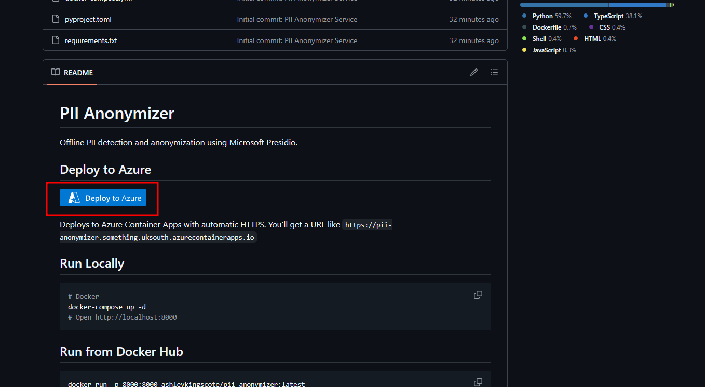
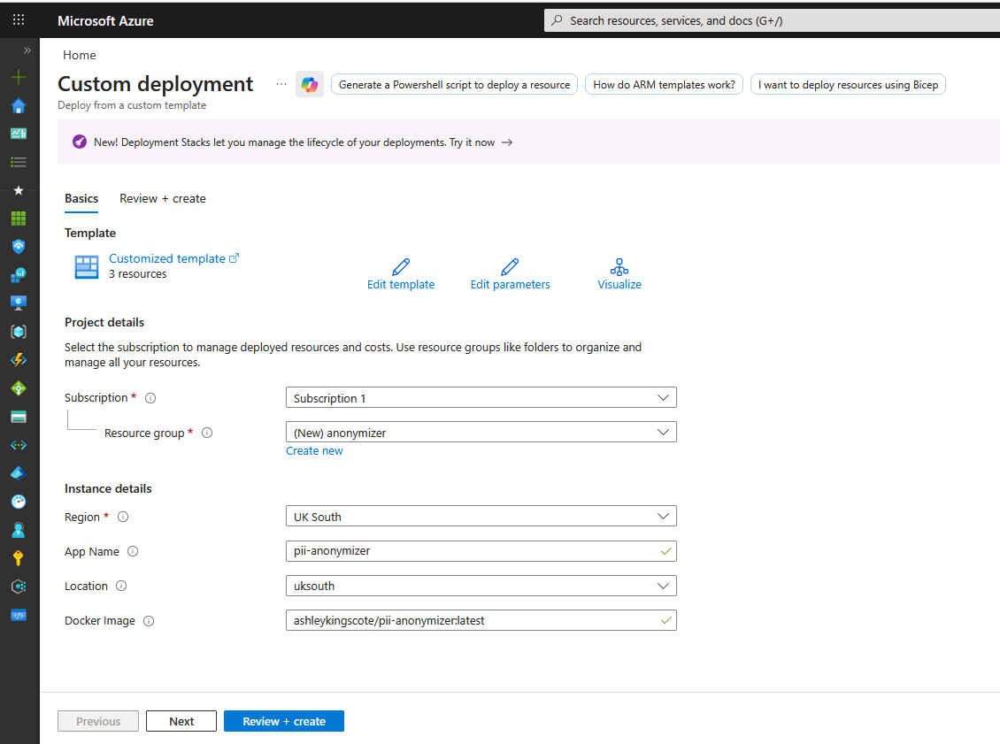
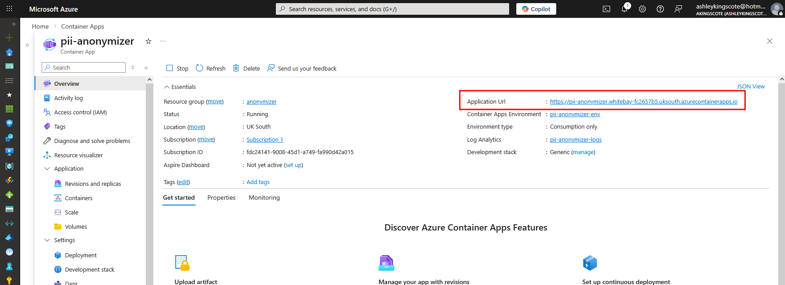
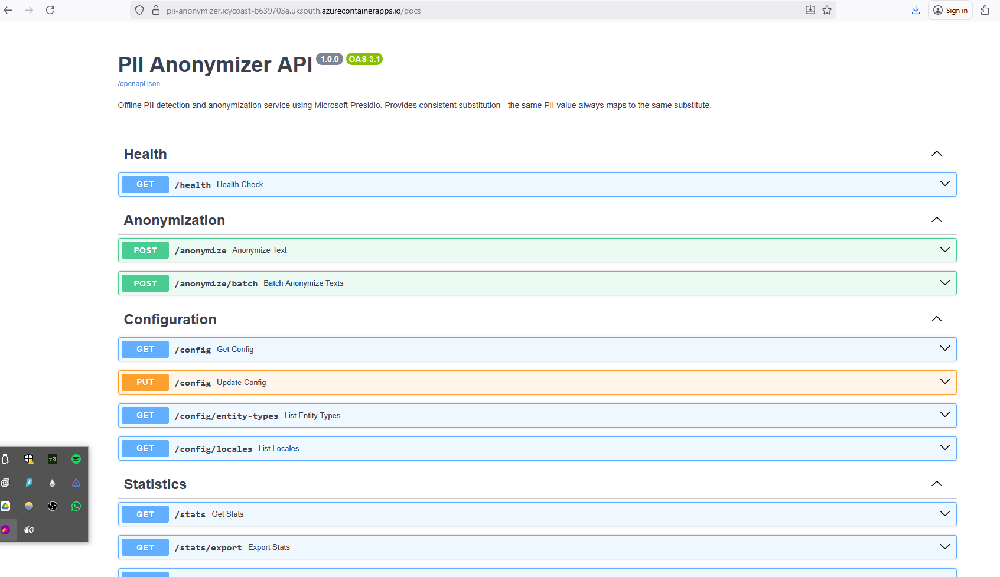

# PII Anonymization Service
I had an idea for a PII anonymization service, with the intention of maintaining integrity with the data it's anonymized.

The original context was for anonymizing Microsoft Sentinel database dumps, so that I can re-use the data for threat hunting training, without exposing real-users PII.

But to maintain integrity and realism, the concept grows in complexity. I can't substitute a private IP address like `192.168.1.1` with a public IP like `8.8.8.8`. But more importantly, I need to track which PII entities have been substituted, so that I can make the same substitutions across all matches. 

Threat hunting in Microsoft Sentinel spans multiple columns and tables, and i'd lose all Indicators of Compromise (IoC) by blindly substituting. If the name "ashley kingscote" is found in the `Syslog` table, I also want to make the **exact same** substitution in the `SigninLogs` table.

I briefly explored if I could integrate Microsoft Sentinel with this service as a pre-processor, so that the data in anonymized before it even reaches Microsoft Sentinel, but I found that its not feasible unless you use custom tables, which I didnt want to do.

So in the end, this blog is just showing off a vibe-coded PII anonymization service. The code can be found [here](https://github.com/akingscote/pii-anonymizer-service), and a video demonstration can be found [here](https://youtu.be/j9Kcnnft2YA).

> This was my own original idea (AFAIK), but the execution has been heavily slopey-shouldered onto Claude 🤖 using [Github speckit](https://github.com/github/spec-kit). After all, its 2026 - who writes proof of concepts by hand nowadays? I knew the architecture I wanted, I knew which technology I wanted to use, but I didn't want to integrate it all together from scratch.
{: .prompt-warning }

# PII Detection
My go-to for PII detection is [Microsoft Presidio](https://microsoft.github.io/presidio/). There's no need to re-invent the wheel, and Presidio meets a lot of my requirements. Mainly being fast, context-aware(ish), offline and extensible.

## Why Not LLMs?
Before diving into Presidio, it's worth addressing the elephant in the room - why not just use an LLM for PII detection? There are a few reasons:

1. **Offline capability** - I wanted this service to run entirely offline without external API calls. For sensitive data, sending it to a third-party API defeats the purpose of anonymization.
2. **Cost and latency** - Processing large Sentinel exports row-by-row through an LLM would be expensive and slow.
3. **Determinism** - Pattern-based detection gives consistent, reproducible results. LLMs can be unpredictable.
4. **Lightweight** - The service runs on modest hardware without requiring GPU acceleration.

## Microsoft Presidio Overview
Presidio is an open-source SDK from Microsoft designed for PII detection and anonymization. It combines multiple detection methods:


- **Named Entity Recognition (NER)** - Uses spaCy's NLP models to identify entities like names, locations, and organisations in natural language
- **Pattern Recognition** - Regex-based detection for structured data like email addresses, phone numbers, credit cards, and SSNs
- **Context Enhancement** - Boosts confidence scores when PII appears near contextual keywords (e.g., "email:" before an email address)
- **Checksum Validation** - Validates formats like credit cards using Luhn algorithm

But the main benefit for Microsoft Presidio, is that its extensible. You can register custom recognizers that plug into the same pipeline. This was crucial for my use case, as i'll explain shortly.

### Limitations
Presidio is excellent, but has some limitations that required custom work for my Microsoft Sentinel use case:

1. No Street Address Detection
Presidio handles cities and countries via NER, but doesn't detect street addresses. Text like "my address is 123 Main Street" won't get picked up. For SigninLogs, location data often includes full addresses.

2. IP Address Handling
The default IP address recognizer doesn't handle CIDR notation (`192.168.1.0/24`). When anonymizing network logs, I need to preserve the subnet mask. Additionally, I need to respect the private/public boundary - replacing a private IP like `10.0.0.5` with a public IP like `203.0.113.50` would corrupt the data's meaning.

3. GUID/UUID Detection
Microsoft Sentinel data is full of GUIDs - `CorrelationId`, `TenantId`, `UserId`, etc. Presidio doesn't have built-in GUID detection, but these identifiers can absolutely be used to track individuals.

4. Coordinate Detection
SigninLogs includes latitude and longitude coordinates with high precision (e.g., `51.500789642333984`). These need to be detected and anonymized separately from general numbers.

5. Compound Location Names
UK-style place names like "Newcastle upon Tyne" or "Stockton-on-Tees" can trip up standard NER models. Originally, presidio would detect, and i'd substitute to something like "Reading-on-Tees", which isnt anonymous enough for me. 

To address these limitations, I (well claude) implemented eight custom Presidio recognizers. You can find them in [`backend/src/services/detector.py`](https://github.com/akingscote/pii-anonymizer-service/blob/main/backend/src/services/detector.py). It's not perfect, but I have found that fleshing out this PoC does help reveal these requirements.

## Synthetic Data Generation
Detection is only half the problem. The synthetic data used for replacement needs to be realistic and contextually appropriate.

### Faker
[Faker](https://faker.readthedocs.io/) is a popular python library that generates realistic fake data for a wide range of entity types:

- Email addresses, phone numbers, URLs
- Credit card numbers (with valid Luhn checksums)
- SSNs, bank account numbers, IBANs
- Street addresses, dates, and more

The key advantage of Faker is its **locale support**. The service supports 24+ locales (en_US, de_DE, fr_FR, ja_JP, etc.), and Faker generates data appropriate for each. A German locale will produce German-style phone numbers and addresses, not American ones etc...

```python
from faker import Faker

fake_us = Faker('en_US')
fake_de = Faker('de_DE')

fake_us.phone_number()  # (555) 123-4567
fake_de.phone_number()  # +49 30 12345678
```

This locale awareness is important when anonymizing multinational Microsoft Sentinel data. I want the synthetic data to match the original data's regional characteristics.

However, Faker has limitations. Its name generation is random and doesn't consider **cultural context**, and its location data can be obviously fake. That's where the specialised libraries come in.

### Culturally-Aware Names
The [names-dataset](https://pypi.org/project/names-dataset/) library provides name origin data. When anonymizing "Ahmed Hassan", the service generates a replacement name from a similar cultural background rather than "John Smith". This preserves the demographic characteristics of the dataset without exposing real individuals. It's also completely offline, and has 730K first names and 983K last names, extracted from the [Facebook massive dump (533M users)](https://www.theguardian.com/technology/2021/apr/03/500-million-facebook-users-website-hackers).

One gotcha I ran into, was that the library originally generated names in native script. So "Mohammad Salah" would be replaced with something like "محمد عبدالله". While culturally accurate, this breaks the data and realism. The original `SigninLogs` contained romanised names, not Arabic script. I had to (claude had to 😅) modify the generator to use romanised versions of culturally-appropriate names, so "Mohammad Salah" becomes "Yusuf Ibrahim" rather than native Arabic script.

### Offline Location Data
I used the [geonamescache](https://pypi.org/project/geonamescache/) library to provide an offline database of real cities with coordinates. This means location substitutes are real places with valid lat/long pairs, not obviously fake data like "Faketown, 0.0, 0.0".

### IP Address Intelligence
The synthetic generator maintains network semantics:
- Private IPs (10.x.x.x, 172.16-31.x.x, 192.168.x.x) are replaced with other private IPs
- Public IPs are replaced with public IPs
- CIDR notation is preserved (e.g., `/24` suffix maintained)

I'm skeptical about its accuracy, especially around how it will work with subnets not in CIDR notation, but I think its adequate for the PoC.

# Demonstration
I've put together a short video demonstrating the concept here:
[](https://youtu.be/j9Kcnnft2YA).


# Setup
But you can deploy this pretty quickly, as its using the `ashleykingscote/pii-anonymizer:latest` docker image.
Alternatively, click the "Deploy to Azure" button from the github repo:


From there, just enter a resource group name:


That will then create a log analytics workspace (a dependency for container apps) and the container app.
Navigate to the container app, and you'll get a URL to the service:


From there you can play around with the service.

You can test the API with a simple curl command like this:
```
curl -X POST https://pii-anonymizer.icycoast-b639703a.uksouth.azurecontainerapps.io/anonymize \
      -H "Content-Type: application/json" \
      -d '{"text": "John Smith lives at 123 Main St, his email is john@example.com and IP is 192.168.1.1"}'
```
Which will respond like:
```
{
  "anonymized_text": "Cesar Lee lives at 4587 Billy Flat Suite 163, his email is john78@example.org and IP is 192.168.143.176",
  "substitutions": [
    {
      "start": 0,
      "end": 10,
      "entity_type": "PERSON",
      "original_length": 10,
      "substitute": "Cesar Lee"
    },
    {
      "start": 20,
      "end": 31,
      "entity_type": "STREET_ADDRESS",
      "original_length": 11,
      "substitute": "4587 Billy Flat Suite 163"
    },
    {
      "start": 24,
      "end": 31,
      "entity_type": "LOCATION",
      "original_length": 7,
      "substitute": "john78@example.org"
    },
    {
      "start": 46,
      "end": 62,
      "entity_type": "EMAIL_ADDRESS",
      "original_length": 16,
      "substitute": "192.168.143.176"
    }
  ],
  "metadata": {
    "entities_detected": 5,
    "entities_anonymized": 4,
    "new_mappings_created": 4,
    "existing_mappings_used": 0,
    "processing_time_ms": 826
  }
}
```

It's all using FastAPI behind the hood, so you can view the API documentation at `https://YOUR-URL/docs`


# Notes
In playing around with the Microsoft Sentinel preprocessing, I discovered that you can create workspace DCRs and perform some anonymization on data on the all tables. Unfortunately, it's not substitution, its more masking with something like this:

```
source
| extend UserPrincipalName = hash_sha256(UserPrincipalName) // Anonymize the user
| extend AlternateEmail = "REDACTED"                        // Hard redact
| extend IPAddress = regex_replace(IPAddress, @"(\d+)\.(\d+)\.(\d+)\.(\d+)", @"$1.$2.$3.0") // Mask IP subnet
```

But to be honest, I dont really think there is a use case for doing that?
