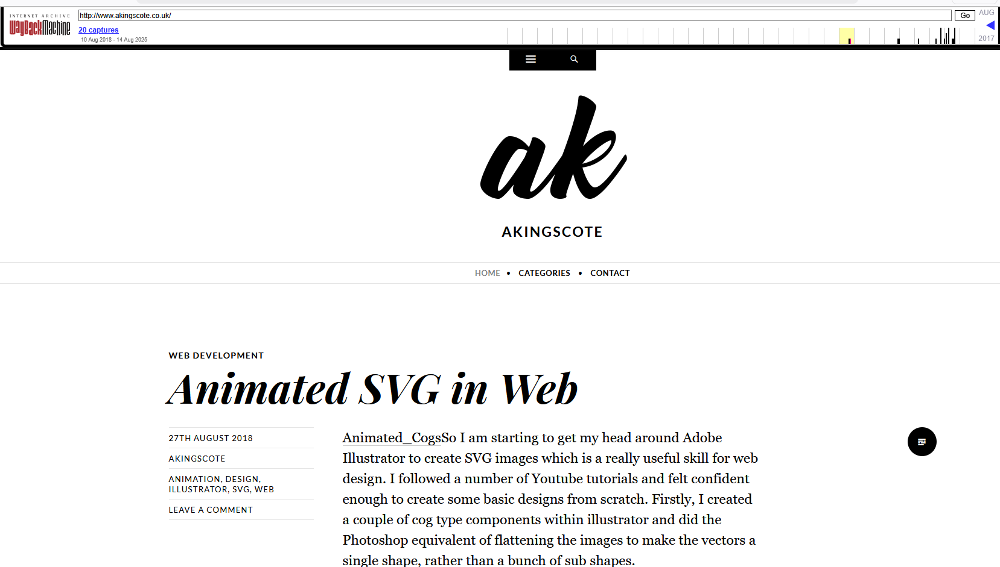
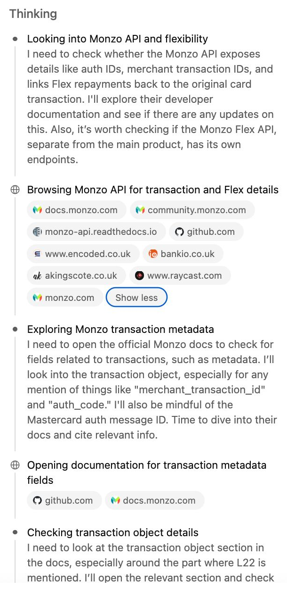
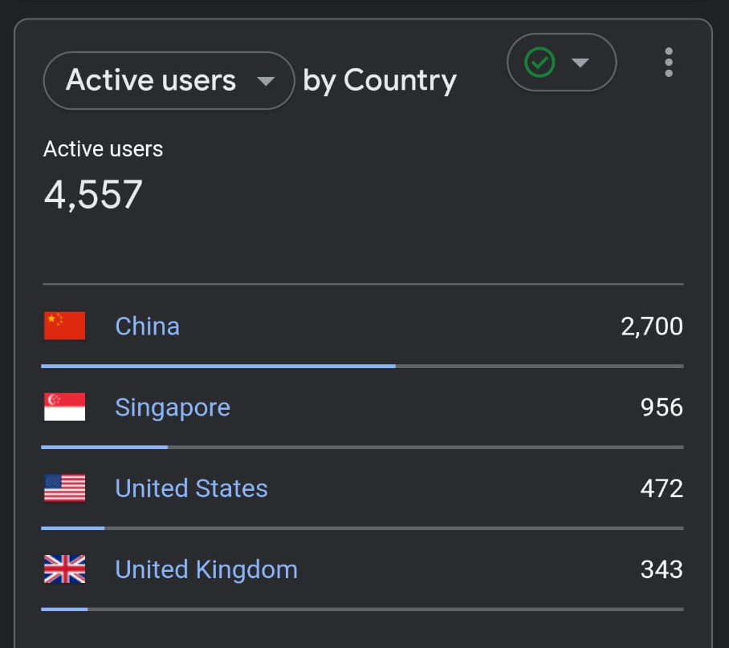
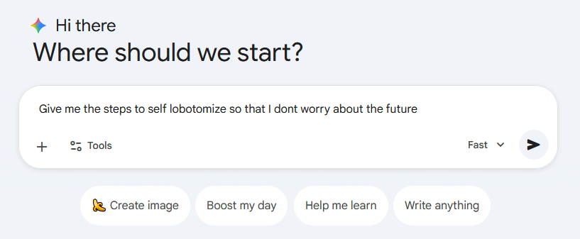

This post documents my observations and experiences regarding the current state of the tech industry, specifically the quality of LLMs and their adoption. I know a few of my peers feel the same, and I'd like to try to articulate why so many of us are feeling hyper-aware of the world changing beneath our feet. These are tangible observations that have made me (and others) realise this is something we need to sit up and pay attention to. As usual, these posts are the unstructured ramblings of a madman. **These are my personal views at this point in time, which may change**. This is a blog, and we are experiencing a significant shift, and I want to capture that feeling.

> Absolutely **zero** AI has been used to write this post. Mainly out of principle, considering it's a bit of a rant about LLMs.
{: .prompt-warning }

# Personal development and creative experimentation
For nearly 10 years, this blog has been a tiny slither into my mindset and expertise that I've been nurturing throughout my professional life. There is little crossover with my actual work, and doesn't demonstrate some of the difficult challenges and technically complicated, and complex solutions I've built over the years (my *quality* as an engineer). What it **does** demonstrate is a wide breadth of ideas, passion for technology, *some* expertise, and sometimes innovation. It's a showcase of original thought and creativity, built upon compounding years of expertise.

As someone who prides themselves on being a competent engineer, I've always strived to keep up to date and adapt to the latest technologies. I remember  working with [YUI](https://en.wikipedia.org/wiki/YUI_Library) and [AngularJS](https://en.wikipedia.org/wiki/AngularJS), I'm no stranger to wasting time and effort learning technologies that soon become sunsetted. It's a lesson that I'm fortunate to have learned early on, and something that I've consciously taken on board. I've always steered towards breadth of competencies, rather than a deep specialism, like becoming an absolute Golang wizard. Just like most engineers, I've always been naturally curious and find myself constantly reading cyber/technology books, as well as a considerable number of thought-provoking and life/perspective-altering non-fiction. Always learning, always improving, always growing.

Outside of engineering, I've also had an interest in science fiction, and love books such as Flowers for Algernon, The Forever War, and Asimov short stories (notably [the last question](https://users.ece.cmu.edu/~gamvrosi/thelastq.html)). I've *known* about AI forever from books/tv (Who hasn't seen I,Robot?). Even during my time at Thales (2016), there were a number of clever cookies showing me some amazing Machine Learning things. But just like everyone else, it wasn't really until ~2022 that I got swept up into the hype.

It was Tim Urban's fantastic blog post from 2015, [The AI Revolution: The road to Superintelligence](https://waitbutwhy.com/2015/01/artificial-intelligence-revolution-1.html) that the real potential of AI was really spelt out to me.

I've pondered the possibility of cold-fusion and the ramifications of infinite "free" energy. But concepts like cell-altering nano technology leading to infinite human life blew my mind. Especially when Tim said these concepts could happen in my lifetime. The lines between science fiction and reality blurred.

## When did the tide change? (for me at least)
I remember early on in my career, people would come to me and be like *"Bro, can you help me build this app?"* . The ideas were always terrible, but people came to me because I had the skills to build. 

Nowadays, I need two hands to count the vibe-coded apps of terrible ideas i've been sent. Just because you *can* now build an application like the rest of us doesn't mean that you should. The barrier to entry is lower than ever, and only seems to be decreasing. Is that all you need now? an idea? The execution is gone. Fail fast, try again. Software and infrastructure is cheap and disposable. Keep going until something sticks.

Literally anyone can vibe-code an app. It's easy to use by design. The skills to build the app no longer matter. All that matters is the idea itself.

The other week I posted a blog post of a [PII Anonymizer service](https://akingscote.co.uk/posts/pii-anonymizer-service/) that I "developed". The vibe-coded app **marked a first for this blog** and represents the tide of change I am going through. It was the first time that I *"published"* something that I didn't write. It was entirely vibe coded. Is there any point in publishing and sharing a Proof of Concept (PoC) anymore? I might as well just create a blog post detailing an idea, as **the execution is the easy part**.

### The impact of blogging
When I first started this blog, it was an effort to document my thinking (almost more as a diary), and to serve as a kind of CV booster. For many years, the website wasn't even indexed, you wouldn't find it on any search engine, and it was never shared. It was **for me**, and my CV as an additional piece of evidence to demonstrate my interest and competence in technology and cyber.

In more recent times, as I've had more valuable things to say, I've changed tack and shared the blog. It's been picked up by a fair few security newsletters by the years and gets traffic from my own professional network. I added Google analytics to track users. **I honestly don't put a lot of work in. I don't write regularly, and I only write when I have something I feel is worthwhile sharing. I have no intention of being an influencer, and I am fully aware that these ramblings aren't particularly insightful and won't reach many people.**

However... 

A few weeks ago, a friend of mine sent me this:

He was using deep research to investigate building (vibe coding) an idea using Monzo. Look at the seventh reference. It's a (pretty terrible) blog post I wrote in 2020 about [building a payment tracker with Monzo](https://akingscote.co.uk/posts/payment-tracker-monzo-api/). That post should not serve as any kind of authority on anything 😅. It was me playing around with an idea, building a PoC and sharing it. This is just one example I've been sent, where this very blog appears as a position of authority regarding a topic.

So i decided to fire up the ol' Google Analytics, and i was pretty shocked.

I'm fully aware that most of these viewers are bots, but it's still very surprising to see 2,700 from our friends in the east. I'm assuming it's web scrapers, using my content to help train the next generation of LLMs. 

The analytics and the deep research has made me realise that these posts do reach people, even if not directly. Potentially, I am contributing to the improvement of LLMs, and their impact. 

# LLMs are dumb right?
Now I fully understand the limitations of LLMs and pretrained transformers, I know they are token predictors, and I full understand that they may not get us to AGI (and ASI). But what I do believe, and I'm seeing the signals everywhere, is that LLMs in their current capacity are enough to disrupt the industry and have the potential for mass unemployment of white-collar workers. I've read [the illusion of thinking](https://ml-site.cdn-apple.com/papers/the-illusion-of-thinking.pdf), [smart until its dumb](https://emaggiori.com/smart-until-dumb/) and numerous others, and I understand what they are saying, but can't shake the feeling that it doesn't matter. The ceiling for LLMs is high enough, even if its not "thinking" and not *technically* intelligent.  LLMs are still incredibly capable, and don't show any signs of slowing down.  [Bondcap trend report (2025)](https://www.bondcap.com/report/tai/) and the [**unprecedented** levels of investment](https://www.reuters.com/technology/artificial-intelligence/trump-announce-private-sector-ai-infrastructure-investment-cbs-reports-2025-01-21/), the effective cold-war-esque race between USA & China for AGI, and the [goals of powerful CEOs](https://www.cnbc.com/2025/06/30/mark-zuckerberg-creating-meta-superintelligence-labs-read-the-memo.html) paint a picture of urgency with clear direction. The aim is to build the most intelligent AI first. There are only so many times the word **unprecedented** can be thrown around before it loses its impact.

Everyone agrees that LLMs won't get us to AGI, but they may enable us to build the tools which *will* get us there (e.g. [DeepSeek is now writing kernels to improve DeepSeek performance](https://github.com/ggml-org/llama.cpp/pull/11453)). Just the other day Anthropic successfully [built a C compiler in rust with Claude](https://www.anthropic.com/engineering/building-c-compiler). Although not perfect, that's the capability today. What on earth is it going to be able to do in five years time?

> ...and thats assuming that the billions of dollars being invested in non-LLM AI technologies don't yield significant breakthroughs.
{: .prompt-info }

[Nicolas Carlini](https://en.wikipedia.org/wiki/Nicholas_Carlini) has some great metaphors on his [thoughts on the future of AI (March 2025)](https://nicholas.carlini.com/writing/2025/thoughts-on-future-ai.html), and how LLMs have their limits.
>  If you're trying to get to the moon, you can get closer by building increasingly tall towers, but this will only get you so far. So then you take an entirely new approach, and make a hot air balloon. This can go so much higher than a tower! But it still can't get you to the moon. That's just not how things work. Eventually you realize that rockets are a thing, and they can actually get you to space. 

> On the other hand, maybe we're going to continue seeing a period of growth for a little longer, but after a year or two, we'll reach a point where we max out the capabilities of large language models. Maybe the available training data runs out, or we can't get enough compute, or the funding dries up, or transformer capabilities just have a hard limit in the same way that SVMs did in the past. After that, maybe LLMs get cheaper and faster, but they don't continue on the same exponential we're on here. Still, current models are already capable enough that LLMs in five years will likely get integrated into more products, and this will be a Big Deal. But it won't change the future of humanity. 

Way before AI went mainstream, I remember heated discussions with colleagues in the canteen discussing the rise of autonmous vehicles (triggered by [FiveAi's series A funding in 2017](https://www.uktech.news/news/cambridge-driverless-car-startup-fiveai-secures-14m-series-20170906)), the potential future displacement of American truck drivers and the sudden influx of 3,500,000 unemployed, and the potential implications. 
> A quick Gemini (is that a verb yet?) confirms that around that time, there was a bit of hysteria around that exact thing.
{: .prompt-info }

It was kind of easy to distance myself from that issue, as I wasn't a truck driver. But with all the signals I see everywhere, I wonder if the truck drivers will outlast the SOC analysts, software engineers and GRC professionals. I know a few incredibly talented people who have already been affected by layoffs related to AI. Then I see things like [Anthropic's new legal tool](https://www.theguardian.com/technology/2026/feb/03/anthropic-ai-legal-tool-shares-data-services-pearson), [Google's CodeMender](https://deepmind.google/blog/introducing-codemender-an-ai-agent-for-code-security/) (AI application security tool), [Google Jules](https://jules.google/) and can see the writing on the wall for many more talented people.

# The pace of change
I've been fortunate to have a relatively varied career, with cyber security (specifically cloud) behind at the heart of it for many years. At times, I've found it challenging to stay up to date with all the latest developments. That means AWS/Azure/GCP/K8s developments, well architected designs, system architecture best practices and frameworks, governance and compliance, operating systems, package updates, cyber threats, critical CVEs, as well as the constant innovation and developments, security breaches and APTs that plague the industry. Zero trust models, service meshes, eBPF, observability engineering, chaos engineering, site reliability engineering, threat modelling, cloud native software patterns. I've signed up for **dozens** of newsletters, and have RSS feedly feeds that are just unusable now. Up until recently, I could *just about* keep up to date with whats going on (whilst also leaning on my colleagues and network for helping to cut through the noise).

I've never known any different to upskilling, learning, and growing. But the speed of change related to AI is just **unprecedented** (there's that word again!), and it's exhausting keeping up. There are dozens more newsletters, blog posts, Youtubers, Twitteres, Linkedin leaders, and the AI companies are releasing new products weekly, as well as newsworthy updates using existing products (gas town, ralph wiggum, clawdbot, Moltbook in January 2026 alone!)

But that's the job now. It's keep up or fall behind, there really isn't much inbetween. As a security professional, it's not about writing complex reverse shell commands. It's about constantly learning, evolving and keeping up with technologies.

Where I want to be intentional (like writing this blog, or writing a technical whitepaper or report), I don't always want to take a shortcut. Sometimes I need careful and calculated thought.
> I'd like a tool to help digest the pace of change and this evolving landscape. Something that reads the newsletters, twitter feeds, linkedin posts, RSS feeds, github issues, hacker news, mainstream news, and injects the information i'm interested in direct into my brain in real time. I get BBC news alerts about the prince of England going to court, but I'd rather get an alert about a new LLM model thats going to improve my quality of life.  Give me 30 mins and I'll just vibe code it and have a working PoC 🙃
{: .prompt-info }

# More fuel to the fire
The other week, [Anthropic's CEO](https://en.wikipedia.org/wiki/Dario_Amodei) released his enourmous essay entitled [The Adolescene of Technology](https://www.darioamodei.com/essay/the-adolescence-of-technology).

My interpretation of the essay was that it was very negative, and pretty depressing and grim, but pretty much a reinforcement of [Bill Joy's points he made in 2000](https://sites.cc.gatech.edu/computing/nano/documents/Joy%20-%20Why%20the%20Future%20Doesn%27t%20Need%20Us.pdf). The key point I picked up on was Darios concern of ***motive* and *ability***, which resonated with me like a thunderbolt. Darios context was for LLMs to be used to create biological weapons (like [mirror life](https://www.oxfordstudent.com/2025/10/27/mirror/) and [gray goo](https://en.wikipedia.org/wiki/Gray_goo)), that would have previously been out of the reach of most individuals. With the advent of LLMs, learning is easier than ever, with LLMs providing step-by-step walkthroughs. He draws an interesting comparison to Ted Kaczynski, who was a dangerous combination of motive and ability. He was highly intelligent and knew how to make bombs, mixed with a nefarious motive, which created a terrible combination. That ability previously set a high barrier to entry for terrorism, which has been significantly lowered by LLMs.

> What Joy is pointing to is the idea that causing large-scale destruction requires both motive and ability, and as long as ability is restricted to a small set of highly trained people, there is relatively limited risk of single individuals (or small groups) causing such destruction.

> The general principle is that without countermeasures, AI is likely to continuously lower the barrier to destructive activity on a larger and larger scale, and humanity needs a serious response to this threat.

The essay also had an interesting section on [Labor market disruption](https://www.darioamodei.com/essay/the-adolescence-of-technology#:~:text=Labor%20market%20disruption).

> This is true even though farming accounted for a huge proportion of employment ex ante. 250 years ago, 90% of Americans lived on farms; in Europe, 50–60% of employment was agricultural. Now those percentages are in the low single digits in those places, because workers switched to industrial jobs (and later, knowledge work jobs).

> Another way to say it is that AI isn’t a substitute for specific human jobs but rather a general labor substitute for humans.

> Cognitive breadth. As suggested by the phrase “country of geniuses in a datacenter,” AI will be capable of a very wide range of human cognitive abilities—perhaps all of them. This is very different from previous technologies like mechanized farming, transportation, or even computers. This will make it harder for people to switch easily from jobs that are displaced to similar jobs that they would be a good fit for. For example, the general intellectual abilities required for entry-level jobs in, say, finance, consulting, and law are fairly similar, even if the specific knowledge is quite different. A technology that disrupted only one of these three would allow employees to switch to the two other close substitutes (or for undergraduates to switch majors). But disrupting all three at once (along with many other similar jobs) may be harder for people to adapt to. Furthermore, it’s not just that most existing jobs will be disrupted. That part has happened before—recall that farming was a huge percentage of employment. But farmers could switch to the relatively similar work of operating factory machines, even though that work hadn’t been common before. By contrast, AI is increasingly matching the general cognitive profile of humans, which means it will also be good at the new jobs that would ordinarily be created in response to the old ones being automated. Another way to say it is that AI isn’t a substitute for specific human jobs but rather a general labor substitute for humans.

Dario also references *"legendary programmers are increasingly [describing themselves as 'behind'](https://x.com/karpathy/status/2004607146781278521)"*. When Andrej Karpathy has *"never felt this much behind as a programmer."*, surely thats a sign to be worried?
 
In one of my many discussions around these topics, my friend make an interesting comparison - the one-legged stool.

In the 1860s, Nitroglycerin manufacturing for making explosives used a one-legged stool, as the operator has to constantly keep an eye on the thermometer of the vat to avoid an explosion. The one-legged stool meant that the operator had to lean to keep themselves upright and stay alert. At one point in time, it was someone's job to sit on a stool all day. That's an example of one of many jobs that was replaced by the advancement of technology, which seems almost medieval now in hindsight. Maybe the future will see software development the same way, and this is all natural for human progress. 

# So where is the moat?
So what is the skillset and ability that AI (or at least LLMs for now) will not be able to replace?

We need to see LLMs as a cognitive amplifier. We need to be more productive and produce more in less time. LLMs lack creative thought and are not good at solving original problems.

> I've got an idea I want to use to try and test this, which I'll share in the next blog post
{: .prompt-info }

I see it as LLMs replacing leet coders, and being able to complete small, discrete components very effectively. I have no doubt we will start describing our interfaces in more LLM-friendly ways to help them with business context, but I feel like that's always going to need some human oversight. At present, they are poor at global orchestration (understanding why that function shouldn't exist in the first place because of a 5-year legacy tech debt).

Idea execution is increasingly worth less and less. When I reflect upon what some of the smartest people I know have done in their careers: Building software for [RTOS](https://en.wikipedia.org/wiki/Real-time_operating_system), rewriting cryptographic algorithms to fit on java cards, building complex PKIs with secure root of trusts, I think that all of these can be done by LLMs. It'll at least get you 90% of the way there, and we don't want 100% of the people competing for 10% of the jobs..

For senior professionals at least, you can continue to provide significant value by providing judgement and decisions. Let the LLMs do the heavy lifting on the execution.

Another piece is cybersecurity. Whenever there are bad guys using AI, there will always need for good guys. Cybersecurity will be a constant thread throughout the noise and disruption thats LLMs have on society. I struggle to see a world where there isn't at least *some* human intervention in the cyber context. I don't think LLMs will be able to train quickly enough to keep up with all the latest developments. I think it'll always have to be a human element. I think we (security profressionals) will be extremely broadened and specialisms will be much rarer.

I guess at a specific view, all cognitive work will be obsolete with AGI, but I think we can all agree that LLMs won't get us there.

> Hows this for a cheesy corporate metaphor? I think that the moat is more like a stream. It's now a fast-flowing and thin, and anyone can jump over. In a moat, you're safe if you stand still, but if you stand still in a stream, you're going to drift away.
{: .prompt-info }

Thats motive vs action right there ^.

**For now, the moat is creative thought, opinion without prompt, and breadth of knowledge and experience**.

> In building the [PII anonymization PoC](https://akingscote.co.uk/posts/pii-anonymizer-service/), I do have one consolation: In "building" the application, it does help to reveal further requirements and edge cases that may have been missed during the initial design. But then again, I suppose thats just fufilling the purpose of a PoC. Fast iteration, get hands on with the output and iterate.
{: .prompt-info }

Good ideas are hard, good architectures are hard; building proof of concepts to validate ideas is easy. The execution is the easy bit (for PoCs at least).

This isn't doomsaying, [it's pragmatic realism](https://youtu.be/rByrD_R9Vuo?si=mw7K3AS0ts-G6ysZ&t=1888). If you know what the moat is, please let me know.

# What can we do?
Now more than ever, you need to upskill constantly and fight off the brain rot.
Using AI day to day is a given, that's the minimum. I don't mean copy and pasting from OpenAI/Gemini web apps, I mean using agentic AI tools. You are the coach and not the player, but you need to be in shape.

This "futuristic" view of an individual orchestrating dozens of autonomous AI agents isn't some far off fantasy. That technology won't pop out of nowhere and exist overnight. It already exists and is being actively refined and adopted. You need to pivot to that mode of working **now**. You need to be the architect. You need the ideas. The execution of those ideas will be handled by your agents. When I say "will be". I mean like next week. You need to learn how to do that now. It's **probably the single most important upskilling you can do.**.

I feel like the age of the leet coder is dead. The focus is now on secure and scalable system design, and not so much discrete pieces of software. Many of the efficient software patterns already exist, are tried and tested, and LLMs will be able to handle that without breaking a sweat. Integrating those components into the wider ecosystem will always be challenging, and an area ripe for focus.

The technology won't just appear, it'll trickle through the scene gradually as it's doing right now. You need to be at the end of these innovations. It's not like 2023, 2024 or even 2025. This year, you need to be switched on and on it. You can't delay anymore. You can't join this band in 2028 as a reaction; you **must** be proactive. That means upskilling now, finding the right people to follow, and gaining practical experience in this area, that you can demonstrate.

**You aren't building these "skills" for today, you're building them for tomorrow.**

As [Karpathy puts it (Dec 2025)](https://x.com/karpathy/status/2004607146781278521): 
> Roll up your sleeves to not fall behind.

# Where do you start?
You start here. Do these exact things and make sure you understand them. No doubt they will be out of date by next month, but if you don't know what these are, you're already behind.

1. Understand what LLMs are and aren't
2. Learn about specification, context and test driven development. (e.g. [Speckit](https://github.com/github/spec-kit), [Openspec](https://openspec.dev/), [conductor](https://developers.googleblog.com/conductor-introducing-context-driven-development-for-gemini-cli/))
3. Understand and **use** MCP, A2A
4. Build your own agent (mainly as a learning exercise, even if you don't use it). As little as [100 lines of Python code is enough to make an AI agent in the top 74% of SWE bench](https://github.com/SWE-agent/mini-swe-agent).
5. Build **and** deploy a complex application you've built via speckit and an AI tool (your own agent, or Claude, Gemini CLI, Codex, Github Copilot CLI)

# Predictions for the future
It feels inevitable to me that there will be a rise in personalised software. For service-first, bespoke needs, abstractions around software. We are basically there already, it just feels like there are a few more abstractions to make to help make that "motive" piece even easier.

Abstractions around abstractions around abstractions until we hit the ultimate (dream?) of everything being piped into our brains.

"AI, I want an app that counts the flowers in my garden..." 
"AI, how do i fix my car"

I'm already fighting the AI brainrot and laziness. It's only going to get harder.

Tools like [Globe Explorer](https://explorer.globe.engineer) were ahead of their time (unfortuantely they shut down without a route to profitability) and provide a glimpse into what the future will be like. [Google Disco](https://labs.google/disco) and [Github Spark](https://github.com/features/spark) are setting the scene for how we browse the web and build software. Search engines will evolve into AI-first (which is already there tbh).

Software is now so easy to build, and is essentially disposable. Is there any point sharing your PoCs or libraries on Github? I don't need your "PII anonymization" service. I can build my own in an hour, and have it completely meet all of my niche requirements without compromise. 

In this [Nov 2025 video](https://www.youtube.com/watch?v=8-boBsWcr5A) Satya Nadella casually mentions that more Github repos are being created than ever before. Obviously thats because software development is more accessible than ever, but it's going to be the majority of useless vibe-coded apps.

As I've written about already, observability engineering and security monitoring are converging. Traditional logs don't cut it. We need high-cardinality, high-dimensonality security data. Observability for AI agents is going to be huge. We are going to need all the millions of pieces of telemetry we already use for APIs/services, and then the additional noise of thousands of autonomous AI agents. We've already had one wave of "big-data". Soon we are going to need a big-big-data.

[Agent identity](https://techcommunity.microsoft.com/blog/microsoft-entra-blog/the-future-of-ai-agents%E2%80%94and-why-oauth-must-evolve/3827391) and agent orchestration are the obvious next steps, but who knows what shape. Kubernetes changed the game for container orchestration, it'll be interesting to see if what emerges for AI orchestration.

This a bit of an abrupt sign off, but as long as we are vigilent and observant of all the indicators all around us, I think we can navigate this space. In the future, I'm going to try and focus future posts on the concepts and ideas, rather than technical execution.
