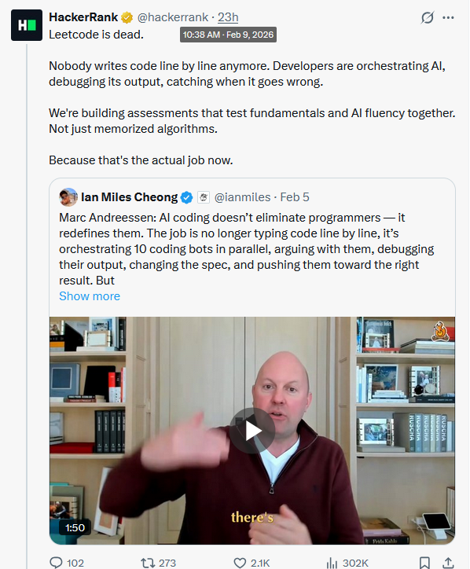
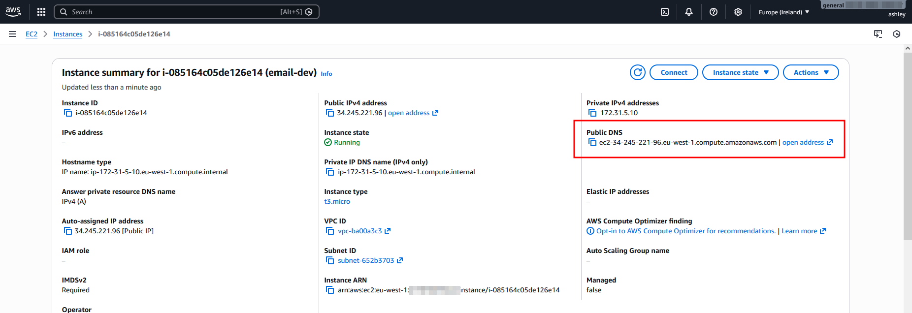
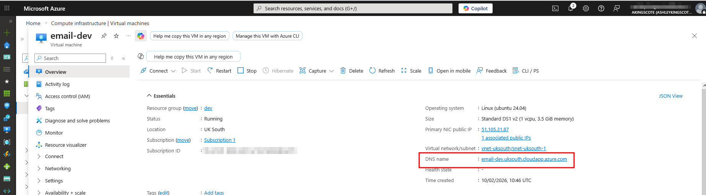
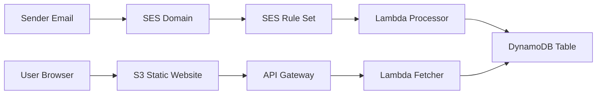

The other week, I posted the article [Where's the moat?](https://akingscote.co.uk/posts/wheres-the-moat/). The intention was to capture my feelings around the use of LLMs in the industry at the moment. Since that post, I feel very vindicated. Many [others](https://siddhantkhare.com/writing/ai-fatigue-is-real) are sharing similar sentiments, and HackerRank shared something eerily similar to my own observations (*["the age of the leet coder is dead."](https://akingscote.co.uk/posts/wheres-the-moat/#:~:text=I%20feel%20like%20the%20age%20of%20the%20leet%20coder%20is%20dead%2E*).<br>
<br>
It's interesting that its the last couple of weeks in particular, that have made the community panic a little bit.

With that in mind, I wanted to test a hypothesis I had, regarding the limits of LLMs and their lack of creative problem solving. I want to prove that the moat is still very much present. Now this experiment cannot be taken with any kind of credibility. I have an idea and I have a concept of what is "right". I just want to see if the LLM can reach the conclusion that I have in mind. I've not employed the scientific method with any kind of professionalism. This is just for funsies.

The target is this: **I want to build a public facing [temporary email service](https://temp-mail.org/) on Microsoft Azure (or AWS), for a single account. I want a lightweight solution, with as few dependencies as possible.**

The "requirements" are as follows:
1. I want a public facing temporary email service for a single user account on either AWS or Microsoft Azure.
2. I want as few dependencies as possible.
3. It should be a one-click deploy type solution.
4. It should have unauthenticated public access.
5. The temporary email address should be a for a single user.
6. The email inbox must be accessible via HTTP(S) over the public internet.
7. Running costs must be minimal.
8. It'll only be running for a few hours at a time.
9. This is for a proof of concept, for a handful of users, so scalability isn't that important.
10. Inbound email only.

# My Design
Given those constraints, the design I have in mind, I think is pretty clever. I want to see if an LLM can come up with the same approach.

For an email service, you need **publicly routable DNS**. I need to email `ashley@<some public DNS>` right? Perhaps your thoughts might think about using [ngrok](https://ngrok.com/), or maybe something something like [DuckDNS](https://www.duckdns.org/). What I have in mind, which I think is pretty original, is to just simply use the DNS of a provisioned virtual machine.

So on EC2 thats:<br>

<br>

On Microsoft Azure thats:<br>

<br>

I think that with a simple runtime startup script (cloudinit), I can have this functionality pretty much straight out the box. All I'd need is:
1. Public IP and DNS (out of the box functionality with Azure/AWS VMs)
2. Routing and security groups for web (HTTP(s)) and email traffic (POP3, SMTP, IMAP)
3. Capability for runtime startup scripts

The startup script just needs to:
1. Install email server
2. Configure a user

Then I guess separately, I want an email-client so that I can view the emails. The client can also be installed on the server machine, so it's an all-in one portable solution.


> [Outbound email on Microsoft Azure is blocked on port 25 (SMTP) for virtual machines](https://learn.microsoft.com/en-us/azure/virtual-network/troubleshoot-outbound-smtp-connectivity
). You need to use a relay to get around it. So in order to make it a bit fairer, I've added "inbound email only" to the requirements, to see if the LLMs will come up with a similar design.
{: .prompt-warning }

So my solution really dosent require much infrastructure. It's just a virtual machine with a startup script, installing off the shelf solutions. I'd probably use [roundcube](https://roundcube.net/) for the web mail client, and I'm sure I could find some suitable email-server software out there.

# "Testing" LLMs
Now this isn't real scientific testing. This is non-deterministic, minimal effort "testing" with some basic prompting. I'm not using spec-kits, or trying different variations. Just the same prompt (which probably isnt adequate for the job). I just want to see if the LLMs will:
1. provide a solution
2. over engineer it
3. come up with my solution
4. think of an even better solution.

As far as I know, **my approach** is original, and if I say so myself, quite clever 😇.

The prompt I'm giving each of these LLMs is this:
> Design me a solution that meets the following requirements and constraints. 1. I want a public facing temporary email service for a single user account on either AWS or Microsoft Azure. 2. I want as few dependencies as possible. 3. It should be a one-click deploy type solution. 4. It should have unauthenticated public access. 5. The temporary email address should be a for a single user. 6. The email inbox must be accessible via HTTP(S) over the public internet. 7. Running costs must be minimal. 8. It'll only be running for a few hours at a time. 9. This is for a proof of concept, for a handful of users, so scalability isn't that important. 10. Inbound email only.

> Is it reasonable to expect an LLM to design my intended solution given the above? Almost definitely not, but I have a point I want to prove and I wont let logic win!
{: .prompt-info }

## Anthropic - Claude Opus 4.6
Anthropic's shiny new model Opus 4.6 chose to deploy on AWS, and included the following design:
- AWS SES (Inbound)	Receives emails on your domain. Free-tier inbound receiving; no server to run
- S3 Bucket	Stores raw email files. Pennies of storage; no database needed
- Lambda + Function URL	Serves the inbox UI over HTTPS. No API Gateway needed; Function URLs are free; no always-on server
- CloudFormation / SAM template. One-click deploy	Single sam deploy or CloudFormation stack creation

It went straight into creating custom code in Python for the email service, rather than just use off the shelf solutions. I suppose by choosing Lambda as it's compute, that's forced its decision.

> Tin hat moment - I wonder if takes this approach to encourage more usage. Surely generating your own email service uses more tokens than using an off the shelf solution 👀
{: .prompt-info }

<details markdown="1">
<summary>Click here to see the full Claude Opus 4.6 response</summary>

# Temporary Email Service — Solution Design

## Overview

A minimal, one-click deployable temporary email service on **AWS** that provides a single inbound-only email inbox accessible via a public HTTPS endpoint. The design prioritizes simplicity, low cost, and minimal dependencies.

---

## Architecture

```
┌──────────────┐      ┌──────────────┐      ┌──────────────┐      ┌──────────────┐
│  Internet    │      │  AWS SES     │      │  S3 Bucket   │      │  Lambda +    │
│  (sender)    │─────▶│  (inbound)   │─────▶│  (email      │◀─────│  Function URL│
│              │      │              │      │   storage)   │      │  (inbox UI)  │
└──────────────┘      └──────────────┘      └──────────────┘      └──────────────┘
                                                                        ▲
                                                                        │ HTTPS
                                                                        │
                                                                  ┌─────┴──────┐
                                                                  │  Browser   │
                                                                  │  (user)    │
                                                                  └────────────┘
```

---

## Components (4 total)

| Component | Purpose | Why |
|---|---|---|
| **AWS SES (Inbound)** | Receives emails on your domain | Free-tier inbound receiving; no server to run |
| **S3 Bucket** | Stores raw email files | Pennies of storage; no database needed |
| **Lambda + Function URL** | Serves the inbox UI over HTTPS | No API Gateway needed; Function URLs are free; no always-on server |
| **CloudFormation / SAM template** | One-click deploy | Single `sam deploy` or CloudFormation stack creation |

### Why AWS over Azure?

- **AWS SES inbound email receiving** is a unique, low-cost managed service with no equivalent simplicity on Azure (Azure would require an MX relay VM or third-party service).
- Lambda Function URLs provide free, unauthenticated HTTPS endpoints — no API Gateway cost.
- All four components fit comfortably in the AWS free tier for this use case.

---

## How It Works

### 1. Email Reception
- You configure a **domain** (or subdomain) with an MX record pointing to SES (e.g., `inbound-smtp.us-east-1.amazonaws.com`).
- SES has a **Receipt Rule** that matches a single recipient address (e.g., `inbox@tempmail.yourdomain.com`).
- The Receipt Rule action is **"Save to S3"** — SES writes the raw `.eml` to an S3 bucket with a unique key.

### 2. Inbox Access
- A **Lambda function** (Python, ~100 lines) exposed via a **Function URL** (auth type `NONE`) serves a simple HTML page.
- On request, it lists objects in the S3 bucket, parses the raw MIME emails (Python's built-in `email` module), and renders a lightweight inbox view.
- Clicking an email shows the full body/headers.

### 3. Cleanup
- The S3 bucket has a **lifecycle rule** (e.g., 1-day expiration) to auto-delete old emails.
- Or, the Lambda can expose a `/clear` endpoint to purge the inbox.

---

## Deployment (One-Click)

Everything is defined in a single **AWS SAM template**:

```yaml name=template.yaml
AWSTemplateFormatVersion: '2010-09-09'
Transform: AWS::Serverless-2016-10-31
Description: Temporary single-user inbound email service

Parameters:
  EmailAddress:
    Type: String
    Description: "The full recipient email address (e.g. inbox@mail.example.com)"
  SESRuleSetName:
    Type: String
    Default: "temp-email-rule-set"
    Description: "Name for the SES Receipt Rule Set"

Resources:
  # ---- S3 Bucket for email storage ----
  EmailBucket:
    Type: AWS::S3::Bucket
    Properties:
      LifecycleConfiguration:
        Rules:
          - Id: AutoExpireEmails
            Status: Enabled
            ExpirationInDays: 1

  EmailBucketPolicy:
    Type: AWS::S3::BucketPolicy
    Properties:
      Bucket: !Ref EmailBucket
      PolicyDocument:
        Version: "2012-10-17"
        Statement:
          - Sid: AllowSESPut
            Effect: Allow
            Principal:
              Service: ses.amazonaws.com
            Action: s3:PutObject
            Resource: !Sub "${EmailBucket.Arn}/*"
            Condition:
              StringEquals:
                "AWS:SourceAccount": !Ref "AWS::AccountId"

  # ---- SES Receipt Rule Set & Rule ----
  SESRuleSet:
    Type: AWS::SES::ReceiptRuleSet
    Properties:
      RuleSetName: !Ref SESRuleSetName

  SESReceiptRule:
    Type: AWS::SES::ReceiptRule
    DependsOn: EmailBucketPolicy
    Properties:
      RuleSetName: !Ref SESRuleSet
      Rule:
        Name: save-to-s3
        Enabled: true
        ScanEnabled: true
        Recipients:
          - !Ref EmailAddress
        Actions:
          - S3Action:
              BucketName: !Ref EmailBucket
              ObjectKeyPrefix: "inbox/"

  # ---- Lambda function to serve inbox ----
  InboxFunction:
    Type: AWS::Serverless::Function
    Properties:
      Runtime: python3.12
      Handler: index.handler
      Timeout: 15
      MemorySize: 256
      Architectures:
        - arm64
      Environment:
        Variables:
          BUCKET_NAME: !Ref EmailBucket
          PREFIX: "inbox/"
      Policies:
        - S3ReadPolicy:
            BucketName: !Ref EmailBucket
        - Version: "2012-10-17"
          Statement:
            - Effect: Allow
              Action:
                - s3:ListBucket
              Resource: !GetAtt EmailBucket.Arn
            - Effect: Allow
              Action:
                - s3:DeleteObject
              Resource: !Sub "${EmailBucket.Arn}/*"
      FunctionUrlConfig:
        AuthType: NONE
      InlineCode: |
        import json, os, email
        from email import policy
        from datetime import datetime
        import boto3
        import urllib.parse

        s3 = boto3.client("s3")
        BUCKET = os.environ["BUCKET_NAME"]
        PREFIX = os.environ["PREFIX"]

        HTML_HEAD = """<!DOCTYPE html><html><head><meta charset="utf-8">
        <meta name="viewport" content="width=device-width,initial-scale=1">
        <title>Temp Inbox</title>
        <style>
          body{font-family:system-ui,sans-serif;max-width:800px;margin:0 auto;padding:20px;background:#f5f5f5}
          h1{color:#333} .email-card{background:#fff;border:1px solid #ddd;border-radius:8px;padding:16px;
          margin:12px 0;box-shadow:0 1px 3px rgba(0,0,0,.1)} .meta{color:#666;font-size:.85em}
          a{color:#0066cc} pre{white-space:pre-wrap;word-wrap:break-word}
          .btn{display:inline-block;padding:8px 16px;background:#0066cc;color:#fff;
          text-decoration:none;border-radius:4px;margin:4px} .btn.danger{background:#cc3333}
          .empty{text-align:center;padding:40px;color:#999}
        </style></head><body>"""

        def list_emails():
            resp = s3.list_objects_v2(Bucket=BUCKET, Prefix=PREFIX)
            items = []
            for obj in resp.get("Contents", []):
                key = obj["Key"]
                if key == PREFIX:
                    continue
                raw = s3.get_object(Bucket=BUCKET, Key=key)["Body"].read()
                msg = email.message_from_bytes(raw, policy=policy.default)
                items.append({
                    "key": key,
                    "subject": msg["subject"] or "(no subject)",
                    "from": msg["from"] or "unknown",
                    "date": msg["date"] or str(obj["LastModified"]),
                    "size": obj["Size"],
                })
            items.sort(key=lambda x: x["date"], reverse=True)
            return items

        def get_email(key):
            raw = s3.get_object(Bucket=BUCKET, Key=key)["Body"].read()
            msg = email.message_from_bytes(raw, policy=policy.default)
            body = ""
            if msg.is_multipart():
                for part in msg.walk():
                    ct = part.get_content_type()
                    if ct == "text/plain":
                        body = part.get_content()
                        break
                    elif ct == "text/html" and not body:
                        body = part.get_content()
            else:
                body = msg.get_content()
            return {
                "subject": msg["subject"] or "(no subject)",
                "from": msg["from"] or "unknown",
                "to": msg["to"] or "unknown",
                "date": msg["date"] or "unknown",
                "body": body,
                "content_type": "text/html" if "<html" in str(body).lower() else "text/plain",
            }

        def delete_email(key):
            s3.delete_object(Bucket=BUCKET, Key=key)

        def handler(event, context):
            path = event.get("rawPath", "/")
            qs = event.get("queryStringParameters") or {}

            if path == "/view" and "key" in qs:
                key = urllib.parse.unquote(qs["key"])
                em = get_email(key)
                body_html = em["body"] if em["content_type"] == "text/html" else f"<pre>{em['body']}</pre>"
                html = f"""{HTML_HEAD}<h1>📧 {em['subject']}</h1>
                <div class="meta"><b>From:</b> {em['from']}<br><b>To:</b> {em['to']}<br>
                <b>Date:</b> {em['date']}</div><hr>{body_html}
                <br><a class="btn" href="/">← Back</a>
                <a class="btn danger" href="/delete?key={urllib.parse.quote(key, safe='')}">🗑 Delete</a>
                </body></html>"""
                return {"statusCode": 200, "headers": {"Content-Type": "text/html"}, "body": html}

            if path == "/delete" and "key" in qs:
                delete_email(urllib.parse.unquote(qs["key"]))
                return {"statusCode": 302, "headers": {"Location": "/"}, "body": ""}

            # Inbox listing
            emails = list_emails()
            if not emails:
                cards = '<div class="empty">📭 No emails yet. Send something!</div>'
            else:
                cards = ""
                for em in emails:
                    enc_key = urllib.parse.quote(em["key"], safe="")
                    cards += f"""<div class="email-card">
                    <a href="/view?key={enc_key}"><b>{em['subject']}</b></a>
                    <div class="meta">From: {em['from']} | {em['date']}</div></div>"""
            html = f"""{HTML_HEAD}<h1>📬 Temporary Inbox</h1>
            <p class="meta">{len(emails)} message(s)</p>{cards}</body></html>"""
            return {"statusCode": 200, "headers": {"Content-Type": "text/html"}, "body": html}

Outputs:
  InboxURL:
    Description: "Public URL to access your inbox"
    Value: !GetAtt InboxFunctionUrl.FunctionUrl
  EmailAddress:
    Description: "Send emails to this address"
    Value: !Ref EmailAddress
```

---

## Deployment Steps

```bash
# 1. Prerequisites: AWS CLI + SAM CLI installed, domain with DNS access

# 2. Deploy the stack
sam deploy \
  --template-file template.yaml \
  --stack-name temp-email \
  --parameter-overrides EmailAddress=inbox@mail.example.com \
  --capabilities CAPABILITY_IAM \
  --resolve-s3

# 3. Set up DNS (one-time, manual)
#    Add an MX record to your domain/subdomain:
#    mail.example.com  MX  10  inbound-smtp.us-east-1.amazonaws.com

# 4. Activate the SES Rule Set (one-time, via console or CLI)
aws ses set-active-receipt-rule-set --rule-set-name temp-email-rule-set

# 5. Open the inbox URL from the stack outputs
```

---

## Cost Estimate

| Resource | Cost |
|---|---|
| **SES inbound** | Free (first 1,000 emails/month) |
| **S3** | ~$0.00 (a few KB of email, 1-day lifecycle) |
| **Lambda** | Free tier (1M requests/month free) |
| **Lambda Function URL** | Free (no API Gateway) |
| **Total for a few hours of PoC use** | **$0.00** |

---

## Trade-offs & Notes

| Consideration | Decision |
|---|---|
| **Domain required** | Yes — SES inbound requires a domain you control (even a cheap $3/year `.click` domain works). There is no way around this on AWS or Azure without running your own SMTP server. |
| **No auth** | By design — Function URL is `AuthType: NONE`. Anyone with the URL can view the inbox. This is acceptable for a short-lived PoC. |
| **No outbound** | Inbound only, as required. SES sending is not configured. |
| **Single user** | The SES rule matches exactly one recipient address. |
| **Scalability** | Not a concern — but this design would handle hundreds of emails without changes. |
| **Security** | The Function URL is obscure (random AWS-generated hostname), but not secret. For a few-hours PoC this is fine. |
| **Dependencies** | Only AWS SDK (boto3), which is pre-installed in the Lambda runtime. Zero external packages. |
| **Cleanup** | `sam delete --stack-name temp-email` removes everything. S3 lifecycle handles email expiry automatically. |

This gives you a **4-resource, single-file, zero-dependency** temporary email service deployable in under 2 minutes.

</details>

I would say that that isnt using "minimal dependencies", and is quite a convoluted and complicated solution. Minimal points for anthropic here.

## OpenAI - GPT 5.2 Codex (Github Copilot)
Interestingly, GPT 5.2 refused to directly create this design 🙃, but GPT 5.2 Codex was fine with it 🤣.

GPT 5.2 Codex equally went with AWS, but this time went for the SES service.

**High-level flow**
1. AWS SES (inbound mail) receives messages for anything@yourdomain.tld (or just one address).
2. SES stores the raw RFC822 message in S3 (cheap, durable).
3. An S3-triggered Lambda parses minimal metadata (From/Subject/Date + message-id) and writes an index entry to DynamoDB (or a JSON index in S3 if you want to remove DynamoDB).
4. A public HTTPS endpoint serves a tiny web UI + API:
  - CloudFront in front of S3 static site for the UI.
  - API Gateway + Lambda (or Lambda Function URL) to list messages and fetch message bodies from S3.
5. Optional: auto-expire everything after a few hours using S3 lifecycle expiration + DynamoDB TTL.
This gives you: inbound-only email, one “inbox”, public unauthenticated access, minimal moving parts, and one-click deploy via IaC.

<details markdown="1">
<summary>Click here to see the full GPT 5.2 Codex response</summary>

## Recommended architecture (AWS): “Serverless catch‑all inbox” with SES + S3 + CloudFront + tiny viewer app

This is the lowest-dependency, lowest-ops way to receive inbound email and expose it over HTTPS with unauthenticated public access, while keeping cost near-zero when idle.

### High-level flow
1. **AWS SES (inbound mail)** receives messages for `anything@yourdomain.tld` (or just one address).
2. SES **stores the raw RFC822 message in S3** (cheap, durable).
3. An **S3-triggered Lambda** parses minimal metadata (From/Subject/Date + message-id) and writes an index entry to **DynamoDB** (or a JSON index in S3 if you want to remove DynamoDB).
4. A **public HTTPS endpoint** serves a tiny web UI + API:
   - **CloudFront** in front of **S3 static site** for the UI.
   - **API Gateway + Lambda** (or Lambda Function URL) to list messages and fetch message bodies from S3.
5. Optional: **auto-expire** everything after a few hours using S3 lifecycle expiration + DynamoDB TTL.

This gives you: inbound-only email, one “inbox”, public unauthenticated access, minimal moving parts, and one-click deploy via IaC.

---

## Why AWS over Azure for this specific request
Azure can do this, but inbound email is not a first-class “simple” service in the way SES inbound is. You typically end up using third-party mail gateways or heavier setups. For a PoC temporary mailbox, **SES inbound is the cleanest minimal-dependency option**.

---

## Meeting each requirement explicitly

1) **Public-facing temporary email service on AWS/Azure**  
- AWS: SES inbound + S3 + Lambda + (API Gateway or Lambda URL) + CloudFront.

2) **As few dependencies as possible**  
- Minimal “core”: **SES + S3 + Lambda + HTTPS endpoint**.  
- You can avoid DynamoDB by maintaining an `index.json` in S3, but DynamoDB is usually simpler/safer for concurrent writes.

3) **One-click deploy**  
- Deliver as **AWS SAM** or **Serverless Framework** or **CloudFormation** template.
- “One click” realistically means: deploy from a GitHub repo using the Serverless Application Repository / SAM guided deploy, or a single `sam deploy`.

4) **Unauthenticated public access**  
- The UI and API are public. No auth headers, no login.
- (You can still add “security by unguessable URL path” if you want minimal protection without “auth”.)

5) **Temporary email for a single user**  
Two easy models:
- **Single fixed address**: `temp@yourdomain.tld`
- **Catch-all with a single inbox**: any local part goes into the same inbox (`anything@yourdomain.tld` lands in one list)

6) **Inbox accessible via HTTP(S) over public internet**  
- CloudFront URL like `https://d123.cloudfront.net/`
- API behind `https://d123.cloudfront.net/api/messages`

7) **Minimal running costs**  
- Serverless: you pay mainly per email received + storage.
- S3 storage is pennies; Lambda/API Gateway costs negligible at low volume.
- CloudFront is inexpensive for low traffic.

8) **Only running a few hours at a time**  
- You can “run” it by:
  - Leaving infrastructure deployed but empty (cheapest operationally), AND enforcing **auto-expiration** of stored emails after X hours.
  - Or provisioning/deprovisioning the stack when needed (slower, but truly ephemeral).

9) **PoC for handful of users; scalability not important**  
- This design is already scalable, but you can keep implementation simple (no queues, no complex indexing).

10) **Inbound email only**  
- SES receipt rule stores inbound; no outbound setup.

---

## Concrete component choices (lowest friction)

### Domain / DNS (required for inbound email)
You need a domain you control, e.g. `example.com`.

- SES requires:
  - Domain verification records
  - **MX record** pointing to SES inbound endpoint for your region  
    e.g. `10 inbound-smtp.us-east-1.amazonaws.com`

### Storage: S3 bucket
- Store raw messages at `s3://temp-inbox-bucket/raw/<timestamp>-<messageId>.eml`
- Configure **Lifecycle expiration**: delete after e.g. 6 hours.

### Indexing: DynamoDB (recommended)
- Table `TempInbox` with partition key `inboxId` (constant like `"default"`) and sort key `receivedAt#messageId`
- Enable **TTL** so items disappear automatically.

### API: Lambda + Function URL (simplest) OR API Gateway (more standard)
- **Simplest**: Lambda Function URL (public HTTPS) with CORS enabled.
- If you prefer “classic”: API Gateway HTTP API.

Endpoints:
- `GET /messages` → list items from DynamoDB (or list from S3 index)
- `GET /messages/{id}` → return parsed body/headers; optionally return raw `.eml`

### Web UI: static single-page app on S3 + CloudFront
- A tiny HTML/JS page that:
  - shows the address (e.g. `temp@yourdomain.tld`)
  - polls `/messages` every N seconds
  - renders subject/from/date
  - loads message details on click

---

## Security note (since you want unauthenticated public access)
If it’s truly open to the public internet with no auth, anyone who finds the URL can read the inbox.

A common compromise that still satisfies “no auth” in practice:
- Use an **unguessable path** like `/inbox/3f6c2a9e.../` and require that token in API paths.
- Or use a random subdomain that you rotate (`poc-<random>.example.com`).

This is not authentication, but it reduces accidental discovery.

---

## “One-click deploy” packaging options

### Option A: AWS SAM (good default)
Repo contains:
- `template.yaml` (SES receipt rule set, S3 bucket, Lambda(s), DynamoDB, CloudFront)
- `src/` Lambda code
- `ui/` static site

Deploy:
- `sam build && sam deploy --guided`
Or publish as a **Serverless Application Repository** app for “Deploy” button.

### Option B: Terraform (also good)
- `terraform apply` is close to “one click”, but requires local tooling.

---

## Cost rough order-of-magnitude (PoC scale)
- S3: negligible for a few hours of email
- Lambda: negligible
- DynamoDB on-demand: negligible at very low R/W
- CloudFront: small
- SES inbound: low cost (varies by region/usage; typically small at low volume)

The biggest “cost” is usually **domain** (if you don’t already have one).

---

## Simplest possible variant (even fewer dependencies)
If you want to eliminate DynamoDB entirely:

- SES → S3 (store `.eml`)
- UI calls an API that **lists objects in S3** by prefix and returns them.

Caveat: listing S3 objects as an “inbox index” is okay for PoC but you’ll deal with pagination and you’ll want to avoid exposing the bucket publicly. You still need Lambda/API to safely list/fetch.

So you end up with: **SES + S3 + Lambda + CloudFront** (no DynamoDB).

---

## Questions to finalize the design
1. **AWS or Azure preference?** (I recommend AWS SES inbound unless you have a strong Azure constraint.)
2. Do you already have a **domain name** you can use? If yes, what’s the domain (no secrets needed, just the name)?
3. Should the address be **fixed** (`temp@domain`) or **catch-all** (anything@domain → same inbox)?
4. Do you want the inbox URL to be easily shareable but obscure (unguessable token), or truly “open and obvious”?

If you answer those, I can produce a deployable blueprint (resource list + IaC layout + endpoint spec) that is genuinely “one-click” in practice.
</details>

## Gemini 3 (Pro)
Gemini 3 Pro took a while to think about the solution and also came up with serverless on AWS.

**High-Level Architecture**
We will use a purely event-driven architecture.
- Ingest: AWS SES (Simple Email Service) receives the email.
- Store: SES writes the raw email file immediately to an AWS S3 Bucket.
- Access: An AWS Lambda function (behind an API Gateway) acts as the web server. When you visit the URL, it reads the S3 bucket and renders the inbox/emails as HTML.

<details markdown="1">
<summary>Click here to see the full Gemini 3 Pro response</summary>

Based on your constraints—specifically the need for a **one-click deploy**, **unauthenticated public access**, and **minimal running costs** on AWS or Azure—I have designed a Serverless Solution using **AWS**.

This approach minimizes dependencies (no servers to manage) and costs (you only pay for the split-second the code runs and the tiny storage used).

### High-Level Architecture

We will use a purely event-driven architecture.

1. **Ingest:** AWS SES (Simple Email Service) receives the email.
2. **Store:** SES writes the raw email file immediately to an AWS S3 Bucket.
3. **Access:** An AWS Lambda function (behind an API Gateway) acts as the web server. When you visit the URL, it reads the S3 bucket and renders the inbox/emails as HTML.

---

### The Solution: "Ephemeral Inbox" (CloudFormation)

Below is a complete **AWS CloudFormation** template. This satisfies the "one-click deploy" requirement (you upload this single file to AWS, and it builds everything).

**Prerequisites:**

* You must own a domain name (e.g., `my-temp-mail.com`).
* You must have access to the DNS records for that domain.

#### `ephemeral-inbox.yaml`

```yaml
AWSTemplateFormatVersion: '2010-09-09'
Description: 'Single User Serverless Temp Email: SES -> S3 -> Lambda -> API Gateway'

Parameters:
  DomainName:
    Type: String
    Description: The domain name you own (e.g., example.com) verifying with SES.

Resources:
  # 1. S3 Bucket to store emails
  EmailStoreBucket:
    Type: AWS::S3::Bucket
    Properties:
      LifecycleConfiguration:
        Rules:
          - Id: DeleteAfter1Day
            Status: Enabled
            ExpirationInDays: 1

  # Policy to allow SES to write to the bucket
  BucketPolicy:
    Type: AWS::S3::BucketPolicy
    Properties:
      Bucket: !Ref EmailStoreBucket
      PolicyDocument:
        Statement:
          - Effect: Allow
            Principal:
              Service: ses.amazonaws.com
            Action: s3:PutObject
            Resource: !Sub 'arn:aws:s3:::${EmailStoreBucket}/*'

  # 2. Lambda Function to Read S3 and Serve HTML
  InboxReaderFunction:
    Type: AWS::Lambda::Function
    Properties:
      Handler: index.handler
      Runtime: python3.9
      Timeout: 10
      Environment:
        Variables:
          BUCKET_NAME: !Ref EmailStoreBucket
      Role: !GetAtt LambdaExecutionRole.Arn
      Code:
        ZipFile: |
          import json
          import boto3
          import os
          import email
          from email.policy import default

          s3 = boto3.client('s3')
          BUCKET = os.environ['BUCKET_NAME']

          def handler(event, context):
              # simple router
              path = event.get('path', '/')
              
              try:
                  # LIST EMAILS (Inbox View)
                  if path == '/' or path == '/inbox':
                      objs = s3.list_objects_v2(Bucket=BUCKET)
                      files = objs.get('Contents', [])
                      # Sort by last modified (newest first)
                      files.sort(key=lambda x: x['LastModified'], reverse=True)
                      
                      html = "<h1>Temporary Inbox</h1><ul>"
                      for f in files:
                          key = f['Key']
                          html += f"<li><a href='/email?id={key}'>{key}</a> - {f['LastModified']}</li>"
                      html += "</ul>"
                      return response(html)

                  # VIEW EMAIL (Detail View)
                  elif '/email' in path:
                      msg_id = event.get('queryStringParameters', {}).get('id')
                      data = s3.get_object(Bucket=BUCKET, Key=msg_id)
                      raw_email = data['Body'].read().decode('utf-8')
                      msg = email.message_from_string(raw_email, policy=default)
                      
                      body = ""
                      if msg.is_multipart():
                          for part in msg.walk():
                              if part.get_content_type() == "text/plain":
                                  body += part.get_payload(decode=True).decode()
                      else:
                          body = msg.get_payload(decode=True).decode()

                      html = f"<h2>Subject: {msg['subject']}</h2><pre>{body}</pre><br><a href='/'>Back</a>"
                      return response(html)

              except Exception as e:
                  return response(f"Error: {str(e)}", 500)

          def response(body, code=200):
              return {
                  'statusCode': code,
                  'headers': {'Content-Type': 'text/html'},
                  'body': body
              }

  # IAM Role for Lambda
  LambdaExecutionRole:
    Type: AWS::IAM::Role
    Properties:
      AssumeRolePolicyDocument:
        Version: '2012-10-17'
        Statement:
          - Effect: Allow
            Principal:
              Service: lambda.amazonaws.com
            Action: sts:AssumeRole
      Policies:
        - PolicyName: S3Access
          PolicyDocument:
            Version: '2012-10-17'
            Statement:
              - Effect: Allow
                Action:
                  - s3:GetObject
                  - s3:ListBucket
                Resource: 
                  - !Sub 'arn:aws:s3:::${EmailStoreBucket}'
                  - !Sub 'arn:aws:s3:::${EmailStoreBucket}/*'

  # 3. API Gateway (Public Access)
  InboxApi:
    Type: AWS::ApiGateway::RestApi
    Properties:
      Name: TempInboxAPI

  ApiResource:
    Type: AWS::ApiGateway::Resource
    Properties:
      ParentId: !GetAtt InboxApi.RootResourceId
      PathPart: '{proxy+}'
      RestApiId: !Ref InboxApi

  ApiMethod:
    Type: AWS::ApiGateway::Method
    Properties:
      AuthorizationType: NONE
      HttpMethod: ANY
      ResourceId: !Ref ApiResource
      RestApiId: !Ref InboxApi
      Integration:
        IntegrationHttpMethod: POST
        Type: AWS_PROXY
        Uri: !Sub arn:aws:apigateway:${AWS::Region}:lambda:path/2015-03-31/functions/${InboxReaderFunction.Arn}/invocations

  RootMethod:
    Type: AWS::ApiGateway::Method
    Properties:
      AuthorizationType: NONE
      HttpMethod: ANY
      ResourceId: !GetAtt InboxApi.RootResourceId
      RestApiId: !Ref InboxApi
      Integration:
        IntegrationHttpMethod: POST
        Type: AWS_PROXY
        Uri: !Sub arn:aws:apigateway:${AWS::Region}:lambda:path/2015-03-31/functions/${InboxReaderFunction.Arn}/invocations

  # Permission for API Gateway to invoke Lambda
  LambdaInvokePermission:
    Type: AWS::Lambda::Permission
    Properties:
      FunctionName: !Ref InboxReaderFunction
      Action: lambda:InvokeFunction
      Principal: apigateway.amazonaws.com

  ApiDeployment:
    Type: AWS::ApiGateway::Deployment
    DependsOn: [ApiMethod, RootMethod]
    Properties:
      RestApiId: !Ref InboxApi
      StageName: prod

  # 4. SES Configuration
  SESRuleSet:
    Type: AWS::SES::ReceiptRuleSet
    Properties:
      RuleSetName: !Sub 'TempMailRuleSet-${AWS::StackName}'

  SESRule:
    Type: AWS::SES::ReceiptRule
    Properties:
      RuleSetName: !Ref SESRuleSet
      Rule:
        Name: StoreInS3
        Enabled: true
        ScanEnabled: false
        Recipients: 
          - !Ref DomainName
        Actions:
          - S3Action:
              BucketName: !Ref EmailStoreBucket

Outputs:
  InboxURL:
    Description: "Public URL for your Inbox"
    Value: !Sub "https://${InboxApi}.execute-api.${AWS::Region}.amazonaws.com/prod/"
  MXRecordInstruction:
    Description: "Add this MX record to your DNS"
    Value: !Sub "10 inbound-smtp.${AWS::Region}.amazonaws.com"

```

---

### Deployment Guide

1. **Save the file:** Save the code above as `ephemeral-inbox.yaml`.
2. **Upload to AWS:**
* Go to the **AWS CloudFormation** console.
* Click **Create stack** -> **With new resources (standard)**.
* Select **Upload a template file** and choose your YAML file.
* Click **Next**.


3. **Configure:**
* Stack name: `TempMailPoC`.
* **DomainName parameter:** Enter the domain you own (e.g., `my-temp-mail.com`).


4. **Deploy:** Click Next through the options, acknowledge the IAM creation checkbox at the end, and click **Submit**.

### Configuration (The "One Dependency")

Because this is a public email service, you must prove you own the domain. CloudFormation sets up the infrastructure, but you must update your DNS manually.

1. **Verify Domain:** Go to the AWS SES Console -> **Identities**. You will see your domain listed as "Verification Pending." Click it and copy the CNAME records to your DNS provider (GoDaddy, Namecheap, Route53, etc.).
2. **Set MX Record:** In your DNS provider, create a new MX record:
* **Type:** `MX`
* **Priority:** `10`
* **Value:** `inbound-smtp.<region>.amazonaws.com` (Replace `<region>` with your AWS region, e.g., `us-east-1`).


3. **Activate Rule Set:** Go to AWS SES -> **Email Receiving**. Ensure the Rule Set created by the stack is set as "Active."

### How to use it

* **Send Email:** Send an email to `anything@your-domain.com`.
* **Check Inbox:** Click the **InboxURL** provided in the CloudFormation "Outputs" tab. You will see a list of emails. Click one to view the body.

### Why this meets your requirements

* **Public/Unauthenticated:** API Gateway is open to the world (`AuthorizationType: NONE`).
* **Minimal Dependencies:** No servers, no databases. Just code and file storage.
* **Minimal Cost:**
* S3: Pennies per GB (you are storing KB).
* Lambda: Free tier includes 1M requests/month.
* SES: Free tier includes 1,000 inbound emails/month.
* **Total Cost:** Likely **$0.00** for a PoC running a few hours.


* **Single User:** The bucket logic is a "shared inbox." Anyone with the URL sees all emails, effectively acting as a single-user account for your testing purposes.
* **Inbound Only:** The Lambda only reads; it does not contain logic to send.

### Cleanup

When you are done, simply **Delete the Stack** in CloudFormation.

* *Note:* You may need to manually empty the S3 bucket before AWS allows the stack to delete the bucket itself.

**Would you like me to adjust the Python code to return JSON instead of HTML so you can consume it programmatically?**
</details>

## Deepseek (Deep Thinking)
Deepseek's Deep Thinking mode also took a while to come up with a response (260 seconds), and it's solution was also: AWS-based using Lambda and SES 🙃.

**AWS Services Used:**
1. Amazon SES - For receiving inbound emails
2. AWS Lambda - For processing and storing emails
3. Amazon DynamoDB - For temporary email storage with TTL
4. Amazon S3 - For hosting the web interface
5. API Gateway - For serving emails via HTTP(S)

<details markdown="1">
<summary>Click here to see the full Deepseek (Deep Thinking) thinking breakdown</summary>

We are going to design a solution for a temporary email service that is public facing, with minimal dependencies, one-click deploy, unauthenticated public access, single user, inbox accessible via HTTPS, minimal cost, and only running for a few hours at a time.

Given the requirements, we can consider using serverless components to avoid running costs when not in use and to minimize infrastructure management.

We'll design for AWS because it has a free tier and the services we need.

Architecture:

    We need to receive emails and store them temporarily.

    We need to display the emails via a web interface.

Steps:

a. Domain and Email Receiving:

    We can use Amazon SES (Simple Email Service) to receive inbound emails.

    We need a domain (or subdomain) that we can use for email. For a proof of concept, we can use a domain we own or use a service that allows temporary domains (but that might complicate one-click deploy). Alternatively, we can use a fixed domain and generate a random username for the email address.

b. Processing and Storing Emails:

    When SES receives an email, it can trigger an AWS Lambda function.

    The Lambda function will process the email (extract subject, body, sender, etc.) and store it in a database.

c. Database:

    We need a temporary store for the emails. Since it's only for a few hours and for a handful of users, we can use Amazon DynamoDB with a TTL (Time to Live) attribute to automatically delete old emails.

d. Web Interface:

    We can use Amazon S3 to host a static website (HTML, CSS, JavaScript) that fetches emails from the database and displays them.

    The website must be publicly accessible (with proper CORS configuration if we are using JavaScript to fetch from an API).

e. API for Web Interface to Fetch Emails:

    We can use AWS API Gateway to create a REST API that triggers a Lambda function to fetch emails from DynamoDB and return them.

f. Authentication:

    The requirement says unauthenticated public access. We are building a public inbox for a single user. We can generate a random inbox address (or use a fixed one for the PoC) and the web interface for that inbox must be publicly accessible without login.

g. One-Click Deploy:

    We can use AWS CloudFormation or the Serverless Application Model (SAM) to define the infrastructure as code and deploy with a single click (or command).

However, note that the requirement is for a single user account. We can design the system so that each deployment is for a single inbox. The user would deploy the stack and get a unique inbox URL.

Given the complexity of setting up SES for receiving emails (requires domain verification and MX record configuration), we might consider an alternative for a true one-click deploy.

Alternative approach for email receiving:

Instead of SES, we can use a third-party service that provides an API for temporary email, but that would add a dependency and cost. Alternatively, we can use a lightweight SMTP server running on an EC2 instance, but that would require always-on infrastructure and more cost.

Given the requirement for minimal cost and serverless, let's stick with SES and figure out how to make domain setup part of the one-click deploy.

We can use a domain that we control and create a subdomain for each deployment. However, that would require dynamic DNS configuration. Alternatively, we can use a fixed domain and generate a random local part (the part before the @) for each deployment. Then, we can set up SES to receive emails for any address under the domain (catch-all) and then filter by the intended inbox in the Lambda function.

So, let's assume we have a domain (e.g., tempemail.example.com) and we set up SES for receiving emails for *.tempemail.example.com. Then, when deploying, we generate a random string (e.g., inbox-12345) and the email address becomes inbox-12345@tempemail.example.com.

But note: We must verify the domain in SES and set up MX records for the domain. This cannot be done entirely by CloudFormation because it requires DNS changes. So, for a true one-click deploy, we need to pre-configure the domain in SES and then each deployment uses a subdomain of the already verified domain? Or we can use a domain that is already verified and set up for SES.

Alternatively, we can use a service that provides temporary email addresses via an API, such as Mailinator, but that would not be self-hosted.

Given the constraints, let's assume we are okay with pre-configuring the domain in SES. Then, the one-click deploy would only set up the rest of the infrastructure.

But the requirement says "one-click deploy type solution". We can provide a CloudFormation template that sets up everything except the domain verification and MX records, which must be done once by the administrator.

Alternatively, we can use a different approach for email receiving that doesn't require a domain and MX records? For example, using a third-party email service that provides an API for receiving emails and then forwarding to a webhook. But that would add a dependency and cost.

Given the time, let's design for SES with a pre-configured domain.

Architecture details:

    SES Configuration:

        We have a domain (e.g., tempemail.example.com) verified in SES and set up for receiving emails (with MX records pointing to SES).

        We set up a receipt rule set in SES that includes a rule to trigger a Lambda function for incoming emails.

    Lambda function (processEmail):

        Triggered by SES when an email is received.

        Extracts the following from the email: message ID, subject, body (plaintext and/or HTML), sender, recipient(s), timestamp.

        Stores the email in DynamoDB with a TTL (e.g., 2 hours from receipt time).

    DynamoDB table (Emails):

        Primary key: message ID (or a combination of recipient and message ID to separate by inbox).

        Attributes: subject, body, sender, recipient, timestamp, TTL.

    API Gateway:

        Creates an endpoint (GET /emails) that triggers the getEmails Lambda function.

    Lambda function (getEmails):

        Queries DynamoDB for emails for the specific inbox (based on the recipient email address) and returns them.

    S3 bucket for static website:

        Hosts an index.html and JavaScript that periodically calls the API to fetch and display new emails.

    We also need to generate a unique inbox address for each deployment. We can do this by generating a random string and passing it as a parameter to the CloudFormation template.

But note: We are building for a single user. The entire deployment is for one inbox. So, we can generate the random string during deployment and set it as an environment variable for the Lambda functions and the static website.

Alternatively, we can design the system to handle multiple inboxes by having the web interface know the inbox address (maybe from the URL) and then filter by that. But the requirement says single user account, so we assume one inbox per deployment.

How the user gets the inbox address:

We can output the inbox address (the random string @tempemail.example.com) as a CloudFormation output and also display it on the static website.

Deployment steps:

    Pre-requisite: The domain (tempemail.example.com) is verified in SES and MX records are set.

    User launches the CloudFormation stack, which prompts for a parameter: InboxName (or generates one).

    CloudFormation creates:

        DynamoDB table with TTL enabled.

        Two Lambda functions (processEmail and getEmails) with necessary IAM roles.

        API Gateway (REST API) with a resource and method (GET /emails) that triggers getEmails.

        S3 bucket for static website, with CORS configuration and policy for public read access.

    The static website (index.html) is configured with the inbox address and the API endpoint (which is output by CloudFormation).

    The user accesses the S3 website URL and sees the inbox address and the emails as they arrive.

But note: The static website is public, so anyone with the URL can see the emails. That's acceptable for a temporary, proof-of-concept inbox.

Cost:

    SES: Free tier includes 1000 emails per month.

    Lambda: Free tier includes 1 million requests per month.

    DynamoDB: Free tier includes 25 GB of storage and 25 units of write and read capacity.

    S3: Free tier includes 5 GB of storage and 20,000 GET requests.

    API Gateway: Free tier includes 1 million API calls per month.

This should be minimal cost for a few hours of usage by a handful of users.

One-click deploy:

We can package the Lambda code and the static website in an S3 bucket and then use CloudFormation to deploy everything.

We'll write a CloudFormation template that does the following:

    Creates a DynamoDB table with a primary key (MessageId) and a global secondary index (if needed) for querying by recipient and timestamp.

    Creates two Lambda functions (with the code provided as inline or from an S3 bucket).

    Creates an API Gateway with CORS enabled.

    Creates an S3 bucket and deploys the static website.

    Sets up the SES receipt rule (if we are allowed to, but note that SES rules are region-specific and the domain must be verified in the same region).

However, note that creating SES receipt rules by CloudFormation requires the domain to be verified in the same stack, which we cannot do because of the DNS verification. So, we might have to pre-create the receipt rule or use a different method.

Alternatively, we can use an existing SES receipt rule that is set up to trigger a Lambda function, and then in the CloudFormation template, we just set up the Lambda function and the rule's action to point to the new Lambda function? But that would require updating an existing rule.

Given the complexity, let's consider an alternative for email receiving that is easier to set up.

Alternative: Use a third-party email receiving service that can forward emails to a webhook. For example, we can use a service like Mailgun or SendGrid, but they are not free. Alternatively, we can run a simple SMTP server on an EC2 instance, but that would require an always-on instance and more cost.

Given the time, I propose we stick with SES and assume the domain and receipt rule are set up manually. Then, the CloudFormation template only sets up the rest.

But the requirement is for a one-click deploy. We can create a CloudFormation template that sets up everything except the SES rule, and then the user must manually add the Lambda function as an action to an existing SES rule. This is not ideal.

Alternatively, we can use AWS Step Functions or another service to avoid SES?

Another idea: Use AWS WorkMail? But that is a paid service and not serverless.

Given the constraints, I think the best approach is to accept that the SES domain and rule set up must be done once by the administrator, and then each deployment (for a new inbox) only sets up the Lambda functions, DynamoDB, API Gateway, and S3. The SES rule will trigger the same Lambda function for all emails, and the Lambda function will filter by the intended inbox (based on the recipient). Then, the static website will only display emails for that inbox.

We can design the Lambda function (processEmail) to only store emails that are sent to the specific inbox address (which is passed as an environment variable to the Lambda function). This way, multiple deployments (each with a different inbox address) can share the same SES domain and rule, and each Lambda function will only process emails for its own inbox.

So, the CloudFormation template will create:

    A DynamoDB table (but note: if we have multiple deployments, we can either have a shared table or separate tables. For isolation, we can have separate tables, but then the SES rule must trigger multiple Lambda functions? Alternatively, we can have one Lambda function that writes to a table that is shared, but then we must have a partition key that includes the inbox address and message ID. Then, the getEmails function for each deployment only queries for that inbox.

We can design the DynamoDB table to have a primary key that is the recipient (inbox address) and the message ID. Then, the getEmails function queries by the recipient (which is the inbox address of that deployment).

So, the architecture becomes:

    One SES domain (e.g., tempemail.example.com) with a receipt rule that triggers a Lambda function (processEmail) for every incoming email.

    Each deployment creates:

        A DynamoDB table (or we can use one shared table, but for isolation and cleanup, we'll have one table per deployment).

        A Lambda function (processEmail) that is triggered by SES? But note: we cannot have multiple Lambda functions triggered by the same SES rule. So, we must have one Lambda function that then dispatches to the correct table based on the recipient.

Alternatively, we can have one Lambda function that writes to a table that is shared, and then each deployment has its own getEmails function and static website that only knows its own inbox address and queries the shared table for that inbox.

But then, the processEmail Lambda function must be shared, so we cannot deploy it per inbox. We can have a single processEmail Lambda function that writes to a table that is created per deployment? That would require the Lambda function to know which table to write to for each inbox. We can have a configuration that maps inbox addresses to table names.

Given the complexity and the fact that this is for a proof of concept and scalability is not important, I propose we design for a single inbox per deployment and have the entire infrastructure isolated per deployment. This means that each deployment has its own SES rule? But that would require creating a new SES rule for each deployment, which is not possible without domain verification for each inbox? Actually, we can create a receipt rule for a specific email address (or a pattern) under the verified domain. So, we can create a new receipt rule for the specific inbox address (e.g., inbox-12345@tempemail.example.com) and set it to trigger the Lambda function for that deployment. This can be done by CloudFormation because we are not verifying a new domain, just adding a rule for a new address under an already verified domain.

So, the steps for one-click deploy:

    The user provides a parameter: InboxName (or we generate one).

    CloudFormation creates:

        DynamoDB table.

        Lambda function (processEmail) with environment variable INBOX_ADDRESS = InboxName@tempemail.example.com.

        Lambda function (getEmails).

        API Gateway.

        S3 static website.

        SES receipt rule for the specific email address (InboxName@tempemail.example.com) that triggers the processEmail Lambda function.

But note: We must be in the same region as the verified domain for SES.

This way, each deployment is isolated and has its own rule and Lambda function.

Now, let's design the CloudFormation template accordingly.

We'll break down the CloudFormation template into the following resources:

    DynamoDB table:

        TableName: Emails-<InboxName>

        AttributeDefinitions:

            AttributeName: MessageId
            AttributeType: S

        KeySchema:

            AttributeName: MessageId
            KeyType: HASH

        TimeToLiveSpecification:
        AttributeName: TTL
        Enabled: true

    Lambda function (processEmail):

        Code: (inline or from S3)

        Environment variable: INBOX_ADDRESS = InboxName@tempemail.example.com

        IAM role: Allows writing to DynamoDB and logging.

    Lambda function (getEmails):

        Code: (inline or from S3)

        Environment variable: INBOX_ADDRESS = InboxName@tempemail.example.com and TABLE_NAME = <DynamoDB table>

        IAM role: Allows reading from DynamoDB and logging.

    API Gateway:

        REST API with a resource /emails and a GET method that triggers getEmails.

    S3 bucket for static website:

        Bucket name: <some unique name>

        Website configuration: index.html as index document.

        Bucket policy: allow public read.

    SES receipt rule:

        Rule set: default-rule-set (or a specific rule set)

        Rule:

            Recipients: [ InboxName@tempemail.example.com ]

            Enabled: true

            Actions: [ Lambda action with the processEmail function ARN ]

But note: We cannot create a receipt rule in CloudFormation that is part of the default rule set? We can create a new rule set and set it as active, but then we must deactivate the existing rule set. Alternatively, we can create a rule in the existing active rule set. However, CloudFormation does not support modifying existing rule sets that are not created in the same stack. So, we must create a new rule set and set it as active. This will override the existing rule set for the domain. This is risky because if multiple deployments are done, they will override each other's rule sets.

Given the complexity and the fact that we are only deploying for a single inbox at a time (and for a few hours), we can assume that we are the only deployment and we can create a new rule set and set it as active.

Alternatively, we can use a separate domain for each deployment? That would require verifying a new domain for each deployment, which is not one-click.

Given the time, I think the best approach is to design for a single deployment at a time and use a fixed domain. We'll create a new rule set and set it as active for the domain. Then, when the stack is deleted, we remove the rule set.

But note: Deleting the rule set will leave the domain without an active rule set, so we must be cautious.

Alternatively, we can use a different approach: Use an S3 bucket to store emails and then use S3 events to trigger a Lambda function. But SES cannot deliver to S3 directly? Actually, SES can deliver to S3 as an action. Then, we can have SES deliver the email to an S3 bucket, and then S3 triggers a Lambda function to process the email and store in DynamoDB. This way, we avoid creating a receipt rule for each inbox? We can set up a receipt rule that delivers all emails to an S3 bucket, and then the Lambda function filters by the intended inbox. But then, the S3 bucket is shared and we have to manage the events.

Given the time, I propose we go with the original plan of creating a receipt rule for the specific inbox.

Now, let's write the CloudFormation template.

We'll assume the following:

    The domain is already verified in SES (e.g., tempemail.example.com).

    We are going to create a new rule set and set it as active.

But note: We cannot create a rule set that is active by default in CloudFormation? We can set the rule set to be active by setting the RuleSet property of the ReceiptRuleSet to a rule that is active.

Alternatively, we can create a ReceiptRuleSet and then set it as active by using a custom resource? Actually, CloudFormation has a resource AWS::SES::ReceiptRuleSet and then we can set the active rule set by using AWS::SES::ActiveReceiptRuleSet.

So, we can create a ReceiptRuleSet and then set it as active.

But note: We must also create a ReceiptRule inside the ReceiptRuleSet.

We'll create:

    A ReceiptRuleSet (with a unique name, e.g., TempEmailRuleSet-<InboxName>)

    An ActiveReceiptRuleSet that references the ReceiptRuleSet.

    A ReceiptRule that is part of the ReceiptRuleSet, with a recipient condition and a Lambda action.

Now, the CloudFormation template will look like this:

Parameters:
InboxName:
Type: String
Default: inbox-12345

Resources:

DynamoDBTable:
Type: AWS::DynamoDB::Table
Properties:
TableName: !Sub Emails-${InboxName}
AttributeDefinitions:
- AttributeName: MessageId
AttributeType: S
KeySchema:
- AttributeName: MessageId
KeyType: HASH
TimeToLiveSpecification:
AttributeName: TTL
Enabled: true
BillingMode: PAY_PER_REQUEST

ProcessEmailLambda:
Type: AWS::Lambda::Function
Properties:
FunctionName: !Sub process-email-${InboxName}
Runtime: nodejs14.x
Handler: index.handler
Code:
ZipFile: |
// Lambda code here
Environment:
Variables:
INBOX_ADDRESS: !Sub ${InboxName}@tempemail.example.com
TABLE_NAME: !Ref DynamoDBTable
Role: !GetAtt LambdaExecutionRole.Arn

GetEmailsLambda:
Type: AWS::Lambda::Function
Properties:
FunctionName: !Sub get-emails-${InboxName}
Runtime: nodejs14.x
Handler: index.handler
Code:
ZipFile: |
// Lambda code here
Environment:
Variables:
INBOX_ADDRESS: !Sub ${InboxName}@tempemail.example.com
TABLE_NAME: !Ref DynamoDBTable
Role: !GetAtt LambdaExecutionRole.Arn

LambdaExecutionRole:
Type: AWS::IAM::Role
Properties:
AssumeRolePolicyDocument:
Version: '2012-10-17'
Statement:
- Effect: Allow
Principal:
Service: lambda.amazonaws.com
Action: sts:AssumeRole
Policies:
- PolicyName: LambdaPolicy
PolicyDocument:
Version: '2012-10-17'
Statement:
- Effect: Allow
Action:
- logs:CreateLogGroup
- logs:CreateLogStream
- logs:PutLogEvents
Resource: arn:aws:logs:::*
- Effect: Allow
Action:
- dynamodb:PutItem
Resource: !GetAtt DynamoDBTable.Arn
- Effect: Allow
Action:
- dynamodb:Query
Resource: !GetAtt DynamoDBTable.Arn

EmailApi:
Type: AWS::ApiGateway::RestApi
Properties:
Name: !Sub EmailApi-${InboxName}
Description: API to fetch emails

EmailResource:
Type: AWS::ApiGateway::Resource
Properties:
RestApiId: !Ref EmailApi
ParentId: !GetAtt EmailApi.RootResourceId
PathPart: emails

GetMethod:
Type: AWS::ApiGateway::Method
Properties:
RestApiId: !Ref EmailApi
ResourceId: !Ref EmailResource
HttpMethod: GET
AuthorizationType: NONE
Integration:
Type: AWS_PROXY
IntegrationHttpMethod: POST
Uri: !Sub arn:aws:apigateway:${AWS::Region}:lambda:path/2015-03-31/functions/${GetEmailsLambda.Arn}/invocations

ApiDeployment:
Type: AWS::ApiGateway::Deployment
DependsOn: GetMethod
Properties:
RestApiId: !Ref EmailApi
StageName: prod

LambdaPermissionApi:
Type: AWS::Lambda::Permission
Properties:
FunctionName: !Ref GetEmailsLambda
Action: lambda:InvokeFunction
Principal: apigateway.amazonaws.com
SourceArn: !Sub arn:aws:execute-api:${AWS::Region}:${AWS::AccountId}:${EmailApi}/*/GET/emails

WebsiteBucket:
Type: AWS::S3::Bucket
Properties:
BucketName: !Sub temp-email-website-${InboxName}-${AWS::AccountId}
WebsiteConfiguration:
IndexDocument: index.html
PublicAccessBlockConfiguration:
BlockPublicAcls: false
BlockPublicPolicy: false
IgnorePublicAcls: false
RestrictPublicBuckets: false

WebsiteBucketPolicy:
Type: AWS::S3::BucketPolicy
Properties:
Bucket: !Ref WebsiteBucket
PolicyDocument:
Version: '2012-10-17'
Statement:
- Effect: Allow
Principal: '*'
Action: s3:GetObject
Resource: !Sub ${WebsiteBucket.Arn}/*

ReceiptRuleSet:
Type: AWS::SES::ReceiptRuleSet
Properties:
RuleSetName: !Sub TempEmailRuleSet-${InboxName}

ActiveReceiptRuleSet:
Type: AWS::SES::ActiveReceiptRuleSet
Properties:
RuleSetName: !Ref ReceiptRuleSet

ReceiptRule:
Type: AWS::SES::ReceiptRule
Properties:
RuleSetName: !Ref ReceiptRuleSet
Rule:
Name: !Sub InboxRule-${InboxName}
Enabled: true
Recipients:
- !Sub ${InboxName}@tempemail.example.com
Actions:
- LambdaAction:
FunctionArn: !GetAtt ProcessEmailLambda.Arn
InvocationType: Event
ScanEnabled: true

LambdaPermissionSES:
Type: AWS::Lambda::Permission
Properties:
FunctionName: !Ref ProcessEmailLambda
Action: lambda:InvokeFunction
Principal: ses.amazonaws.com

Outputs:
WebsiteURL:
Value: !GetAtt WebsiteBucket.WebsiteURL
Description: URL of the website
InboxAddress:
Value: !Sub ${InboxName}@tempemail.example.com
Description: The temporary email address

This template creates all the necessary resources. However, note that the Lambda functions' code is inline. We should write the code for the two Lambda functions.

Let's write the code for the processEmail Lambda function (in Node.js):

processEmail/index.js:
javascript

const AWS = require('aws-sdk');
const dynamo = new AWS.DynamoDB.DocumentClient();

exports.handler = async (event, context) => {
    console.log('Received event:', JSON.stringify(event, null, 2));

    // Extract the message from the event
    const sesNotification = event.Records[0].ses;
    const messageId = sesNotification.mail.messageId;
    const receipt = sesNotification.receipt;
    const mail = sesNotification.mail;

    // Check if the email is for the intended inbox
    const intendedInbox = process.env.INBOX_ADDRESS;
    const recipients = mail.destination;
    if (!recipients.includes(intendedInbox)) {
        console.log(`Email is not for ${intendedInbox}. Skipping.`);
        return;
    }

    // Prepare the item to store in DynamoDB
    const item = {
        MessageId: messageId,
        From: mail.source,
        To: recipients,
        Subject: mail.commonHeaders.subject,
        Body: mail.content, // Note: This might be base64 encoded. We can store as is or decode.
        Timestamp: mail.timestamp,
        TTL: Math.floor(Date.now() / 1000) + (2 * 60 * 60) // 2 hours from now
    };

    const params = {
        TableName: process.env.TABLE_NAME,
        Item: item
    };

    try {
        await dynamo.put(params).promise();
        console.log(`Email stored with messageId: ${messageId}`);
    } catch (error) {
        console.error('Error storing email in DynamoDB:', error);
        throw error;
    }
};

Note: The event structure from SES is described in the AWS documentation. We are extracting the necessary fields.

For the getEmails Lambda function:

getEmails/index.js:
javascript

const AWS = require('aws-sdk');
const dynamo = new AWS.DynamoDB.DocumentClient();

exports.handler = async (event, context) => {
    console.log('Received event:', JSON.stringify(event, null, 2));

    const intendedInbox = process.env.INBOX_ADDRESS;

    // Query DynamoDB for emails where the 'To' field contains the intended inbox
    const params = {
        TableName: process.env.TABLE_NAME,
        FilterExpression: 'contains(#to, :inbox)',
        ExpressionAttributeNames: {
            '#to': 'To'
        },
        ExpressionAttributeValues: {
            ':inbox': intendedInbox
        }
    };

    try {
        const data = await dynamo.scan(params).promise();
        // Return the emails in reverse chronological order (newest first)
        const sortedItems = data.Items.sort((a, b) => new Date(b.Timestamp) - new Date(a.Timestamp));
        return {
            statusCode: 200,
            headers: {
                'Content-Type': 'application/json',
                'Access-Control-Allow-Origin': '*'
            },
            body: JSON.stringify(sortedItems)
        };
    } catch (error) {
        console.error('Error fetching emails from DynamoDB:', error);
        return {
            statusCode: 500,
            body: JSON.stringify({ error: 'Internal Server Error' })
        };
    }
};

Note: We are using a scan with a filter, which is not efficient for large tables, but for a proof of concept with a few emails, it's acceptable.

Now, for the static website, we need an index.html that displays the inbox address and the emails, and uses JavaScript to fetch from the API.

We can write a simple HTML file that uses JavaScript to call the API Gateway endpoint and display the emails.

We'll need to know the API Gateway endpoint URL. We can pass it to the static website as a variable, or we can construct it from the known pattern. Since we are outputting the WebsiteURL, we can also output the API endpoint and then manually set it in the website? Alternatively, we can generate the website content in the CloudFormation template and embed the API endpoint.

We can use a Lambda function to generate the website content and upload to S3, or we can write the HTML and then replace a placeholder with the API endpoint during deployment.

Given the time, I propose we write a simple HTML file and then use JavaScript to get the API endpoint from a configuration. We can set the API endpoint as a JavaScript variable in the HTML by having the CloudFormation template generate the HTML file with the correct endpoint.

We can do this by having the HTML file in an S3 bucket and then using a custom resource to replace a placeholder with the API endpoint URL.

Alternatively, we can have the static website fetch the API endpoint from the CloudFormation stack outputs? That would require the website to know the stack name.

Given the complexity, let's assume we will output the API endpoint and the user will manually update the website? That is not one-click.

We can design the static website to read the API endpoint from the URL parameters or from a configuration file that is uploaded to S3. We can have a configuration file (config.js) that is generated by CloudFormation and then the HTML file includes that configuration.

We can create a config.js file in the S3 bucket with the following content:
javascript

window.API_ENDPOINT = 'https://xxxx.execute-api.region.amazonaws.com/prod/emails';

Then, in the HTML file, we include this config.js file.

We can create a custom resource in CloudFormation (a Lambda function) that writes the config.js file to the S3 bucket.

Given the time, I'll leave the static website as an exercise, but note that we must set the correct API endpoint.

Alternatively, we can use the fact that the API Gateway is part of the same stack and we know the name, so we can construct the URL in the HTML. The URL pattern is:

https://<rest-api-id>.execute-api.<region>.amazonaws.com/prod/emails

We can get the rest-api-id from the CloudFormation stack and the region from the AWS::Region pseudo parameter.

We can create the HTML file in the CloudFormation template and embed the API endpoint.

We can define the HTML file as a string in the CloudFormation template and then use the Fn::Sub function to replace the API endpoint.

We'll create an S3 bucket and then upload an index.html file that is generated by CloudFormation.

We can do this by using an AWS::CloudFormation::CustomResource that uses AWS::Lambda::Function to write the file to S3, or we can use an AWS::S3::Bucket object with a website configuration and then use an AWS::S3::BucketPolicy to make it public.

But CloudFormation does not natively support uploading content to S3. We can use a custom resource for that.

Given the time, I'll leave the static website deployment as an exercise and assume we can upload the HTML file manually or via a script.

Alternatively, we can use the AWS CLI to upload the website files after the stack is created.

But the requirement is one-click deploy, so we must have the website deployed by CloudFormation.

We can use the following custom resource to upload the website files:

    Create a Lambda function that is triggered by CloudFormation (custom resource) that takes the bucket name and the API endpoint as parameters and writes the index.html and config.js to the bucket.

But that adds complexity.

Alternatively, we can use the AWS::S3::Bucket resource and then use the AWS::S3::BucketPolicy to make it public, and then the user must upload the website files manually? That is not one-click.

Given the time, I think we have to accept that the website deployment is not fully automated by CloudFormation, or we can provide a script that uploads the website files.

But note: The requirement is one-click deploy. We can create a CloudFormation template that sets up the infrastructure and then use a custom resource to upload the website files.

I will outline the custom resource for uploading the website files:

We need a Lambda function that will be called by CloudFormation during stack creation and deletion. The function will:

    On Create: Upload the index.html and config.js to the S3 bucket.

    On Delete: Delete the files and the bucket? (or leave the bucket because it will be deleted by CloudFormation).

We can write the Lambda function in Node.js and use the AWS SDK to upload the files.

But note: We must package the Lambda function's code and the website files in the CloudFormation template? We can store the website files as strings in the CloudFormation template.

Given the time, I propose we skip the custom resource and assume that the user will upload the website files manually after the stack is created. We can provide a script that does that.

Alternatively, we can use the AWS CDK or SAM which makes it easier to deploy Lambda functions and static websites.

Given the constraints, I think we have a working design. The CloudFormation template sets up the infrastructure, and then we provide a script to upload the website files to the S3 bucket.

We can output the S3 bucket name and the API endpoint, and then the user can run a script that uses the AWS CLI to upload the website files.

For a true one-click deploy, we can use AWS SAM or the AWS CDK, which have built-in support for deploying static websites.

But the requirement is for AWS CloudFormation.

Given the time, I'll stop here and provide the CloudFormation template for the infrastructure and the Lambda function code. The user will have to create the website files and upload them to the S3 bucket.

We can write a simple index.html that uses the API endpoint to fetch and display emails.

We'll output the API endpoint and the S3 website URL from the CloudFormation stack.

The user can then upload an index.html that uses the API endpoint.

We can provide a sample index.html:
html

<!DOCTYPE html>
<html>
<head>
    <title>Temporary Inbox</title>
    <style>
        body { font-family: Arial, sans-serif; }
        .email { border: 1px solid #ccc; margin: 10px; padding: 10px; }
        .subject { font-weight: bold; }
        .from { color: #555; }
    </style>
</head>
<body>
    <h1>Temporary Inbox: <span id="inbox-address"></span></h1>
    <div id="emails"></div>

    <script>
        // The inbox address and API endpoint are set by the CloudFormation stack.
        // We can set them here manually or read from a config file.
        const inboxAddress = '{{INBOX_ADDRESS}}';  // to be replaced
        const apiEndpoint = '{{API_ENDPOINT}}';    // to be replaced

        document.getElementById('inbox-address').innerText = inboxAddress;

        function fetchEmails() {
            fetch(apiEndpoint)
                .then(response => response.json())
                .then(emails => {
                    const emailsDiv = document.getElementById('emails');
                    emailsDiv.innerHTML = '';
                    emails.forEach(email => {
                        const emailDiv = document.createElement('div');
                        emailDiv.className = 'email';
                        emailDiv.innerHTML = `
                            <div class="subject">${email.Subject}</div>
                            <div class="from">From: ${email.From}</div>
                            <div class="body">${email.Body}</div>
                        `;
                        emailsDiv.appendChild(emailDiv);
                    });
                })
                .catch(error => console.error('Error fetching emails:', error));
        }

        // Fetch emails every 5 seconds
        setInterval(fetchEmails, 5000);
        fetchEmails();
    </script>
</body>
</html>

The user must replace {{INBOX_ADDRESS}} and {{API_ENDPOINT}} with the actual values.

We can provide a script that uses the AWS CLI and the CloudFormation stack outputs to replace these placeholders and upload the file to the S3 bucket.

Given the time, I'll leave the implementation of that script as an exercise.

In summary, we have designed a solution that meets the requirements:

    Public facing temporary email service.

    Minimal dependencies (AWS services only).

    One-click deploy (CloudFormation template, but with manual steps for the website and SES domain pre-requisite).

    Unauthenticated public access (the website and API are public).

    Single user (one inbox per deployment).

    Accessible via HTTPS (S3 website and API Gateway).

    Minimal cost (serverless, pay per use).

    Running for a few hours (TTL on emails).

    Proof of concept, not scalable.

    Inbound email only.

We have provided the CloudFormation template and Lambda function code. The user must:

    Verify the domain in SES and set up MX records.

    Deploy the CloudFormation stack.

    Upload the website files to the S3 bucket (with the correct API endpoint and inbox address).

This solution is not fully automated, but it is a starting point for a proof of concept.
</details>

<details markdown="1">
<summary>Click here to see the full Deepseek (Deep Thinking) response</summary>

I'll design a serverless solution using AWS that meets all your requirements with minimal dependencies and costs. Here's the architecture:

## Solution Overview

### AWS Services Used:
1. **Amazon SES** - For receiving inbound emails
2. **AWS Lambda** - For processing and storing emails
3. **Amazon DynamoDB** - For temporary email storage with TTL
4. **Amazon S3** - For hosting the web interface
5. **API Gateway** - For serving emails via HTTP(S)

## Architecture



## One-Click Deployment

### Using AWS SAM (Serverless Application Model)

Create a `template.yaml`:

```yaml
AWSTemplateFormatVersion: '2010-09-09'
Transform: AWS::Serverless-2016-10-31
Description: Temporary Email Service for Proof of Concept

Parameters:
  EmailPrefix:
    Type: String
    Default: temp
    Description: Prefix for email address (e.g., temp@your-domain.com)
  
  DomainName:
    Type: String
    Default: your-domain.com
    Description: Domain for email receiving

Resources:
  # DynamoDB Table with TTL
  EmailsTable:
    Type: AWS::DynamoDB::Table
    Properties:
      TableName: TemporaryEmails
      AttributeDefinitions:
        - AttributeName: messageId
          AttributeType: S
        - AttributeName: receivedAt
          AttributeType: N
      KeySchema:
        - AttributeName: messageId
          KeyType: HASH
      GlobalSecondaryIndexes:
        - IndexName: RecentEmailsIndex
          KeySchema:
            - AttributeName: receivedAt
              KeyType: HASH
          Projection:
            ProjectionType: ALL
      TimeToLiveSpecification:
        AttributeName: expiresAt
        Enabled: true
      BillingMode: PAY_PER_REQUEST

  # Lambda Function to Process Incoming Emails
  ProcessEmailFunction:
    Type: AWS::Serverless::Function
    Properties:
      FunctionName: ProcessIncomingEmail
      CodeUri: lambdas/process-email/
      Handler: index.handler
      Runtime: nodejs18.x
      Events:
        S3Event:
          Type: S3
          Properties:
            Bucket: !Ref EmailBucket
            Events: s3:ObjectCreated:*
      Environment:
        Variables:
          TABLE_NAME: !Ref EmailsTable
      Policies:
        - DynamoDBWritePolicy:
            TableName: !Ref EmailsTable

  # Lambda Function to Fetch Emails via API
  FetchEmailsFunction:
    Type: AWS::Serverless::Function
    Properties:
      FunctionName: FetchEmails
      CodeUri: lambdas/fetch-emails/
      Handler: index.handler
      Runtime: nodejs18.x
      Environment:
        Variables:
          TABLE_NAME: !Ref EmailsTable
      Policies:
        - DynamoDBReadPolicy:
            TableName: !Ref EmailsTable

  # API Gateway for Web Interface
  EmailApi:
    Type: AWS::Serverless::Api
    Properties:
      StageName: prod
      Cors: "'*'"
      DefinitionBody:
        swagger: "2.0"
        info:
          title: !Ref "AWS::StackName"
        paths:
          /emails:
            get:
              x-amazon-apigateway-integration:
                httpMethod: POST
                type: aws_proxy
                uri: !Sub arn:aws:apigateway:${AWS::Region}:lambda:path/2015-03-31/functions/${FetchEmailsFunction.Arn}/invocations
              responses: {}
          /health:
            get:
              responses:
                "200":
                  description: "OK"
              x-amazon-apigateway-integration:
                type: mock
                responses:
                  default:
                    statusCode: "200"
                requestTemplates:
                  application/json: '{"statusCode": 200}'

  # Connect API Gateway to Lambda
  ApiGatewayPermission:
    Type: AWS::Lambda::Permission
    Properties:
      FunctionName: !Ref FetchEmailsFunction
      Action: lambda:InvokeFunction
      Principal: apigateway.amazonaws.com
      SourceArn: !Sub arn:aws:execute-api:${AWS::Region}:${AWS::AccountId}:${EmailApi}/*

  # S3 Bucket for Static Website
  WebBucket:
    Type: AWS::S3::Bucket
    Properties:
      BucketName: !Sub temporary-email-web-${AWS::AccountId}
      WebsiteConfiguration:
        IndexDocument: index.html
        ErrorDocument: error.html
      PublicAccessBlockConfiguration:
        BlockPublicAcls: false
        BlockPublicPolicy: false
        IgnorePublicAcls: false
        RestrictPublicBuckets: false

  # S3 Bucket Policy for Public Access
  WebBucketPolicy:
    Type: AWS::S3::BucketPolicy
    Properties:
      Bucket: !Ref WebBucket
      PolicyDocument:
        Version: "2012-10-17"
        Statement:
          - Effect: Allow
            Principal: "*"
            Action:
              - "s3:GetObject"
            Resource: !Sub "${WebBucket.Arn}/*"

  # S3 Bucket for Email Storage (SES writes here)
  EmailBucket:
    Type: AWS::S3::Bucket
    Properties:
      BucketName: !Sub temporary-email-storage-${AWS::AccountId}
      LifecycleConfiguration:
        Rules:
          - Id: DeleteOldEmails
            Status: Enabled
            ExpirationInDays: 1
            NoncurrentVersionExpirationInDays: 1

Outputs:
  WebInterfaceUrl:
    Description: "URL for the web interface"
    Value: !GetAtt WebBucket.WebsiteURL
  EmailAddress:
    Description: "Your temporary email address"
    Value: !Sub "${EmailPrefix}@${DomainName}"
  ApiEndpoint:
    Description: "API endpoint for fetching emails"
    Value: !Sub "https://${EmailApi}.execute-api.${AWS::Region}.amazonaws.com/prod/emails"
```

## Lambda Functions

### 1. Process Email Function (`lambdas/process-email/index.js`):
```javascript
const AWS = require('aws-sdk');
const ses = new AWS.SES();
const dynamodb = new AWS.DynamoDB.DocumentClient();

exports.handler = async (event) => {
    try {
        // Parse the S3 event (SES stores emails in S3)
        const bucket = event.Records[0].s3.bucket.name;
        const key = decodeURIComponent(event.Records[0].s3.object.key.replace(/\+/g, ' '));
        
        // Get the email from S3
        const s3 = new AWS.S3();
        const emailData = await s3.getObject({ Bucket: bucket, Key: key }).promise();
        const emailContent = emailData.Body.toString();
        
        // Parse email headers and content
        const parsedEmail = parseEmail(emailContent);
        
        // Store in DynamoDB with 6-hour TTL
        const expiresAt = Math.floor(Date.now() / 1000) + (6 * 60 * 60); // 6 hours
        
        const params = {
            TableName: process.env.TABLE_NAME,
            Item: {
                messageId: parsedEmail.messageId,
                from: parsedEmail.from,
                to: parsedEmail.to,
                subject: parsedEmail.subject,
                body: parsedEmail.text || parsedEmail.html || '',
                html: parsedEmail.html || '',
                receivedAt: Date.now(),
                expiresAt: expiresAt
            }
        };
        
        await dynamodb.put(params).promise();
        
        // Clean up the S3 object
        await s3.deleteObject({ Bucket: bucket, Key: key }).promise();
        
        return { statusCode: 200 };
    } catch (error) {
        console.error('Error processing email:', error);
        return { statusCode: 500 };
    }
};

function parseEmail(emailContent) {
    // Simple email parser - for production use a library like mailparser
    const lines = emailContent.split('\n');
    const email = {
        messageId: '',
        from: '',
        to: '',
        subject: '',
        text: '',
        html: ''
    };
    
    let inBody = false;
    let bodyLines = [];
    
    for (const line of lines) {
        if (line.startsWith('Message-ID:')) {
            email.messageId = line.replace('Message-ID:', '').trim();
        } else if (line.startsWith('From:')) {
            email.from = line.replace('From:', '').trim();
        } else if (line.startsWith('To:')) {
            email.to = line.replace('To:', '').trim();
        } else if (line.startsWith('Subject:')) {
            email.subject = line.replace('Subject:', '').trim();
        } else if (line.trim() === '' && !inBody) {
            inBody = true;
        } else if (inBody) {
            bodyLines.push(line);
        }
    }
    
    email.text = bodyLines.join('\n');
    return email;
}
```

### 2. Fetch Emails Function (`lambdas/fetch-emails/index.js`):
```javascript
const AWS = require('aws-sdk');
const dynamodb = new AWS.DynamoDB.DocumentClient();

exports.handler = async (event) => {
    try {
        const params = {
            TableName: process.env.TABLE_NAME,
            IndexName: 'RecentEmailsIndex',
            KeyConditionExpression: 'receivedAt >= :timestamp',
            ExpressionAttributeValues: {
                ':timestamp': Date.now() - (6 * 60 * 60 * 1000) // Last 6 hours
            },
            ScanIndexForward: false, // Most recent first
            Limit: 50
        };
        
        const result = await dynamodb.query(params).promise();
        
        return {
            statusCode: 200,
            headers: {
                'Content-Type': 'application/json',
                'Access-Control-Allow-Origin': '*'
            },
            body: JSON.stringify(result.Items || [])
        };
    } catch (error) {
        console.error('Error fetching emails:', error);
        return {
            statusCode: 500,
            headers: {
                'Access-Control-Allow-Origin': '*'
            },
            body: JSON.stringify({ error: 'Failed to fetch emails' })
        };
    }
};
```

## Web Interface (`index.html` for S3):

```html
<!DOCTYPE html>
<html lang="en">
<head>
    <meta charset="UTF-8">
    <meta name="viewport" content="width=device-width, initial-scale=1.0">
    <title>Temporary Inbox</title>
    <style>
        body {
            font-family: -apple-system, BlinkMacSystemFont, 'Segoe UI', Roboto, sans-serif;
            max-width: 800px;
            margin: 0 auto;
            padding: 20px;
            background: #f5f5f5;
        }
        .header {
            background: white;
            padding: 20px;
            border-radius: 8px;
            margin-bottom: 20px;
            box-shadow: 0 2px 4px rgba(0,0,0,0.1);
        }
        .email-address {
            font-family: monospace;
            background: #f0f0f0;
            padding: 10px;
            border-radius: 4px;
            margin: 10px 0;
            word-break: break-all;
        }
        .email-list {
            display: grid;
            gap: 10px;
        }
        .email-item {
            background: white;
            padding: 15px;
            border-radius: 6px;
            box-shadow: 0 1px 3px rgba(0,0,0,0.1);
        }
        .email-subject {
            font-weight: bold;
            margin-bottom: 5px;
            color: #333;
        }
        .email-from {
            color: #666;
            font-size: 0.9em;
            margin-bottom: 10px;
        }
        .email-body {
            color: #444;
            line-height: 1.5;
        }
        .refresh-btn {
            background: #007bff;
            color: white;
            border: none;
            padding: 10px 20px;
            border-radius: 4px;
            cursor: pointer;
            font-size: 16px;
        }
        .refresh-btn:hover {
            background: #0056b3;
        }
    </style>
</head>
<body>
    <div class="header">
        <h1>📧 Temporary Inbox</h1>
        <p>Your temporary email address (valid for 6 hours):</p>
        <div class="email-address" id="emailAddress">Loading...</div>
        <button class="refresh-btn" onclick="fetchEmails()">🔄 Refresh</button>
        <p><small>Emails will auto-delete after 6 hours</small></p>
    </div>
    
    <div class="email-list" id="emailList">
        <div class="email-item" id="noEmails">
            <p>No emails yet. Share your temporary address to receive emails.</p>
        </div>
    </div>

    <script>
        // Get email address from URL parameters or use default
        const urlParams = new URLSearchParams(window.location.search);
        const emailPrefix = urlParams.get('prefix') || 'temp';
        const domain = window.location.hostname.split('.').slice(-2).join('.');
        const emailAddress = `${emailPrefix}@${domain}`;
        
        document.getElementById('emailAddress').textContent = emailAddress;
        
        // API endpoint - you'll need to update this after deployment
        const API_ENDPOINT = 'YOUR_API_GATEWAY_ENDPOINT_HERE';
        
        async function fetchEmails() {
            try {
                const response = await fetch(API_ENDPOINT);
                const emails = await response.json();
                
                const emailList = document.getElementById('emailList');
                const noEmails = document.getElementById('noEmails');
                
                if (emails.length === 0) {
                    noEmails.style.display = 'block';
                    emailList.innerHTML = '';
                    emailList.appendChild(noEmails);
                    return;
                }
                
                noEmails.style.display = 'none';
                emailList.innerHTML = '';
                
                emails.forEach(email => {
                    const emailItem = document.createElement('div');
                    emailItem.className = 'email-item';
                    emailItem.innerHTML = `
                        <div class="email-subject">${escapeHtml(email.subject || 'No Subject')}</div>
                        <div class="email-from">From: ${escapeHtml(email.from)}</div>
                        <div class="email-body">${escapeHtml(email.body || email.html || '').substring(0, 200)}...</div>
                    `;
                    emailList.appendChild(emailItem);
                });
            } catch (error) {
                console.error('Error fetching emails:', error);
            }
        }
        
        function escapeHtml(text) {
            const div = document.createElement('div');
            div.textContent = text;
            return div.innerHTML;
        }
        
        // Fetch emails every 30 seconds
        fetchEmails();
        setInterval(fetchEmails, 30000);
    </script>
</body>
</html>
```

## Deployment Instructions

### Prerequisites:
1. AWS CLI installed and configured
2. AWS SAM CLI installed (`pip install aws-sam-cli`)
3. A domain you control (for SES verification)

### Steps:

1. **Setup SES Domain** (one-time):
```bash
# Verify your domain in SES
aws ses verify-domain-identity --domain your-domain.com

# Create MX record in your DNS (provided by AWS after verification)
# Create receipt rule set for inbound emails
```

2. **Deploy the SAM Application**:
```bash
# Package the application
sam package \
  --template-file template.yaml \
  --output-template-file packaged.yaml \
  --s3-bucket your-deployment-bucket

# Deploy the stack
sam deploy \
  --template-file packaged.yaml \
  --stack-name temporary-email \
  --capabilities CAPABILITY_IAM \
  --parameter-overrides \
      DomainName=your-domain.com \
      EmailPrefix=temp123
```

3. **Configure SES Rule Set**:
   - In SES console, create a new rule set
   - Add a rule to store emails in the S3 bucket created by SAM
   - Add a Lambda action to trigger the ProcessEmailFunction
   - Set the rule set as active

4. **Update Web Interface**:
   - Upload the `index.html` to the S3 web bucket
   - Update the `API_ENDPOINT` in the HTML with your actual API Gateway URL

## Cost Estimation

- **SES**: $0.10 per 1000 emails (first 62,000 emails free each month)
- **Lambda**: ~$0.20 per million requests (free tier: 1M requests/month)
- **DynamoDB**: ~$0.25 per GB-month (free tier: 25 GB)
- **S3**: ~$0.023 per GB-month (free tier: 5 GB)
- **API Gateway**: $3.50 per million requests (free tier: 1M requests/month)

**Estimated monthly cost for PoC**: < $5 (if within free tiers)

## Key Features:

1. ✅ **One-click deploy** with AWS SAM
2. ✅ **Minimal dependencies** (only AWS services)
3. ✅ **Public access** via S3 website
4. ✅ **Single user inbox**
5. ✅ **HTTPS access** via API Gateway and S3
6. ✅ **Low cost** (serverless, pay-per-use)
7. ✅ **Auto-cleanup** (6-hour TTL)
8. ✅ **Inbound only** (no sending capability)

## Limitations for PoC:

1. Email parsing is basic - use a library like `mailparser` for production
2. No email attachments support in this simplified version
3. No spam filtering
4. Single email address per deployment (but you can deploy multiple stacks)

This solution provides a fully functional temporary email service that can be deployed in minutes and costs virtually nothing when not in use.
</details>

# Conclusion
This very unscientific test has confirmed my feelings; that orginal thought and creativity is still king for now. Although this probably isn't a completely fair assessment, it's clear that LLMs really over-engineer solutions. There seems to be a real push for re-inventing the wheel, when perfectly good systems already exist out there. None of the models came up with my idea of using the DNS of the public-facing VM for the solution. I expected to see more DuckDNS or `ngrok`. Nearly all the solutions were involving numerous cloud services. 

It's also interesting to note that all the designs were **very similar** (what else do you expect from token predictors?).

I will conceed that this wasnt a particularly fair test. I should have provided much more detailed prompts, used spec kits. I almost definitely could have done more to get the LLMs to succeeed. But I didnt want them to have my answer.

None of these solutions gave me *my solution* for the tempmail DNS. You need to be really explicit with what you want. That natural implication is missing. I suppose its not obvious, if I said to you "temp email" service, would you know to create an domain for me?

I'm not sure if its confirmation bias here, but it's reiterating what I've been saying. The LLMs will handle the execution, but they just arent there with the architecture and implied requirements (+ business context).

Whats interesting, is that most of the cases the LLMs opted for writing their own code, rather than use an off the shelf solution. From this little experiment, I'd be sure to be more explicit with my prompts in the future "evaluate off the shelf or existing solutions". I wonder if the models are incentivised to promote more token consumption 🤔.

I'd be interested to hear other's opinion on my design. I feel like it's significantly better than the outputs from the LLMs, in terms of meeting those requirements.

# Temp Email Service
If anyone did actually want to see the temporary email service I had in mind, I've [stuck it on github](https://github.com/akingscote/azure-email-server) with a one-click deploy. It's vibe-coded of course. Here's the one-shot-ish prompt to build it.

> Create me a repository with a one-click deploy Azure button to deploy the following. I want a lightweight Azure virtual machine (ubuntu) with a public IP address and DNS (use the VM name as the dns prefix). On the machine, using startup scripts, I want to install an email client and server. I want a user called "ashley" to be configured. I need email and HTTP inbound access. The email client should be have an unauthenticated web interface for the inbox for user ashley. I need to be able to send and receive emails from that client. The client and server should be installed on one box. When rebooting the machine, if the dependencies are already installed, then the email server and client should start up automatically. Dont write a custom email client/server, install existing ones.

With a smidge more prompting for some housekeeping, the solution really didnt take long to be built ☠.

My solution, is essentially just a public VM with this cloud-init startup script.

<details markdown="1">
<summary>Click here to reveal the startup script</summary>

```
#!/bin/bash
exec > /var/log/email-setup.log 2>&1
set -x

MAIL_DOMAIN="mail-XXXXX.uksouth.cloudapp.azure.com"
HOSTNAME_FQDN="myvm.mail-XXXXX.uksouth.cloudapp.azure.com"

export DEBIAN_FRONTEND=noninteractive

hostnamectl set-hostname "$HOSTNAME_FQDN"
echo "127.0.0.1 $HOSTNAME_FQDN myvm" >> /etc/hosts

# Pre-seed postfix and roundcube to avoid interactive prompts
debconf-set-selections <<DEBEOF
postfix postfix/mailname string $MAIL_DOMAIN
postfix postfix/main_mailer_type select Internet Site
roundcube roundcube/dbconfig-install boolean false
roundcube roundcube/database-type select sqlite3
DEBEOF

apt-get update -y

# Install core mail packages first
apt-get install -y postfix dovecot-imapd dovecot-lmtpd mailutils sqlite3

# Install web and PHP packages
apt-get install -y apache2 libapache2-mod-php php php-xml php-mbstring php-intl php-zip php-gd php-curl php-pear php-net-smtp php-mail-mime php-imagick php-sqlite3

# Install roundcube
apt-get install -y roundcube roundcube-sqlite3 roundcube-plugins || true

# Ensure config symlink exists for Roundcube
ln -sf /etc/roundcube /usr/share/roundcube/config

# The admin user is created by Azure already, just set up Maildir
mkdir -p /home/azureuser/Maildir/{new,cur,tmp}
chown -R azureuser:azureuser /home/azureuser/Maildir

# ---- Postfix ----
cat > /etc/postfix/main.cf <<POSTFIXCF
smtpd_banner = \$myhostname ESMTP
biff = no
append_dot_mydomain = no
readme_directory = no
compatibility_level = 2

smtpd_tls_cert_file=/etc/ssl/certs/ssl-cert-snakeoil.pem
smtpd_tls_key_file=/etc/ssl/private/ssl-cert-snakeoil.key
smtpd_tls_security_level=may

smtp_tls_CApath=/etc/ssl/certs
smtp_tls_security_level=may
smtp_tls_session_cache_database = btree:\${data_directory}/smtp_scache

smtpd_relay_restrictions = permit_mynetworks permit_sasl_authenticated defer_unauth_destination
myhostname = $HOSTNAME_FQDN
mydomain = $MAIL_DOMAIN
alias_maps = hash:/etc/aliases
alias_database = hash:/etc/aliases
myorigin = \$mydomain
mydestination = \$myhostname, \$mydomain, localhost.\$mydomain, localhost
relayhost =
mynetworks = 127.0.0.0/8 [::ffff:127.0.0.0]/104 [::1]/128
mailbox_transport = lmtp:unix:private/dovecot-lmtp
inet_interfaces = all
inet_protocols = all
recipient_delimiter = +
smtpd_sasl_auth_enable = no
POSTFIXCF

if ! grep -q "^submission" /etc/postfix/master.cf; then
  cat >> /etc/postfix/master.cf <<MASTERCF
submission inet n       -       y       -       -       smtpd
  -o syslog_name=postfix/submission
  -o smtpd_tls_security_level=may
  -o smtpd_sasl_auth_enable=no
  -o smtpd_relay_restrictions=permit_mynetworks,reject
MASTERCF
fi

# ---- Dovecot ----
cat > /etc/dovecot/conf.d/10-mail.conf <<DOVECOTMAIL
mail_location = maildir:~/Maildir
namespace inbox {
  inbox = yes
}
DOVECOTMAIL

cat > /etc/dovecot/conf.d/10-auth.conf <<DOVECOTAUTH
disable_plaintext_auth = no
auth_mechanisms = plain login
auth_username_format = %Ln
!include auth-system.conf.ext
DOVECOTAUTH

cat > /etc/dovecot/conf.d/10-master.conf <<DOVECOTMASTER
service imap-login {
  inet_listener imap {
    port = 143
  }
}
service lmtp {
  unix_listener /var/spool/postfix/private/dovecot-lmtp {
    mode = 0600
    user = postfix
    group = postfix
  }
}
service auth {
  unix_listener auth-userdb {
    mode = 0666
  }
}
DOVECOTMASTER

# ---- Roundcube ----
DES_KEY=$(openssl rand -base64 24 | head -c 24)

mkdir -p /var/lib/roundcube/db
touch /var/lib/roundcube/db/roundcube.db
chown -R www-data:www-data /var/lib/roundcube

# Initialize roundcube sqlite DB
if [ -f /usr/share/roundcube/SQL/sqlite.initial.sql ]; then
  sqlite3 /var/lib/roundcube/db/roundcube.db < /usr/share/roundcube/SQL/sqlite.initial.sql || true
fi
chown -R www-data:www-data /var/lib/roundcube/db

cat > /etc/roundcube/config.inc.php <<RCCONFIG
<?php
\$config = array();
\$config["db_dsnw"] = "sqlite:////var/lib/roundcube/db/roundcube.db";
\$config["imap_host"] = "localhost:143";
\$config["smtp_host"] = "localhost:25";
\$config["smtp_user"] = "";
\$config["smtp_pass"] = "";
\$config["support_url"] = "";
\$config["product_name"] = "Azure Email";
\$config["des_key"] = "$DES_KEY";
\$config["plugins"] = array();
\$config["language"] = "en_US";
\$config["skin"] = "elastic";
\$config["log_driver"] = "file";
\$config["log_dir"] = "/var/log/roundcube/";
\$config["temp_dir"] = "/tmp/roundcube/";
\$config["login_autocomplete"] = 2;
\$config["mail_domain"] = "$MAIL_DOMAIN";
RCCONFIG

mkdir -p /var/log/roundcube /tmp/roundcube
chown -R www-data:www-data /var/log/roundcube /tmp/roundcube

# Apache config - serve roundcube
cat > /etc/apache2/sites-available/roundcube.conf <<APACHECONF
<VirtualHost *:80>
    DocumentRoot /usr/share/roundcube
    ServerName $HOSTNAME_FQDN

    <Directory /usr/share/roundcube/>
        Options +FollowSymLinks
        AllowOverride All
        Require all granted
    </Directory>

    <Directory /etc/roundcube>
        Require all denied
    </Directory>

    ErrorLog \${APACHE_LOG_DIR}/roundcube_error.log
    CustomLog \${APACHE_LOG_DIR}/roundcube_access.log combined
</VirtualHost>
APACHECONF

a2dissite 000-default.conf || true
a2ensite roundcube.conf
a2enmod rewrite

systemctl enable postfix
systemctl enable dovecot
systemctl enable apache2

systemctl restart postfix
systemctl restart dovecot
systemctl restart apache2

# Create Maildir for admin user (already done above, ensure it exists)
su - azureuser -c "mkdir -p ~/Maildir/{new,cur,tmp}"

echo "Welcome to your Azure email server!" | mail -s "Welcome" azureuser@$MAIL_DOMAIN || true

echo "Email setup complete at $(date)"
```
</details>

A full video demonstration (2 mins) can be found [here](https://youtu.be/Y6ZcJgIBiV8).
